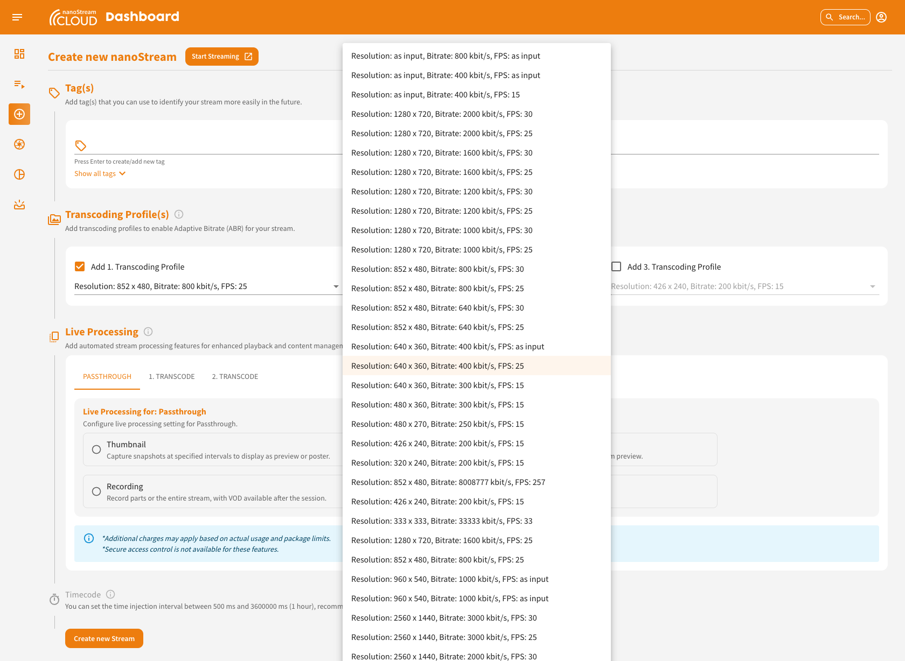
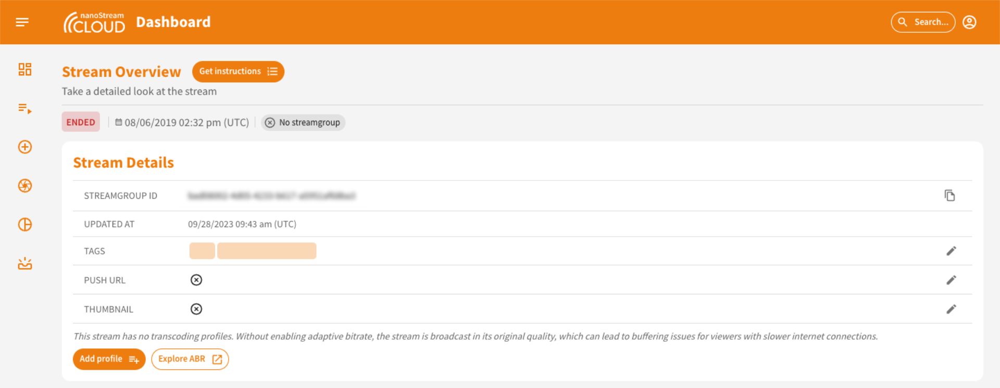
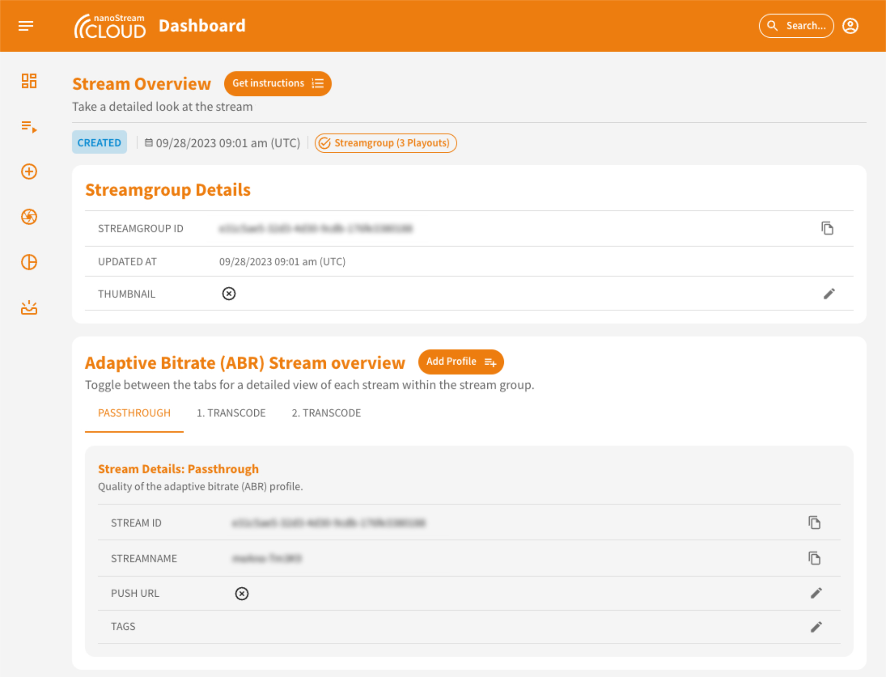
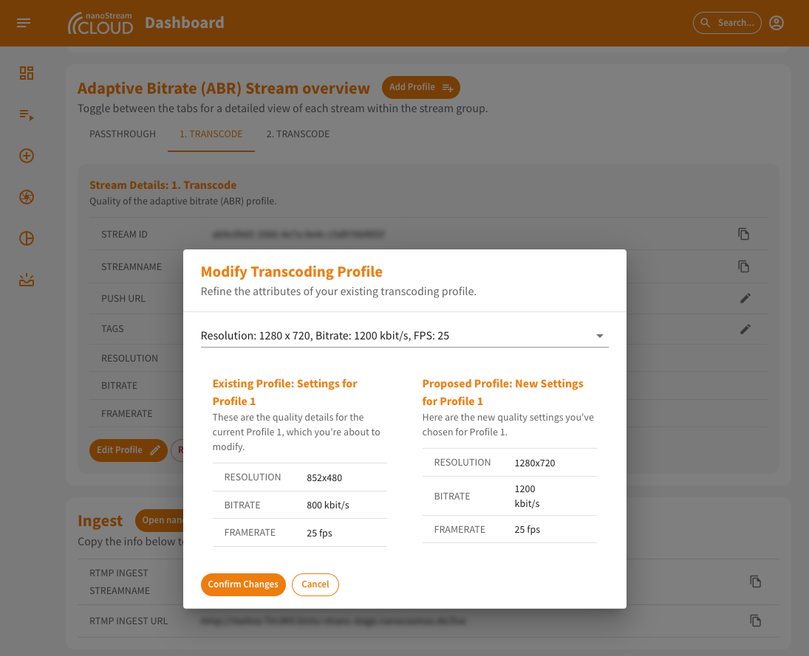

## Adaptive Bitrate (ABR)

### What is Adaptive Bitrate Playback?

Live playback of a live stream relies on a specific network bandwidth. If the viewer's network cannot support the required bandwidth, buffering issues may occur. To prevent buffering, the stream quality can be dynamically adjusted by switching to a lower quality stream encoded with a lower bitrate. Adaptive Bitrate Playback (ABR) is a feature that enables the live player to automatically adapt to the optimal stream quality based on the viewer's available network capacity.

For ABR to function effectively, the live stream needs to be available in multiple quality levels, allowing seamless adjustment according to the viewer's network bandwidth.

For instance, consider a live stream that offers a high-quality Full HD stream at 1920x1080 resolution with a bitrate of 3 Mbit/s, as well as a lower-resolution stream at 640x360 with a bitrate of 500 kBits/s. This enables viewers with varying network conditions to select the most suitable stream quality for their viewing experience.

*Infographic: Adaptive Bitrate Playback*

### How to enable Adaptive Bitrate

Adaptive Bitrate Playback with nanoPlayer does not require server-generated live transcoding. You can also create 3 live streams with the same content but different bitrates from your live encoder. Typically, live transcoding is done on the server to avoid sending 3 separate streams.

## Live Transcoding

### What is Live Transcoding?

Live Transcoding refers to the process of converting a high-quality input live stream into multiple lower-quality output streams. It eliminates the need to send multiple streams from the live encoder or broadcaster by dynamically generating additional formats suitable for distribution and playback at the player.

By employing live transcoding, a single high-quality input stream can be transformed into various output streams with different resolutions, bitrates, or other encoding parameters. This allows for efficient streaming to viewers with diverse network conditions and device capabilities, ensuring an optimal viewing experience for each user without the need for separate streams for each quality level.

Live transcoding simplifies the streaming workflow by enabling broadcasters to send a single stream while the transcoding system automatically generates the required output formats, reducing bandwidth and storage requirements. This process ensures that viewers can access the live stream in the most suitable quality based on their device capabilities and network conditions.

### How to enable Live Transcoding

You can enable Live Transcoding for your stream during the [stream creation](https://dashboard.nanostream.cloud/stream/create).

:::info Before starting
To begin, please sign in using your nanoStream Cloud/Bintu account credentials.  
If you have not created an account yet, you can [sign up](https://dashboard.nanostream.cloud/auth?signup) or reach out to our dedicated sales team via the [contact form](https://www.nanocosmos.de/contact) or by sending an email to sales(at)nanocosmos.de.
:::

*Screenshot: Create Stream and select Transcoding Profiles*

During the stream creation process live transcoding is already enabled by default. You have the option to add transcoding profiles and configure them according to your requirements. The default selection is pre-filled, but you can choose different settings. Ensure that the bitrate of each Transcoding Profile is lower than the ingest/passthrough bitrate or the profile above. Once you have completed the setup and created the stream, you can start broadcasting using your live encoder or the nanoStream Webcaster.

## Modifying Transcoding Profiles After Stream Creation

As your streaming requirements evolve, you may find the need to revise your transcoding profiles. Whether it was an oversight initially or a strategic shift, nanoStream Cloud ensures you have the tools to make post-creation adjustments effortlessly.

Should you have omitted transcoding profiles during your stream's setup, they can always be integrated later through the stream overview.

:::note ⓧ No streamgroup vs. ✓ Streamgroup (2-4 Playouts)
Beneath the "Stream Overview" header, you'll notice a tag that reads ⓧ No streamgroup. This tag is an indicator that **no transcoding profiles have been configured for this stream**. In contrast, if transcoding profiles were present, it would display as ✓ Streamgroup (2-4 Playouts)."
:::

### Transform a Non-Transcoding Stream into an ABR Stream

At the bottom of the stream details, you'll find an option to add a profile. When you click on it, a dialog will appear, allowing you to create a profile and transform your single stream into a stream group.

*Screenshot: Transform a Non-Transcoding Stream into an ABR Stream in the Stream Overview*

### Integrating Additional Profiles to Your Streamgroup

Upon either initializing your stream as a streamgroup with transcoding profiles or transitioning it to one, the stream overview presents a refined interface, as illustrated in the accompanying screenshot.

In the "Adaptive Bitrate (ABR) Stream Overview" section you can switch between various tabs to explore the passthrough and the associated transcoding profiles. Significantly, atop this section, the "Add Profile" button stands ready. By clicking on the button, you can effortlessly incorporate additional profiles to the streamgroup. Each added profile seamlessly integrates and becomes a cohesive part of the overarching streamgroup.

*Screenshot: Stream Overview with the option to add transcoding profiles*

### Edit profiles

Within the streamgroup, each profile is designed for adaptability. As you navigate, options to edit or remove specific profiles become apparent. Opting to edit brings forth a the option to update the transcoding profile. 

Upon selection, a side-by-side comparison layout emerges. On the left, you're presented with "Existing profile: settings for profile 1," showcasing the current configurations. In contrast, the right side displays "Proposed profile: new settings for profile 1," revealing potential modifications. Before any changes take effect, a confirmation is required, ensuring intentional adjustments. Nevertheless, if uncertainty strikes, the option to cancel remains readily available, providing flexibility in decision-making.

*Screenshot: A detailed view of the profile editing process*

### Delete profiles

Alongside the edit function, the "remove profile" option is noticeably present for every transcoding profile. Initiating the removal action triggers a modal window, necessitating your confirmation for the deletion.

It's worth noting that post-deletion, the system intuitively restructures the extant profiles within the streamgroup. This automatic reorganization ensures that the streaming quality remains at its optimal level, even in the absence of the deleted profile.

*Screenshot: A detailed view of the profile deletion process*

## Operation and Workflow

Transcoding and Adaptive Bitrate Playback (ABR) are built upon a group of streams. On the customer/viewer side, the stream switching occurs seamlessly in the background, depending on the internet connection. A typical configuration involves a single input stream (ingest) and three output streams, including one "passthrough" stream (maintaining the same input quality) and two lower-resolution streams.

### Example

- Input (Ingest) and Highest Quality: 1920x1080, 3 Mbit/s
- Output 1 (Passthrough): 1920x1080, 3 Mbit/s
- Transcode 1 (High): 1280x720, 1600 Kbit/s
- Transcode 2 (Medium): 852x480, 800 Kbit/s
- Transcode 3 (Low): 640x360, 400 Kbit/s

## Switch Stream Quality manually

*Screenshot: Stream Quality Switch*

On the playout page, you have the ability to adjust the stream quality manually by collapsing the stream qualities section labeled "Stream Quality: Original (adaptive)." By default, the adaptation is set to automatic, which allows the player to dynamically adjust the stream quality based on the viewer's network conditions. However, you can choose to switch to manual mode.

When in manual mode, you can switch between the stream names along with their corresponding qualities, including resolution, bitrate, and framerate. This gives you greater control over the playback experience and allows you to choose a specific quality that suits your preferences or requirements.

