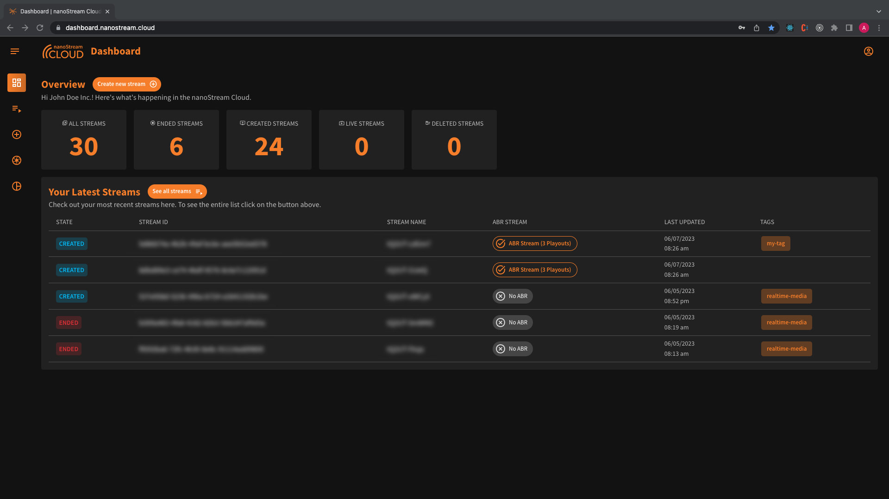
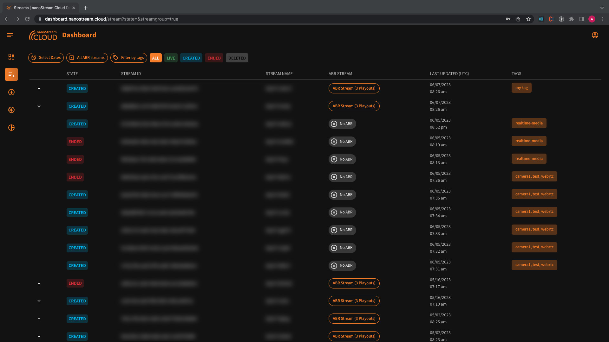
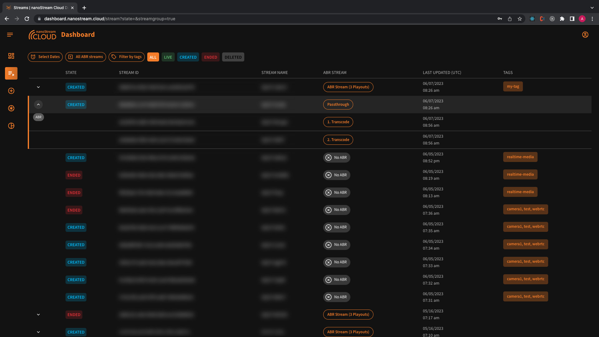
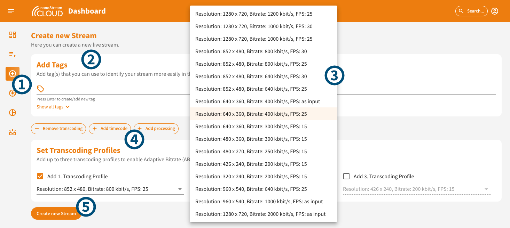
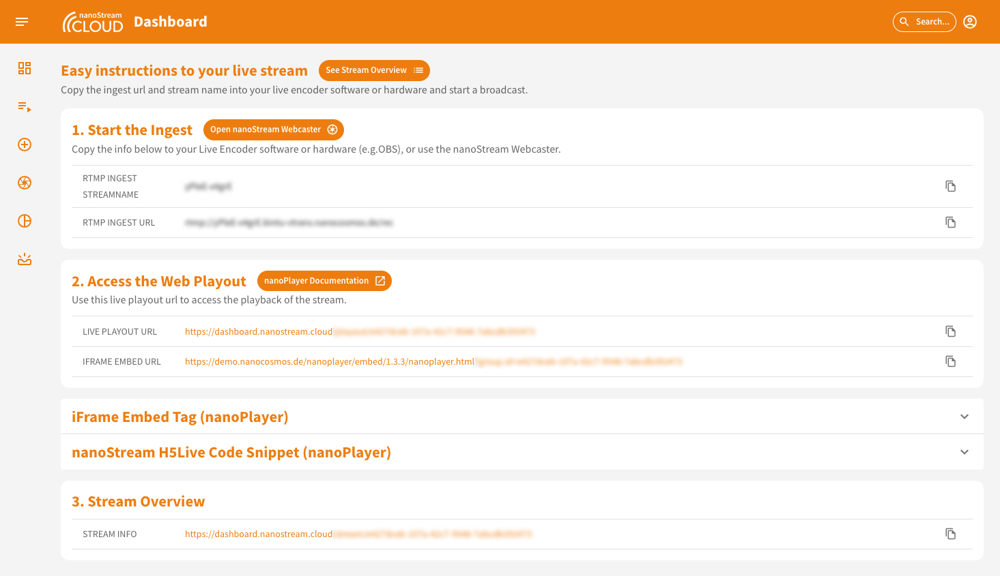
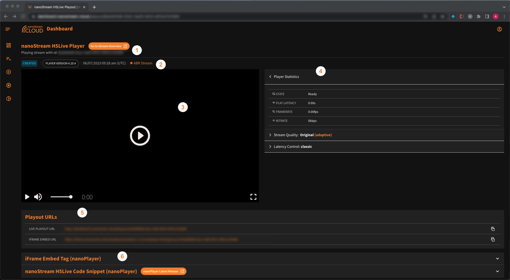
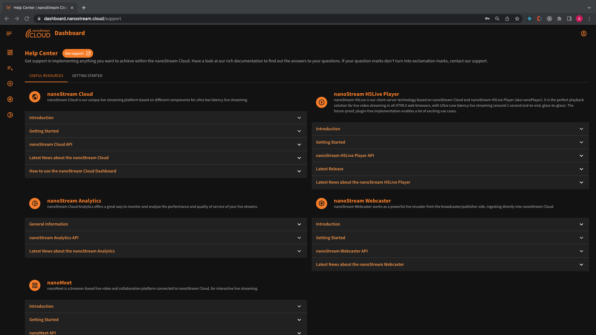

The nanoStream Cloud Dashboard is a web-based tool implemented and designed to provide users with an intuitive and comprehensive overview of their streaming activities. It serves as a centralized hub to monitor and manage the users live video streaming workflow.

The intended audience of the nanoStream Cloud Dashboard includes streaming professionals, broadcasters, content creators, and anyone involved in managing live video streaming services. It caters to both technical and non-technical users, offering a user-friendly interface with visualizations and clear introductions to start a live stream, monitor the settings and generate source codes to get the nanoPlayer work on any webpage.

## Key features

1. **Compact organization overview**: The dashboard provides a concise and comprehensive overview of your organization's streaming activities, giving you a clear understanding of your streaming infrastructure and workflows at a glance.
2. **Intuitive stream creation**: Creating and customizing new streams is made easy and intuitive through the dashboard's user-friendly interface. You can quickly set up and configure your streams according to your specific requirements.
3. **Adaptive bitrate transcoding**: The dashboard allows you to create transcoded streams with adaptive bitrate support. This ensures that your streams can dynamically adjust their quality based on viewers' network conditions, delivering optimal playback experience across various devices and network connections.
4. **Secured stream playback**: You can create secured streams with jwt-token-based security for playback. This feature enables you to protect your streams and control access to them, ensuring that only authorized users can view your content.
5. **Stream overview and playback**: The dashboard provides a convenient stream overview, allowing you to monitor your streams and watch their playback immediately. This real-time access enables you to verify the quality of your streams and ensure they are functioning as expected.
6. **Easy playout steps**: From ingest to playout, the dashboard simplifies the streaming workflow by providing easy-to-follow steps. You can seamlessly manage the entire process, from capturing your content to broadcasting it to your audience.
7. **Embeddable code snippets**: The dashboard offers code snippets that you can easily embed on your own web pages. This allows you to integrate your streams into your website or application effortlessly, providing a seamless viewing experience for your audience.

## Authentication

To authenticate on the nanoStream Cloud Dashboard, you can either sign in with your existing account or sign up for a new account.

> [Click here](https://dashboard.nanostream.cloud/auth) to authenticate.

### Sign In

1. Enter the email address associated with your existing nanoStream Cloud Dashboard account.
2. Enter your password in the provided password field. Make sure to type it accurately, as passwords are case-sensitive.
3. If the entered credentials are correct, you will be successfully logged in to your nanoStream Cloud Dashboard account. You can now access and manage your streaming workflows.

*Screenshot: Authentication Login*

### Sign Up

1. Fill in the required information, including your email address, company name, and a password of your choice.
2. Double-check the entered information for accuracy, ensuring that your email address is valid.
3. If all the information is successfully validated, your account will be created, and you will be logged in automatically. You can now log in to the dashboard and begin managing your streaming workflows using the dashboard's features.

*Screenshot: Authentication Sign Up*

If you can see the trial flag in the header, it means that you are currently in trial mode with certain limitations. To unlock the full features and capabilities, we encourage you to get in touch with us or use the „Upgrade to Premium" Button.

*Screenhot: Trial Flag and Upgrade to Premium*

:::info Contact Us
[Click here](https://www.nanocosmos.de/contact) for this and enjoy the complete benefits of our service.
:::

## Dashboard

The Dashboard page of the nanoStream Cloud Dashboard provides a summary of your streaming activities. It includes the count of all streams, ended streams, created streams, live streams, and deleted streams. Additionally, it displays the details of your latest 5 streams. This gives you a quick overview of your streaming status and recent activities.

> [Click here](https://dashboard.nanostream.cloud/) to see the dashboard.

*Screenshot: Dashboard Overview*

## All Streams

The "All Streams" section provides a comprehensive list of your streams, displaying their state (created, live, ended), stream ID, stream name, whether they are part of a stream group, and their last update timestamp. Additionally, the presence of tags allows for easier stream identification.

> [Click here](https://dashboard.nanostream.cloud/stream) to see all streams of your organisation.

*Screenshot: All Streams Overview*

If a stream belongs to a stream group, you have the option to collapse the row and view the individual streams within the group, such as passthrough, first transcode, and second transcode.

*Screenhot: Collapsed Streamgroup*

To streamline your search, you can utilize various filters such as selecting a date range to view specific streams, filtering streams by tags, or filtering by state.

*Screenshot: Filter*

These features enable you to efficiently manage and navigate through your streams, providing a clear and organized overview of your streaming content within the nanoStream Cloud Dashboard.

## Stream Creation

The nanoStream Cloud Dashboard offers a straightforward process for creating a new stream with various customization options. 

> [Click here ](https://dashboard.nanostream.cloud/stream/create)to create a stream.

Here's how you can do it:

1. Access the nanoStream Cloud Dashboard and navigate to the stream creation section.
2. You have the option to add stream tags. You can either manually enter tags or choose from your existing ones, making it easier to categorize and identify your streams.
3. For enhanced streaming quality, you have the option to configure transcoding profiles. You can define up to three profiles that enable Adaptive Bitrate (ABR) streaming. These profiles provide multiple quality versions of the stream, ensuring optimal playback across different network conditions.
4. The dashboard also offers advanced features like `timecode` and `live processing`, but please note that these features are available as paid options. Timecodes allow precise synchronization or indexing of video content, while live processing enables real-time modifications or effects during the streaming process.

:::info Contact Us
If you wish to utilize these features, you would need to activate them and ensure that the corresponding pricing and payment options are set up. 
Contact us [here](https://www.nanocosmos.de/contact) to find the perfect solution for you!
:::
5. After customizing your stream with tags, transcoding profiles, and any additional features, click on create  and create the new stream.

*Screenshot: Create Stream*

By following these steps, you can create a new stream using the nanoStream Cloud Dashboard, assign tags for easy identification, configure transcoding profiles for Adaptive Bitrate streaming, and optionally activate advanced features like timecodes and live processing.

In order to send a live stream to the nanoStream Cloud, you will require a Live Encoder. This can be accomplished using industry-standard software like OBS, dedicated hardware encoders, or even a web page equipped with the [nanoStream Webcaster.](https://docs.nanocosmos.de/docs/webrtc/nanostream_webrtc_introduction)

## Instructions to start a stream

To initiate a stream using the nanoStream Cloud Dashboard, you can access the "Instructions to start a stream" page either after creating a stream or through the regular stream overview page. This page provides you with all the information required to begin streaming, including the necessary steps and details for a seamless setup.

On this page, you'll find all the essential information required to begin your stream. The information is presented in three sections:

1. **Start the Ingest**: Here, you'll find the ingest details, including the RTMP stream name and RTMP URL. To easily copy these details, simply click on the copy icon provided at the end of the row.
2. **Access the Web Playout**: In this section, you'll discover the live playout URL. Clicking on it will also reveal a code snippet. This code snippet contains everything you need to embed the H5Live Player with your stream onto your web page.
> Additionally, the dashboard offers the `secure` option (if enabled) to generate a playback token. During your logged-in session, you have a jwt token that is valid for the whole organisation and lets you watch every stream. Alternatively, you can create a new stream JWT token with an expiration date. This token can be valid for the entire organization, specific stream groups, or individual stream names. You can specify options such as "not before" date, client IP, domain, user ID, or a single tag for added security and control. Contact us [here](https://www.nanocosmos.de/contact) to enable the `secure` feature for you!
3. **Stream Overvie**w: This section provides a link to the stream's overview page. By clicking on the URL, you can access the complete stream overview, which includes various other relevant details.

*Screenshot: Easy Instructions to the live stream*

By following these instructions, you can start your stream smoothly, access playout options, generate playback tokens with specific configurations, and embed the nanoStream H5Live Player on your webpage using the provided code snippets or iFrame tag.

## Stream Overview

The stream overview provides a comprehensive view of your streams and their associated details. This section serves as a central hub where you can access important information about your stream.

*Screenshot: Stream Overview*

1. **Detailed Stream View**:
   - Take a closer look at a specific stream by identifying it through its unique stream ID.
   - The stream's state (live, created, ended), date of creation, stream group association, and the number of associated playouts are on the top of each stream overview.
2. **Stream Group Details**:
   - Gain insights into the stream group by accessing its ID and the timestamp of the last update.
3. **Adaptive Bitrate (ABR) Stream Overview**:
   - Switch between tabs to access a more detailed overview of individual streams within a stream group.
   - Each stream's ABR profile quality, stream ID, tags, push URL, and stream name are presented. The tags and push url of each profile can be edited.
4. **Ingest Section**:
   - Find the RTMP ingest stream name and RTMP ingest URL for seamless integration with your streaming source.
5. **H5Live Playout**:
   - Access the live playout URL, which enables viewers to watch the stream in real-time.
   - If you prefer embedding the nanoStream H5Live Player on your webpage, an iframe embed URL is also provided for quick integration.
6. **Secure JWT Token Creation** (if enabled):
   - If enabled, you have the option to generate secure JWT tokens for stream access, ensuring enhanced security and control.
7. **Codes for Nanoplayer Integration**:
   - Simplify the integration process by utilizing the provided code snippets, such as an iframe embed tag or a HTML nanoStream H5Live code snippet, to seamlessly integrate the nanoStream H5Live Player into your own webpage.
8. **RTMP Playout Stream**:
   - Obtain the RTMP playout stream name and URL, which can be used for further distribution or integration with other platforms.
9. **VODs** (if enabled):
   - If enabled, this section provides relevant information about associated Video-On-Demand content, enabling easy management and access.
10. **Stream Management (Delete, Lock)**:
   - Take control of your streams by performing actions such as removing a stream, or locking and unlocking it for ingests.

## nanoPlayer

The nanoPlayer in the Cloud Dashboard plays all your streams and lets you access important player settings and statistics:

*Screenshot: nanoPlayer*

1. **Playing Stream with ID**:
   - Identify and play a specific stream by referencing its unique stream ID.
2. **Stream State and Information**:
   - Quickly assess the state of the stream (live, created, ended).
   - View the player version, date of creation, and whether the stream supports adaptive bitrate (ABR).
1. **nanoPlayer**
4. **Player Settings and Statistics**:
   - The player interface is divided into two sections: player settings and player statistics.
       - **Player Statistics**:
         - Monitor the state of the player, latency, framerate, and bitrate.
      - **Player Settings**:
         - Adjust stream quality based on the available profiles you have set up.
         - Choose between automatic or manual quality selection.
         - Fine-tune latency control with options such as classic, balanced adaptive, and fast adaptive.
5. **Playout URLs and Embedding Options**:
   - Access playout URLs to view the stream directly.
   - Utilize the iframe embed URL to seamlessly integrate the nanoPlayer into any webpage.
6. **Code Snippets for NanoPlayer Integration**:
   - Simplify the integration process by using provided code snippets, such as an iframe embed tag or a nanoStream H5Live code snippet, to seamlessly embed the nanoPlayer onto your webpage.

## Organisation Area

- **Organisation Overview**: Provides essential information about your organization, including the organization name, access to a pre-filled support form, and an overview of enabled features within the nanoStream Cloud. Also: Organisation Hash, Player Metrics, Support Level.
- **API Access**: API Key and Player Key: Important credentials for API access. Remember to keep them private and secure.
- **Manage Users**: Invite new users and gain an overview of existing users associated with your organization. Additionally, you have the ability to delete user accounts when necessary.

*Screenshot: Organisation Overview*

> [Click here](https://dashboard.nanostream.cloud/organisation) to see the organisation area.

## Help Center, About

The Help Center page offers comprehensive support for implementing various functionalities within the nanoStream Cloud. It includes rich documentation to find answers to your questions, a section to explore useful resources related to different topics in the nanoStream Cloud, a dedicated "Getting Started" guide, and a convenient "Get Support" button to contact the support team for further assistance.

> [Click here](https://dashboard.nanostream.cloud/support) to visit the Help Center.

*Screenshot: Help Center*

On the About page are various informations provided such as access to social media channels, appearance customization options (light mode, dark mode, system preference), and the ability to view the current version of the platform.

> [Click here](https://dashboard.nanostream.cloud/about) to learn more about nanoStream Cloud.

*Screenshot: About*

