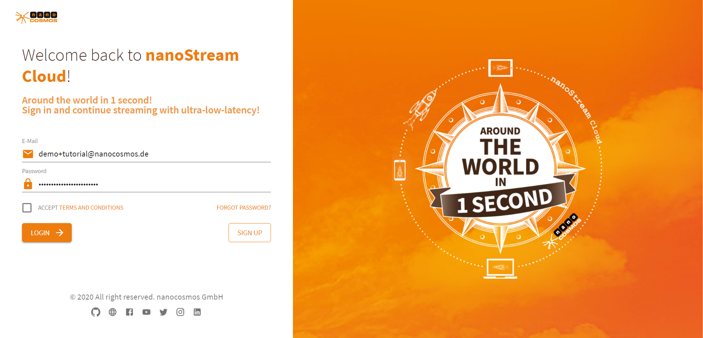
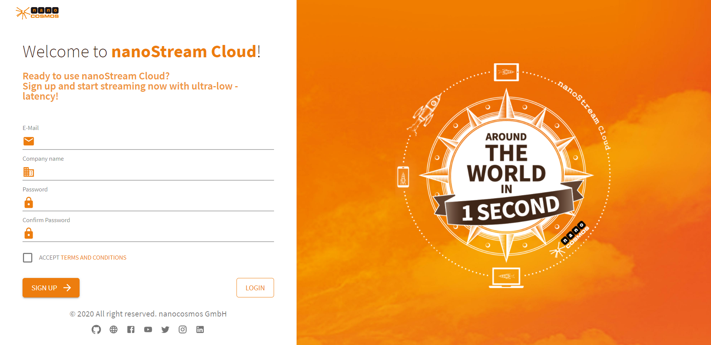

# How to Log in to the nanoStream Cloud

First, go to https://bintu-cloud-frontend.nanocosmos.de/.

Now you'll see this screen. Enter your login credentials.

Don't forget to check *Accept Terms and Conditions* before clicking *Login* to log in to your account. 

### Signing Up for the nanoStream Cloud

If you don't have an account yet, click *Sign Up*. You'll be redirected, enter your information to sign up for the nanoStream cloud.

I hope that this tutorial was helpful for you. For further assistance, check our [support page](../cloud/support), browse the [FAQs](../faq/faq_streaming) or contact us.
