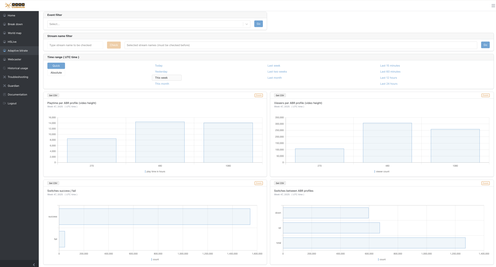
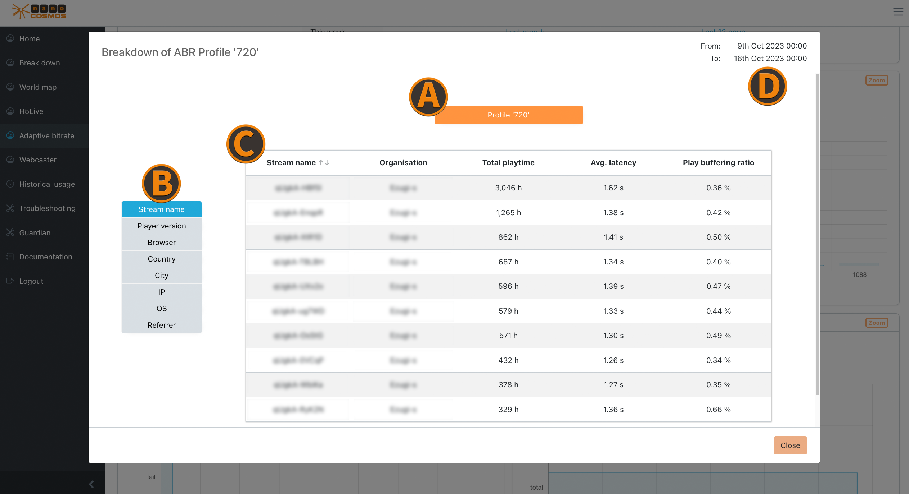

import { ScaledImage } from '../../src/components/global/ScaledImage.js';
import TOCInline from '@theme/TOCInline';

# Adaptive Bitrate (ABR)

If you have ABR enabled and you successfully configured transcoding profiles for your live streams, you will see data within the ABR tab of the Analytics Dashboard.  

*Screenshot: Adaptive Bitrate Overview*

## Playtime per ABR profile 

<ScaledImage image="analytics-dashboard-abr-playtime.png" alt="ABR Playtime Example" widthScaling="50" title="Playtime per Profile" 
    description="This example shows the playtime per ABR- (Transcoding-) profile for 270p / 480p / 1080p. The profiles get classified by their video height settings in it transcoding configuration." />

## Viewers per ABR profile

<ScaledImage image="analytics-dashboard-abr-viewers.png" alt="ABR Viewers Example" widthScaling="50" title="Viewers per Profile" 
    description="This example shows the viewer count per ABR- (Transcoding-) profile for 270p / 480p / 1080p. The profiles get classified by their video height settings in it transcoding configuration." />

## Switches Success / Fail

<ScaledImage image="analytics-dashboard-abr-switches-success.png" alt="ABR Switches Success Example" widthScaling="50" title="Success Rate of Profile Switch" 
    description="In this widget the success rate of all automatic profile switch attempts get compared, based on their actual success or failure." />

## Switches between ABR profiles

<ScaledImage image="analytics-dashboard-abr-switches-between.png" alt="ABR Switches between Profiles Example" widthScaling="50" title="Up and Down Switch Rate" 
    description="The ratio between UP and DOWN switches gets compared within this widget. A ratio of 50% / 50% might be an indicator of well configured transcoding settings for your audience." />

## Zoom on ABR

*Screenshot: Zoom on ABR*

### Profile Details
The ABR profiles represent different resolutions for the playback, based on the video height (e.g. 360p, 720p, 1080p):

#### Playtime per Profile
- playtime per resoultion, ranked by longest playtime

#### Viewer Count per Profile
- active viewers per profile (not concurrent viewers)

### Profile Switch Details
Insights for the ABR profile switches provide useful information to determine general stream or bandwidth quality:

#### Success Rate
- relation between successed and failed up and down profile switches

#### Up and Down Switches
- more distinct insights of different profile switch categories (e.g. only up or down switches)