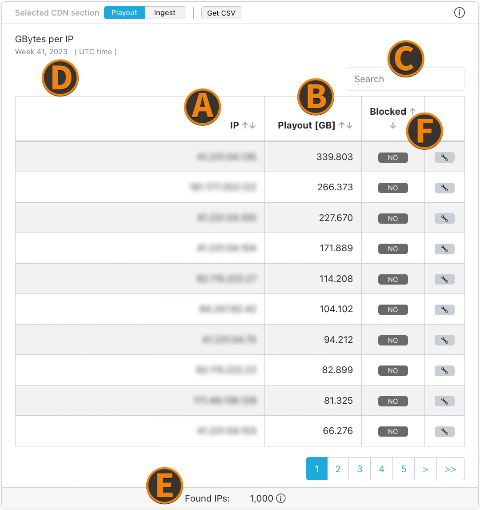

# Breakdown

## GBytes per stream name

Ingest (received) and playback (sent) traffic for each stream.

## GBytes per client

Playback (sent) traffic for each client (referrer).

## GBytes per IP

Ingest (received) and playback (sent) traffic for each IP.

## IP/Referrer Blocking

(A) Lists the IP's/referrer of playout/ingest.  
(B) Lists the Playout or Ingest in GB for the corresponding IP/referrer.  
(C) Search bar.  
(D) Toggle between playout metrics and ingest metrics.  
(E) Lists the total number of IP's/referrer found.  
(F) Shows if IP/referrer is blocked and lets you **block the IP/referrer**. By clicking on the wrench symbol in the (F) column, a prompt will show up asking to **block the IP/referrer**.  

:::caution note
The block only affects new connections or the next reconnect and takes max. 6 minutes to be effected. Blocking for a running playout requires a reconnect to take effect.
:::