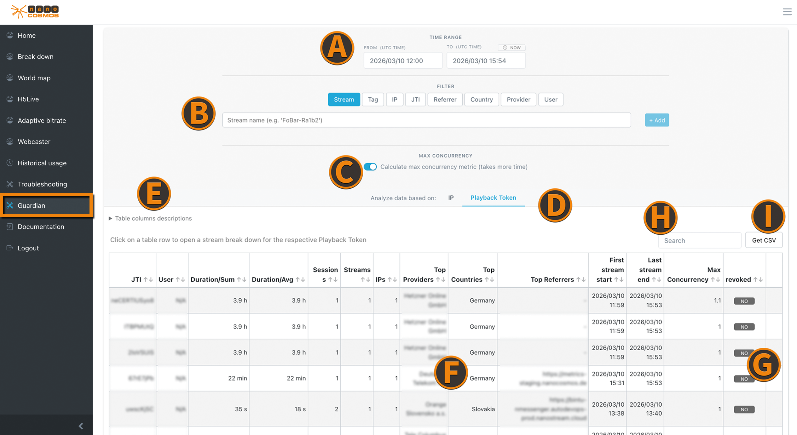
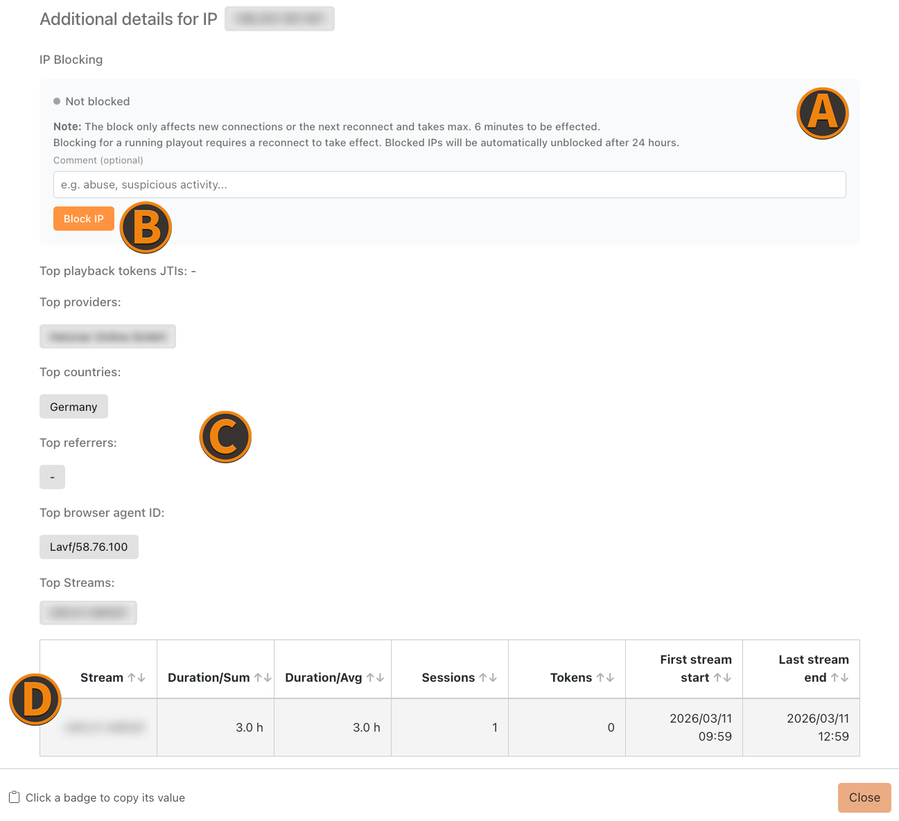
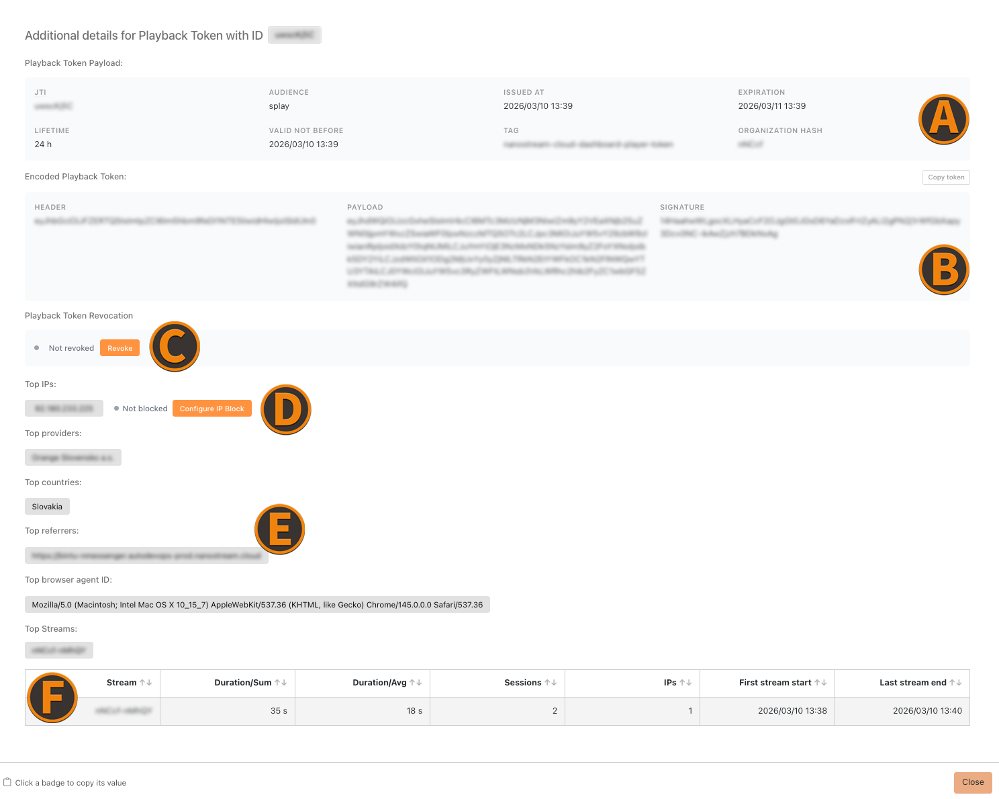
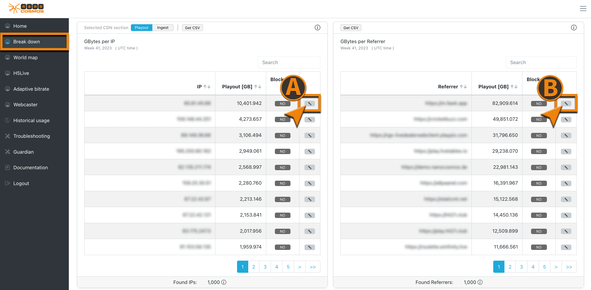

# Guardian

This section describes the Guardian features which can be accessed within the [Analytics Dashboard](https://metrics.nanostream.cloud).

:::tip learn more
Further details and general information about the **nanoStream Guardian** features can be found [here](./guardian).
:::

The Guardian in the Analytics dashboard is a tool used to monitor stream access and quickly block suspicious clients. It allows operators to analyze viewer activity (such as IP addresses or referrers) and block specific IPs or referrers that attempt to access a stream in an unauthorized or suspicious way. In addition, Guardian enables token revocation, allowing operators to invalidate compromised or misused playback tokens to immediately stop unauthorized access. This helps protect live streams from misuse and ensures controlled and secure distribution of streaming content.

## Guardian Table

:::info Before starting
To begin, please sign in to the [Analytics Dashboard](https://metrics.nanostream.cloud/login) using your nanoStream Cloud/Bintu account credentials.  
If you have not created an account yet, you can [sign up](https://dashboard.nanostream.cloud/auth?signup) or reach out to our dedicated sales team via the [contact form](https://www.nanocosmos.de/contact) or by sending an email to sales(at)nanocosmos.de.
:::

Once you logged in, click on the Guardian tab to open the Guardian menu.

*Screenshot: Analytics Guardian*

(A) `Time Range Filter (UTC Time)` the **start** (From) and **end** (To) of the time range to search in

(B) `Filter Section:`

:::tip
Filters that are pasted from clipboard get automatically applied after short delay to enhance usability. 
:::

- **Stream**: Stream name (eg.: 'Abcde-Fghij') 
- **Tag**: The customizable stream tag
- **IP**: Playback client IP
- **JTI**: Token inditifier of a playback token 
- **Referrer**: Playback client referrer
- **Country**: Playback client location
- **Provider**: Playback client provider (ISP)
- **User**: If (optional) user IDs are shared with us, you can filter by these IDs

(C) `Calculation Switch` that decides whether to add **max concurrency metric** to the analysis (Calculation can lead to extended response times)

(D) `IP & Playback Token Switch` to choose what the analysis should be based on

(E) `Table columns descriptions overview` can be used to get additional information about what is shown in each column

(F) `Data Table` containing the results of the analysis based on the set filters

:::tip
Insights of each entry can be viewed by left-clicking the row. This will open the breakdown view of the selected entry.
:::

(G) `State of IP / Token` showing whether this entry's IP/Token is blocked/revoked or not

(H) `Search Input` to search for specific entries in the table

(I) `CSV data export button` by clicking you can automatically download a `.csv` file, containing the currently displayed data

### Guardian - IP Breakdown

When choosing to search based on **IPs**, a breakdown of this can be opened by selecting a row in the [guardian table](https://metrics.nanocosmos.de/streamguard?misTerm=ip).

*Screenshot: Guardian - IP Details*

(A) `IP Blocking Status` offering the status of the IP block and the blocking capability with a customizable comment

(B) `IP Block Button` that blocks the corresponding IP from stream access

(C) `Most Popular Metrics` section displays the most important metrics ranked by appearences

- Top Providers
- Top Countries
- Top Referrers
- Top Browser Agent IDs

(D) `Most Popular Streams` that were accesed, by the selected IP and their activity metrics  

### Guardian - Playback Token Breakdown

When choosing to search based on **Playback Tokens**, a breakdown of this can be opened by selecting a row in the [guardian table](https://metrics.nanocosmos.de/streamguard?misTerm=jwtoken).

*Screenshot: Guardian - Playback Token Details*

(A) `Playback Token Payload` this section shows information of the selected playback token

(B) `Encoded Playback Token` a section of the actual token with its structure

(C) `Revocation Status` shows whether the playback token is blocked or not

(D) `IP Block Button` that blocks the corresponding IP that used the selected token

(E) `Most Popular Metrics` section displays the most important metrics ranked by appearences

- Top Providers
- Top Countries
- Top Referrers
- Top Browser Agent IDs

(F) `Most Popular Streams` that were accesed, using the selected playback token and their activity metrics

## IP & Referrer Blocking in Breakdown View

Accessing IP and Referrer Blocking based on playout traffic analysis, can be done easily by taking a look inside the [**Breakdown View**](https://metrics.nanocosmos.de/breakdown). 

*Screenshot: IP/Referrer Blocking Breakdown View*

(A) `IP Block Button` that blocks the corresponding IP from stream access

(B) `Referrer Block Button` that blocks requests from a specific referrer

