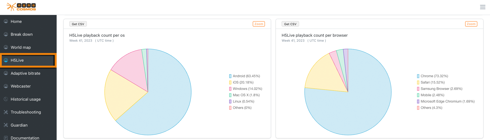
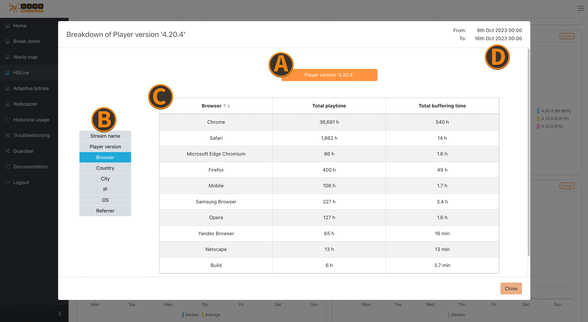

# H5Live

Most of the metrics are only available with [H5Live metrics](#h5live) enabled.
The selected filter options affect all availabe metrics.

*Screenshot: H5Live Charts*

### H5Live play count per OS

Percentage distribution of playbacks on operating systems (OS).

### H5Live play count per browser

Percentage distribution of playbacks in browsers.

### H5Live playtime per os

Percentage distribution of playtime on operating systems (OS).

### H5Live playtime per browser

Percentage distribution of playtime in browsers.

### Reasons for stopping

The number and types of reason why playbacks were stopped or interrupted.
The link in the top right will open a new page with a explanation for each stop reason.

### Play Buffering Ratio

The ratio between buffer and playback duration over all playouts.
Similar to the same category of the [world map](./worldmap).

### Player Loading Count

The number of player initalisations (clients which attempt to playback a stream) per country.

### Average and median of player buffer length in seconds

The buffer length is the decisive factor for the latency.
Similar to the "Latency" category of the [world map](./worldmap).

### Median play start time in seconds

The time it takes until the playback of a stream is started - first frame rendered by the H5Live player.

### Status/Error Codes

The number and types of status and error codes which occurred during playbacks.
The link in the top right will open a new page with a explanation for each code.

### Average and median of played time in seconds

The average and median playback duration of a playback event, shows how long a viewer will watch a stream
Similar to the "Playtime average" category of the [world map](./worldmap).

### Used player versions

Percentage distribution of playbacks based on the used version of the H5Live player.

## Zoom on H5Live

*Screenshot: Zoom on H5Live*

### Playback Count
Shows the playback count per OS or per browser.

### Player Versions
You can check detailed information about the use of different H5Live player versions, ranked by the most occuring player events. (e.g. pause, play, stop)

### Player Startup Times
Here you can find details about the initial loading times of the player, ranked by the longest average first.

### Player Loading Counts
This insight provides information about the frequency of player loading events. Note, that each country is viewed separately.

### Status/Error Codes
Check more defined details on occuring status and error codes, ranked by their counts.

### Reasons for Stopping
Use this details to see which stopping reasons the players had, ranked by how often they occur

### Aggregated Metrics
The following aggregated metrics provide more insight for different use cases regarding your stream quality:

#### Latency
- average and total latency
#### Buffering Ratios
- average and total buffering ratios