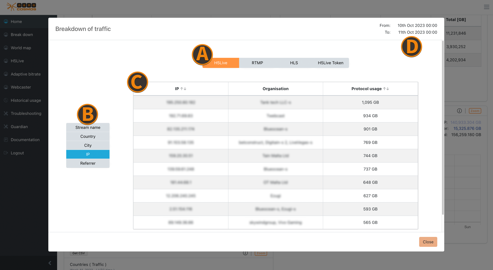

# Home

The selected filter options affect all availabe metrics.

*Screenshot: Metrics Home*

## Usage switch

Switch all metrics in Home between data traffic and playtime.

## Usage Playout/Ingest Overview

The total traffic of playout and ingest data for the selected time period in comparison.

## Maximum concurrent H5Live viewers

The maximum concurrent viewer count for a time interval.

- **Absolute**: the absolute amount of maximum concurrent viewer
- **Delta**: the difference of maximum concurrent viewers to the previous time interval

## Month to Date

The total traffic per month. Can be used to compare the current month with the previous month.

  
*Screenshot: Metrics Month To Date Chart*

- **First row**: shows the total usage from the previous month
- **Second row**: shows the usage from the beginning of the previous month until the current moment (day and time) one month ago
- **Third row**: shows the usage from the beginning of the current month until the current moment (day and time)

:::info trend for the current month
Comparing the second and third row can help to see a trend for the current month.
:::

## Usage Playout

The total playout traffic for each playout method.

- **H5Live**: the standard low latency playback method
- **RTMP**: less scalable
- **HLS**: long latency playback
- **H5Live Token**: in case you have your own (RTMP) ingest server, from which the streams are pulled and then distributed in the nanoStream cloud to your viewers
- **MoQ**: ultra-low-latency playback

## Usage Ingest

The total ingest traffic for each ingest method.

- **RTMP**: generic ingest method
- **Webcaster**: plugin-free stream ingest via Browser

## Countries

A pie-chart which shows the percentage distribution of total traffic for countries.

## Zoom on Home

*Screenshot: Zoom on Home*

### Usage/Traffic
Zooming into an usage diagram opens detailed information about the top 10 with biggest playout or ingest traffic within a specific time frame. (e.g. the top 10 countries with the highest stream data traffic)

### Protocol Usage
The protocol usage shows the traffic for every protocol individually (e.g. H5Live, RTMP, HLS, H5Live Token, MoQ). 

*Screenshot: Zoom on Protocol Usage*

### Max Concurrent Viewer
The max concurrent viewer zoom table ranks by the top 10 results by their concurrent viewer counts for the chosen data feature. (e.g. the top 10 streams with the highest count of concurrent viewer)