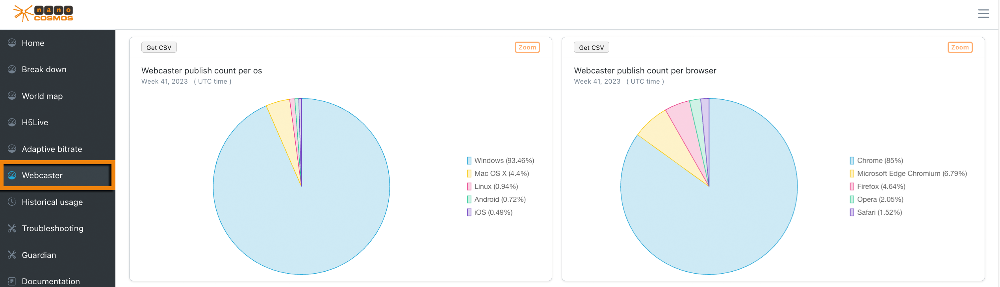
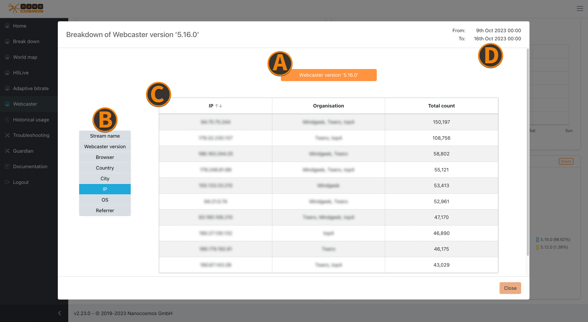

# Webcaster

Most of the metrics are only available with [Webcaster metrics](#webcaster) enabled.
The selected filter options affect all availabe metrics.

*Screenshot: Metrics Webcaster*

## Webcaster publish count per OS

Percentage distribution of ingests on operating systems (OS).

## Webcaster publish count per browser

Percentage distribution of ingests in Browsers.

## Average and median of video bitrate

The average and median bitrate used by the video encoder over all ingested streams.
Note that the video encoder might reduce the bitrate if the available bandwidth is not high enough for the user specified bitrate.

## Average and median of audio bitrate

The average and median bitrate used by the audio encoder over all ingested streams.

## Average and median of ingest time in seconds

The average and median duration a stream was live, over all ingested streams.

## Used webcaster versions

Percentage distribution of ingests based on the used version of the Webcaster.

## Zoom on Webcaster

*Screenshot: Zoom on Webcaster*

### Webcaster Publishes
The counts of publishes which are using the our webcaster.

### Bitrates
The average and median bitrates for video and audio data helps to determine bandwidth fluctuations.

### Error/Status Codes
This widget provides insights for different status and error codes of the webcaster, which get ranked by their frequency.

### Broadcasting Times
These broadcasting times represent the median and average time ranges when the webcaster send a broadcasting signal. 

### Reasons for stopping
This widget lists all the stopping counts of the streams and specific stopping reasons.

### Versions
More details about the different webcaster versions, ranked by their counts of use.