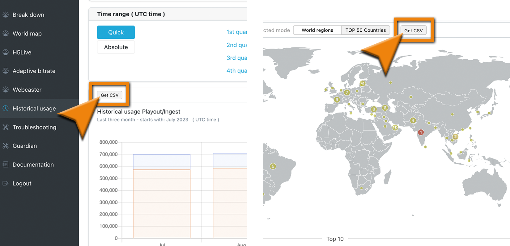

# Analytics Dashboard

Check out our dedicated dashboard features at [metrics.nanocosmos.de](https://metrics.nanocosmos.de)! Many different metrics are available in several levels, dependent on your business agreement, support level and subscription plan. Please get in touch for any questions.

The default level allows you to access most of the metrics available on the different dashboards.

:::info advanced metric widgets
To see advanced metric widgets, e.g. for H5Live player metrics like "Buffering Play Ratio" or "Average and median of played time in seconds", you need the level "premium" for your organization.
Please reach out to us via our [contact form](https://www.nanocosmos.de/contact) or by sending an mail to sales(at)nanocosmos.de if access to the advanced metric widgets is required.
:::

## Filter options

In general you will see metrics for all of the streams available for your organization.
It is possible to use the following filter options to get a more fine-grained overview:

- **Country**: let you select one or more countries
- **Tag**: can be used to filter for specifc stream names
  - you need to assign [tags in Bintu](../dashboard/start_streaming#tags) to your stream(s) to be able to use them for filtering, this is described in our [Blog post about Analytics](https://www.nanocosmos.de/blog/2019/09/nanostream-analytics-get-insights-in-your-nanostream-cloud-service-and-h5live-player-performance/) (search for "Tagging").
:::tip Good to know
Tag selection works like an `AND` filter, only metrics for streams are shown, which have all of the selected tags assigned
:::
- **Time range**: to select specific points in time or different time ranges like "last month", "last 24 hours", etc.
- **Event (only available for H5Live)**: let you filter for events you have labeled your streams with
  - you need to configure the 'eventId' at the H5Live Player to be able to use that filter (see [Player Metrics doc](../nanoplayer/nanoplayer_player_metrics/))

The filter option are available directly at the top of each sub-dashboard.
When switching to another sub-dashboard, already selected filter options will be applied there as well.

## Export Data via CSV File Format

To export the shown data and download it as &nbsp;`.csv` &nbsp;file, simply search for the &nbsp;`Get CSV` &nbsp;button inside the widget's header. 

  
*Screenshot(s): CSV Export Button*

## Zoom Feature

:::info Before starting
To begin, please sign in to the [Analytics Dashboard](https://metrics.nanocosmos.de/login) using your nanoStream Cloud account credentials.  
If you have not created an account yet, you can [sign up](https://dashboard.nanostream.cloud/auth?signup) or reach out to our dedicated sales team via the [contact form](https://www.nanocosmos.de/contact) or by sending an email to sales(at)nanocosmos.de.
:::

This feature is available for multiple widgets. The zoom tag shows if this feature is supported for this chart.

*Screenshot: Zoom Tag*

### Zoom in for more insight
By clicking on a bar in one of the supported widgets an overlay window is being opened.
There you can gain more insight about that specific diagram by doing your own research. The table shows the TOP 10 (highest) ranked results depending on the metric and your selected search parameters.

:::info
Metrics like **max concurrent viewer, latency**  or other **aggregated metrics** do rank by their **individual parameter of significance**. (e.g. viewer count, latency in seconds, etc.)
:::

### Example

*Screenshot: World Map Breakdown*

(A) `Chosen Metric Category` horizontal bar (orange) data **category**:
A list of the available data categories, like Playout/Ingest, a specific transfer protocol you are interested in (e.g. H5Live) or individual metrics.  

:::tip example
The available category options depend on the selected zoom-widgets.  
Here is another example for ABR switches from the worldmap tab:

:::

(B) `Filtering by Data Features` vertical bar (blue) data **feature**: 
This is a data feature you are interested in (e.g. streamname, referrer, country, etc.). These can be used to switch between the metric data to evaluate the results under different points of view.

Most of the zoom menus have these main filters:
- IP
- Stream name
- City
- Country
- Referrer

While `Buffering Ratio`, `Latency`, `Playtime Average`, `ABR Viewers`, `ABR Playtime` and `ABR Switches` and other individual metrics also contain filters for:
- OS
- Player version
- Browser

(C) `Table Columns` represent the chosen filter and show the corresponding data. You can sort all entries by clicking on a header column.  

(D) `Selected Time Range` displays the `start` and `end` of the selected time range.