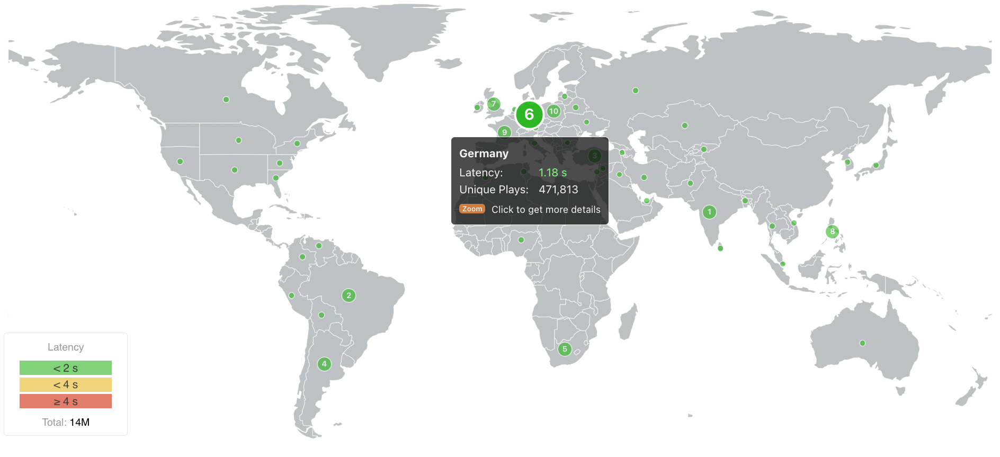

# Introduction

**nanoStream Analytics** offers a great way to monitor and analyze the performance and quality of service of your live streams. 
Get started today with either:
- our dedicated **<a href="https://metrics.nanocosmos.de/">Analytics Dashboard</a>**, providing the most important metrics for a quick and easy start
- and a corresponding **<a  href="https://metrics.nanocosmos.de/api/doc/v2/">API</a>** to get you covered with even more insights and full access of your streaming performances

*Screenshot: nanoStream Analytics Worldmap*

:::info nanoStream Analytics
nanoStream Cloud and the unique nanoStream H5Live Player have been designed as an easy to use ultra-low-latency and light-weight live streaming platform. nanoStream Analytics follows the same philosophy. Easy to use, lightweight and focused on delivering our partners the information that makes their business more successful.
:::

nanoStream Analytics provides three levels of information.

1. **General information** about usage, traffic volume, countries, customers, IP’s and world map overview on ingest/playout
2. **Business intelligence**, conclusions about several aggregated metrics. Example: Tagging: you can “tag” your live streams by topics or events and then query them from the Analytics Dashboard. Or you want insight on how certain countries perform compared to each other. by using the country filter.
3. **Customers enabled for H5Live metrics** will get additional insight and details about the player clients: we show H5Live player information like OS/browser, max concurrent viewers, play buffer ratio, startup time, player error codes and other events like buffer play ratio and latency, both shown as graphs and on a world map

:::tip info
All of this data is meant to help you improve your Quality of Service and your viewers Quality of Experience. Overall, by using nanoStream Analytics, your technical team will have full insights on how your service behaves.
:::

In addition to improving your technical capabilities, nanoStream Analytics enables also a big advantage to your business intelligence, providing valuable data to your Management and to your Marketing and Sales teams to understand where they should strengthen your service and decide on the next steps to be taken.

:::info Before starting
To begin, please sign in to the [Analytics Dashboard](https://metrics.nanocosmos.de/login) using your nanoStream Cloud/Bintu account credentials.  
If you have not created an account yet, you can [sign up](https://dashboard.nanostream.cloud/auth?signup) or reach out to our dedicated sales team via the [contact form](https://www.nanocosmos.de/contact) or by sending an email to sales(at)nanocosmos.de.
:::