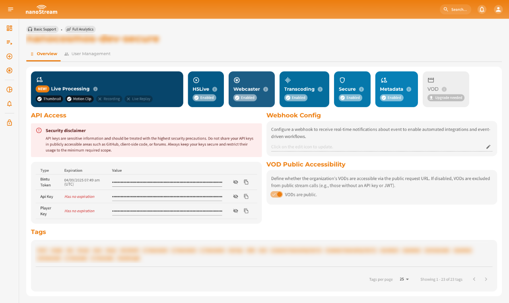

Custom webhooks in **Bintu** allow you to integrate your own backend logic directly into the ingest workflow of nanoStream Cloud.  
Instead of using fixed access rules, you can forward every **publish** and **play** attempt to your own server for validation. Your service decides, in real time, whether a stream may start, continue, or end.

This mechanism enables advanced use cases such as:
- custom authentication and authorization
- per-stream access control
- event-driven backend integration
- logging and auditing of ingest/play events
- enforcing business rules before a stream goes live

Bintu webhooks are **synchronous and blocking**: Bintu will *wait* for your server's response. If your server responds with `200 OK`, the action proceeds. If it responds with `403`, the action is rejected.
This makes webhooks a powerful and flexible control point in your streaming pipeline.

## Prerequisites

To use custom webhooks, you need 
- An active **nanoStream Cloud/Bintu** account (trial or paid).
- Administrative access to your organization in the Dashboard
- An API key (Find here: [dashboard.nanostream.cloud/organisation](https://dashboard.nanostream.cloud/organisation))
- A publicly reachable HTTPS endpoint for receiving webhook requests

:::warning getting started
- Create an account via **[Sign Up](https://dashboard.nanostream.cloud/auth?signup)**  
- Follow the **[Getting Started Guide](/docs/dashboard/getting_started)**  
- Or for account upgrades to help with implementations or hosting reach out to our sales team via the **[contact form](https://www.nanocosmos.de/contact)** or **sales(at)nanocosmos.de**
:::

## How Bintu Webhooks Work

Webhooks are **server-to-server callbacks** that notify your backend when certain events occur in Bintu. Using custom webhooks is the recommended way to **protect your ingest workflow** with custom authentication logic.  

### Event Types

| Event | Description |
|-------|-------------|
| **on_publish** | A broadcaster attempts to start ingest |
| **on_publish_done** | Ingest ended |
| **on_publish_update** | Periodic ingest status update |
| **on_play** | A viewer attempts playback |
| **on_play_done** | Viewer disconnects |

:::caution Playback Protection  
Using webhooks for **playback** (client-side playback access) is not recommended and may not be enabled for all accounts.  
For playback-level protection, always use **[nanoPlayer Token Security](/docs/cloud/security#secure-playback-h5live)** instead.
:::

### Request and Response Logic

For every such event, Bintu sends an **HTTP POST request** to your custom webhook endpoint:
- Header: `Content-Type: application/x-www-form-urlencoded`
- Body: URL-encoded event metadata

Your server must **always** return a valid HTTP response:

| HTTP response | Description |
|---------------|-------------|
| `200 OK` | Allow play/ingest |
| `403 Forbidden` | Deny play/ingest |
| any other status | Request is rejected |

:::tip Performance note
Because the call is **blocking**, slow response times will slow down stream start times. Ensure your service responds quickly (< 100–300 ms recommended).
:::

## Configure Your Custom Webhook

Setting up a custom webhook is very straightforward. You can do this via the dashboard or via the REST API.

It is possible to set it up with the following roles:

|<span className="role role-admin">nanoAdmin</span>|<span className="role role-user">nanoUser</span>|<span className="role role-readonly">nanoReadOnly</span>|
|---|---|---|
| ✓ | - | - |

### Dashboard

If you open the organisation overview page in the dashboard using [dashboard.nanostream.cloud/organisation/overview](https://dashboard.nanostream.cloud/organisation/overview), you can easily set the custom webhook there by clicking on the edit icon at the end of the text field. This will allow you to set/edit the value or delete it, if you are authorised to do so.


*Screenshot: Organization Overview*

### REST API

You can configure your organization's webhook URL using the following API request.

**API Reference** \
[doc.pages.nanocosmos.de/bintuapi-docs/#operation/Set%20Webhook](https://doc.pages.nanocosmos.de/bintuapi-docs/#operation/Set%20Webhook)

**Parameters**
- `X-BINTU-APIKEY`: Your API key for authentication

**Body**
- `WEBHOOK`: A publicly reachable HTTPS endpoint for receiving webhook requests

**cURL**
```js title="bintu/set_webhook.sh"
curl -X PUT \
  https://bintu.nanocosmos.de/organisation/webhook \
  -H 'content-type: application/json' \
  -H 'x-bintu-apikey: YOUR_BINTU_API_KEY' \
  -d '{
    "webhook": "https://your-custom-server.com/hook"
}'
```

## Webhook Request Parameters

Below are the unified parameters followed by per-event parameter tables.

### Common Parameters (All Events)

| Parameter | Description | Example | 
|-----------|-------------|---------|
| **call** | Webhook event type | `publish`, `play`, `publish_done`, `play_done`, `update_publish` |
| **name** | Bintu streamname | 'YYstV-BVPq4' |
| **app** | Application |  `live` or `play` |
| **addr** | Client IP address | `xxx.yyy.zzz.aaa` |
| **clientid** | Internal client identifier | `123456`|

Additional parameters depend on the specific event.

### on_publish

| Parameter | Description |
|----------|-------------|
| **call** | `publish` |
| **name** | Stream name |
| **app** | Publishing application (typically `live`) |
| **addr** | Client IP address |
| **clientid** | Unique client session ID |

### on_publish_done

| Parameter | Description |
|----------|-------------|
| **call** | `publish_done` |
| **name** | Stream name |
| **app** | Publishing application |
| **addr** | Client IP |
| **clientid** | Client session ID |
| **bytes_in** | Total bytes received from encoder |
| **bytes_out** | Total bytes distributed to CDN/clients |

:::info For your information
As stated above, the request body also contains the keys bytes\_in and bytes\_out. The unit of the values is byte.
:::

### on_publish_update

| Parameter | Description |
|----------|-------------|
| **call** | `update_publish` |
| **time** | Seconds elapsed since the publish started |
| **timestamp** | Timestamp of the latest audio/video packet |
| **name** | Stream name |
| **app** | Application |
| **addr** | Client IP |
| **clientid** | Client ID |

### on_play

| Parameter | Description |
|----------|-------------|
| **call** | `play` |
| **name** | Stream name |
| **start** | Playback start position (0 for live) |
| **duration** | Requested playback duration |
| **app** | Application (`play`) |
| **addr** | Viewer IP address |
| **clientid** | Unique viewer session ID |


### on_play_done

| Parameter | Description |
|----------|-------------|
| **call** | `play_done` |
| **name** | Stream name |
| **bytes_in** | Bytes received |
| **bytes_out** | Bytes delivered |
| **app** | Application |
| **addr** | Viewer IP |
| **clientid** | Viewer session ID |


## Custom Data With Query Parameters

You can append your own custom metadata to the stream name when publishing or playing a stream. These custom fields are included in the webhook POST body exactly as they appear in the URL. This allows you to pass e.g. application-specific metadata or any custom parameters relevant to your backend logic. *Bintu will **not modify or interpret** your parameters. They are simply forwarded to your webhook.* You can add **n* query parameters**.

### Custom Data on Publish

1. Your encoder publishes to:
```bash
rtmp://bintu-stream.nanocosmos.de/live/STREAMID123?foo=bar&batz=12345&custom_data=[YOUR_CUSTOMDATA]
```
2. Bintu sends *on_publish* the following POST body to your webhook:
```bash
foo=bar&batz=12345&custom_data=[YOUR_CUSTOMDATA]&call=publish&name=STREAMID123&app=live&addr=xxx.xxx.xxx.xxx&clientid=123456
```


### Custom Data on Playack

You can also attach parameters to your playback request.  
1. You are requesting a playback as:
```bash
http://demo.nanocosmos.de/nanoplayer/release/nanoplayer.html?h5live.server=bintu-play.nanocosmos.de&h5live.rtmp.url=rtmp://bintu-play.nanocosmos.de/play&h5live.rtmp.streamname=CD6xx-123456?test%3D123
```
2. Bintu sends *on_play* the following POST body to your webhook:
```shell
test=123&call=play&name=CD6xx-123456&start=0&duration=0&reset=0&app=play&addr=xxx.yyy.zzz.aaa&clientid=123456    
```  

:::warning URL Encoding Requirements
When sending custom parameters, they must be URL-encoded. Otherwise your player may interpret the parameter incorrectly.

| Character | Must be encoded as | Example |
|-----------|--------------------|---------|
| `=` | `%3D` | token=abc=123 → token=abc%3D123 |
| `&` | `%26` | user=tom&jerry → user=tom%26jerry |
| `?` within values | `%3F` | meta=a?b?c → meta=a%3Fb%3Fc |
:::
