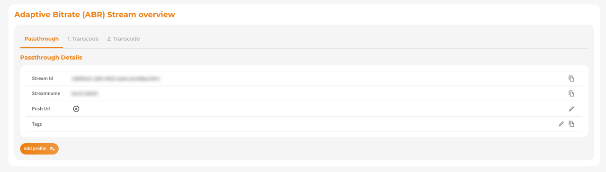
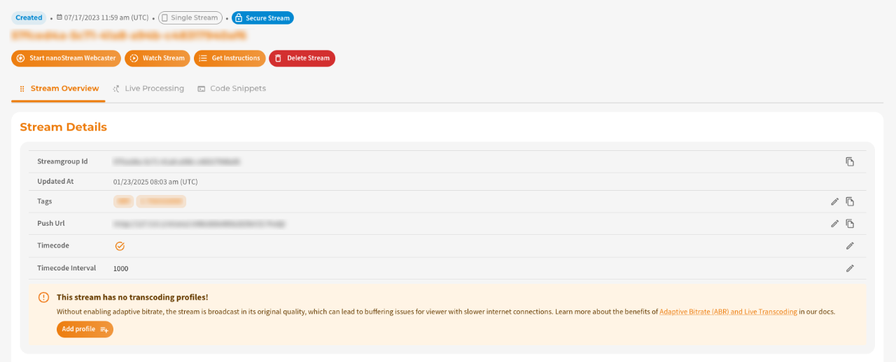
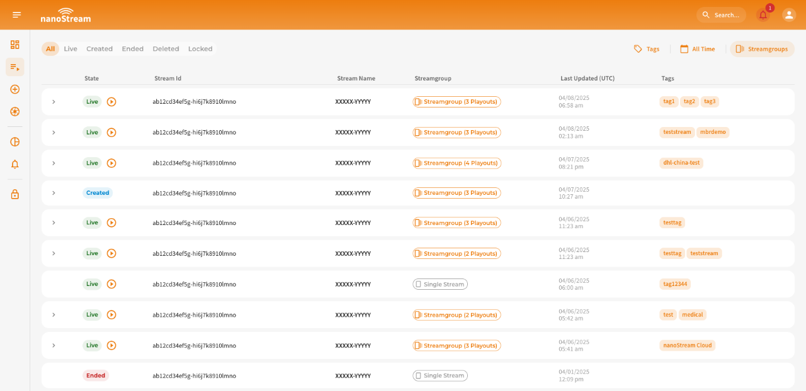

**Stream Tags** in Bintu allow you to organize, structure, and search your streams more efficiently.
They are free-form, human-readable labels that can be attached to any stream.

Tags are lightweight and flexible and help you:

- group streams by department, location, event, or purpose
- filter streams in the Dashboard or via bintu REST API
- search large lists of streams quickly
- power automated workflows (e.g., routing, monitoring, auditing) based on tag values

:::info Best Practice Tag Structure
To keep your tagging system clean and useful use consistent naming. This makes it easier to search and categorize streams.

Tags can follow different patterns depending on your workflow:
- simple labels: camera1 vip marketing
- hierarchical labels: event2025 studio/west
- key/value structure: location:berlin type:concert role:guest
:::

Bintu does not enforce a fixed naming scheme, you define tags as they fit your workflow. They should help your operators understand the context of a stream at a glance.

Tags can be added in two situations:

1. **When Creating a Stream**: If you include tags in during the stream creation, the Bintu REST API will automatically create these tags if they do not already exist in your organization.

2. **Updating an Existing Stream**: You can update or replace the tags of a stream at any time using the Bintu REST API.

This means you can, but do not need to pre-create tags and makes them a simple and powerful way to categorize streams dynamically.

:::tip Tag Management
To understand which user roles can perform which operations on tags, take a look at our [High-level Permission Overview: Tag Management](/docs/cloud/user_roles#tag-management).
:::

:::warning Before starting
If you don’t have an account yet you can [sign up](https://dashboard.nanostream.cloud/signup), or get in touch with our sales team via [nanocosmos.net/contact](https://www.nanocosmos.net/contact) or by email at sales(at)nanocosmos.net.

*Need help accessing an existing organization or unsure how to proceed?*  
👉 Check the [Authentication section](#authentication) in our docs for step-by-step guidance on creating an account, logging in or requesting access from your system administrator.
:::

## Managing Tags in the Dashboard

Tags can be managed in the Dashboard, including browsing all existing tags, assigning or removing tags from a stream and filtering your stream list by tags. When you create new tags via the Dashboard, they become available for all users in your organization.

*Screenshot: Organization Overview incl. Tags Overview on the bottom*

### Create Stream and Add Tags

In the **Create Stream** dialog ([dashboard.nanostream.cloud/stream/create](https://dashboard.nanostream.cloud/stream/create)), use the **Tag(s)** field to add one or *n* tags.

*Screenshot: Create new Stream*

As soon as you start typing, Bintu will suggest existing tags (starting from the 3rd character). To add a tag, or select a suggestion, **Enter** must be hit. You can also click **Show all tags** to browse and pick from your existing tags.

*Adding tags during stream creation*

When you click **Create Stream**, the new stream will be created with these tags.

### Edit Stream and Assign Tags

Depending on the stream type (Single Stream or MBR Stream), tags can be updated in different sections.

**Adaptive Bitrate (ABR) Stream**: Tags are edited inside the **Overview** section.

*Adaptive Bitrate (ABR) Stream overview*

**Single Stream**: Tags appear in the **Stream Details** section.

*Single stream: tag section in Stream Details*

With a click on the **edit icon** at the end of the row you can open the tag editor, where it is possible to add new tags, remove tags or select tags from your organization-wide tag list.

:::warning Important to know  
When creating **MBR Streams** through the Dashboard, Bintu automatically adds descriptive tags to each variant stream of the group (e.g., Passthrough, 1. Transcode, n Transcode, ...).  
This **does not** happen when creating streams through the REST API.  
:::

### Filter Streams Overview with Tags

On the **Streams** page, which can be found under [dashboard.nanostream.cloud/stream/create](https://dashboard.nanostream.cloud/stream/create), the tag filter appears on the far right above the stream list.

- Type at least 3 characters to get suggestions
- Press **Enter** to apply the tag
- Combine multiple tags to narrow down your results

*Screenshot: Stream list*

## Managing Tags via REST API

You can retrieve tags via API to build your own workflow automation:

- filter streams by tag
- automatically route streams based on metadata
- enforce business rules (e.g., certain events require certain tags)

| Action | Description | API Reference |
|--------|-------------|---------------|
| `POST` Create Stream | Create a stream with Tags. | [doc.pages.nanocosmos.de/bintuapi-docs/#operation/Create%20Stream](https://doc.pages.nanocosmos.de/bintuapi-docs/#operation/Create%20Stream) |
| `PUT` Set Stream Tags | Ability to update tags. | [doc.pages.nanocosmos.de/bintuapi-docs/#tag/Stream/paths/\~1stream\~1\{id}~1tag/put](https://doc.pages.nanocosmos.de/bintuapi-docs/#tag/Stream/paths/~1stream~1{id}~1tag/put) |
| `GET` Tag Collection | Ability to list all existing tags in your organisation. | [doc.pages.nanocosmos.de/bintuapi-docs/#tag/Tag](https://doc.pages.nanocosmos.de/bintuapi-docs/#tag/Tag) |
