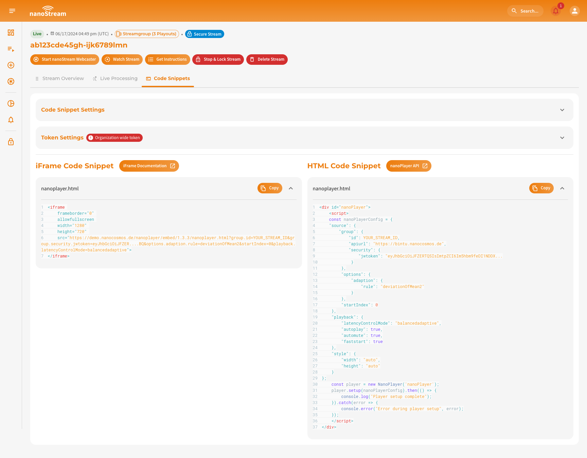

This guide walks you through everything required to get your **first live stream** running on **nanoStream Cloud**.  
You will learn how to:

- create and manage streams with **bintu** (Dashboard or API),  
- push live video from the **browser (nanoStream Webcaster)**, **OBS**, or **Osprey Talon**, and  
- validate playback with the **H5Live** player and analytics.

:::info Before starting
If you don’t have an account yet you can [sign up](https://dashboard.nanostream.cloud/signup), or get in touch with our sales team via [nanocosmos.net/contact](https://www.nanocosmos.net/contact) or by email at sales(at)nanocosmos.net.

*Need help accessing an existing organization or unsure how to proceed?* <br/>
👉 Check the [Authentication section](#authentication) in our docs for step-by-step guidance on creating an account, logging in or requesting access from your system administrator.
:::

## Quick start

1. Sign up / log in to the Dashboard: [dashboard.nanostream.cloud/](https://dashboard.nanostream.cloud/)
2. Create a new stream in the Dashboard (or via the bintu API).  
3. Copy the **Ingest URL** and **Stream name**.  
4. Start your encoder (nanoStream Webcaster / OBS / Osprey / ...) and paste the ingest details.  
5. Open the **Playback URL** in a browser and share it with your audience.

## Prerequisite

To get started with the **nanoStream Cloud Dashboard** or **bintu REST API**, sign in to the nanoStream Cloud Dashboard with your *nanoStream Cloud account*, as you will either need your **API Key** or **bintu token**.

To create and broadcast a live stream, you need your *live event or content* and *equipment to capture it*.
This can either be a **webcam**, an **external camera**, a **streaming device**, or even **your PC screen**. You'll also need streaming software or hardware or simply your browser.

:::tip Find your Api Key / Bintu Token
If you plan to use the **REST API**, you'll need the **API Key / Bintu Token**, available in the Dashboard under your organization's settings: [dashboard.nanostream.cloud/organisation/overview](https://dashboard.nanostream.cloud/organisation/overview). 
*Only* <span className="role role-admin">nanoAdmin</span> *have permission to access **API keys**.*


*Screenshot: Organisation Overview with API Access*
:::

## Create a Stream

A new stream can be created via the dashboard or via the Rest API. It is possible to create a stream with different settings. You can either create a single stream or a multi-bitrate stream.

:::info Good to know
A **multi-bitrate stream (MBR)** is transcoded into streams of varying quality to enable the playback of streams with extremely low latency at low bandwidth.

To understand *what multi-bitrate streams are* and *how adaptive bitrate and live transcoding work*, take a look at our [dedicated explanation page](/docs/dashboard/abr_transcoding).
:::

### Permission Overview

It is possible to create a stream with the following roles:

|<span className="role role-admin">nanoAdmin</span>|<span className="role role-user">nanoUser</span>|<span className="role role-readonly">nanoReadOnly</span>|
|---|---|---|
| ✓ | ✓ | ✗ |

### Rest API

You can find all the details for the [Create Stream API call](https://doc.pages.nanocosmos.de/bintuapi-docs/#operation/Create%20Stream) and various request samples in our bintu Rest API documentation: [doc.pages.nanocosmos.de/bintuapi-docs](https://doc.pages.nanocosmos.de/bintuapi-docs). There you can also learn how to read the responses. A cURL request may look as follows:

```js title="bintu/create_stream.sh"
curl --request POST \
  --url https://bintu.nanocosmos.de/stream \
  --header 'X-BINTU-APIKEY: REPLACE_KEY_VALUE' \
  --header 'content-type: application/json' \
  --data '{"tags":["foo","bar"],"processing":[[{"id":"replay","duration":30},{"id":"thumbs","interval":45},{"id":"rec","duration":null},{"id":"motionclip","duration":5,"interval":30}]]}'
```

:::note Advanced Developer bintu API docs
For additional languages, advanced configuration options, and complete request/response samples, please refer to the official **bintu API documentation**: [doc.pages.nanocosmos.de/bintuapi-docs](https://doc.pages.nanocosmos.de/bintuapi-docs). \
The API reference provides full details on all available endpoints and workflows for managing stream options, including the topic discussed in this section.
:::

### Dashboard

Navigate to [dashboard.nanostream.cloud/stream/create](https://dashboard.nanostream.cloud/stream/create) and set up your stream.

:::tip Create new Stream with the dashboard
In order to learn more about stream creation with the dashboard and setting tags, transcoding profiles, and options such as live processing, check out our dedicated documentation: [Create Stream](/docs/dashboard/start_streaming#create-stream).
:::


*Screenshot: Create new Stream*

## Start a stream

You can ingest streams through popular protocols such as **RTMP**, **SRT**, **WHIP**, and **WebRTC**. nanoStream Cloud integrates easily with industry-standard tools like [OBS](https://www.nanocosmos.net/blog/how-to-use-obs-for-low-latency-live-encoding-to-nanostream-cloud/) or [Osprey Talon](https://www.nanocosmos.net/blog/osprey-talon-and-nanostream-cloud/). For instant browser-based streaming, the **nanoStream Webcaster** lets you broadcast directly without any plugins or third-party software.

| Setting | Recommendation |
|---------|----------------|
| Video Codec | H.264 |
| Audio Codec | AAC |
| Resolution | flexible, e.g. `640×480`, `1280×720`, `1920×1080` |
| Bitrate | flexible, e.g. `500 kbits/s`, `1 MBit/s` |

import Tabs from '@theme/Tabs';
import TabItem from '@theme/TabItem';

<Tabs
  defaultValue="webcaster"
  values={[
    {label: 'nanoStream Webcaster', value: 'webcaster'},
    {label: 'OBS Studio', value: 'obs'},
    {label: 'Osprey Talon', value: 'osprey'},
  ]}>
  <TabItem className="tab-item" value="webcaster">
  
  The **nanoStream Webcaster** is a browser-based encoder that requires no installation or plugins. It is ideal for quick broadcasts live streaming setups.

  You can stream directly from your browser by going to [dashboard.nanostream.cloud/webcaster](https://dashboard.nanostream.cloud/webcaster) and creating a new stream or by selecting an existing one. Alternatively, it is possible to manually append the stream ID to the URL at any time, e.g. `dashboard.nanostream.cloud/webcaster/YOUR-STREAM-ID`.

  **Steps:**
  1. Open the Webcaster via Dashboard → *Webcaster*
  2. Select or create a Stream
  3. Choose camera and microphone
  4. Click **Start Broadcast**

  To learn more about how to set up the webcaster and process the stream, simply refer to our dedicated docs: [Ingesting with the nanoStream Webcaster](/docs/dashboard/start_streaming#ingesting-with-the-nanostream-webcaster).

  If you prefer to assemble the nanoStream Webcaster yourself, you can find all available methods in our [Webcaster API](https://nanocosmos.github.io/webcaster/docs/).

  
  *Screenshot: nanoStream Webcaster*

  </TabItem>

  <TabItem className="tab-item" value="obs">
  
  **OBS Studio** (Open Broadcaster Software) is a free, powerful software for professional live streaming. It allows you to broadcast to **nanoStream Cloud** while giving full control over video quality, bitrate, and encoder settings.
  
  OBS offers **nanoStream Cloud** as a streaming service for automatic setup, making configuration simple and fast.
  
  **Steps:**
  1. Download & Install [OBS Studio](https://obsproject.com/).
  2. Open OBS and go to `Settings → Stream`.
  3. Under **Service**, select `Other… → nanoStream Cloud/bintu`.
  4. Enter the **Stream Key**, known as **Stream name** in nanoStream Cloud Dashboard (e.g., `ABCDE-XYZ12`). 
  5. Configure video source (add source, arrange overlays, etc.)
  6. Start Streaming around the world!
  7. Check your nanoStream Cloud Dashboard to confirm that the live stream is running.

  :::tip Start Streaming
  Learn how to start and share a stream, including the necessary steps and details for a seamless setup [here](/docs/dashboard/start_streaming#start-streaming).
  :::

  -----

  If you need more guidance, read our extended blog post about [Low Latency OBS: How to use OBS for Low Latency Live Encoding to nanoStream Cloud](https://www.nanocosmos.net/blog/how-to-use-obs-for-low-latency-live-encoding-to-nanostream-cloud/).

  <div class="video-wrap">
      <div class="video-container">
          <iframe src="https://www.youtube.com/embed/vkQmMIQJl_4?si=PtzBgA52KC3Su1wA" frameborder="0" allowfullscreen></iframe>
      </div>
  </div>
  *Video Tutorial: Set up OBS with nanoStream Cloud*

  </TabItem>

  <TabItem className="tab-item" value="osprey">
  
  [Osprey Talon](https://www.ospreyvideo.com/) is a professional hardware encoder that allows you to broadcast high-quality, ultra-low-latency streams to **nanoStream Cloud**. This guide walks you through configuring your device for RTMP, SRT, and WHIP ingestion.

  #### Step 1: Login to your Osprey Device
  
  Access your Osprey Talon via a web browser using the device IP. \
  Default credentials: **Username:** `admin` / **Password:** `osprey`
  
  #### Step 2: Select the Upstream Protocol

  Osprey Talon supports multiple protocols for live ingest. nanoStream Cloud supports **RTMP**, **SRT**, and **WHIP**. You can find the appropriate ingest URL and stream name in your **nanoStream Cloud Dashboard** in the [stream overview](/docs/dashboard/stream_overview).
  
  Once logged in, navigate to `Output → Upstream Protocol` to configure the first channel.


  #### a) RTMP

  For the most common setup:
  1. Select `nanocosmos (RTMP)` or `RTMP/RTMPS` in the Protocol dropdown.
  2. In the `Destination URL`, enter your RTMP ingest URL (e.g., `rtmp://bintu-stream.nanocosmos.de/live`).
  3. Enter the **Stream Key**, known as **Stream name** in nanoStream Cloud Dashboard (e.g., `ABCDE-XYZ12`). 

  #### b) SRT
  
  SRT provides reliable streaming over unpredictable networks and can be used as an alternative to RTMP.
  
  1. Select **TS over SRT** as the protocol.
  2. Set **SRT Mode:** `Caller`.
  3. **Destination Address:** `bintu-srt.nanocosmos.de`.
  4. **Port:** `5000`.

  :::tip When to use SRT
  SRT is ideal for low-latency streaming in challenging network conditions, as it handles packet loss and jitter automatically.
  :::
  
  
  #### c) WHIP (WebRTC-based Ingest)
  
  WHIP allows **browser-friendly, ultra-low-latency ingest** via WebRTC.
  1. Select **nanocosmos WHIP** as the protocol.
  2. Enter the **Stream Key**, known as **Stream name** in nanoStream Cloud Dashboard (e.g., `ABCDE-XYZ12`). 
  
  :::tip When to use WHIP
  WHIP is recommended for scenarios where ultra-low latency and direct WebRTC playback are required, such as interactive webinars or live betting.
  :::

  #### Step 3: Video Configuration & Start Your Broadcast
  
  1. Configure the video source, resolution, and encoding settings for your broadcast.
  2. Click `Actions → Start` to begin streaming.
  3. Check your nanoStream Cloud Dashboard to confirm that the live stream is running.

  ------

  If you need more guidance, have a look at our blog post [Tutorial: Osprey Talon and nanoStream Cloud](https://www.nanocosmos.net/blog/osprey-talon-and-nanostream-cloud/).
  
  </TabItem>
</Tabs>


## Play your live stream

Playing streams is straightforward. You can either copy the playback URL from the dashboard, figure it out through the API, or assemble it yourself:

- [dashboard.nanostream.cloud/playout/[YOUR-STREAM-ID]](https://dashboard.nanostream.cloud/playout/YOUR-STREAM-ID)
- [http://demo.nanocosmos.de/nanoplayer/release/nanoplayer.html?bintu.apiurl=https://bintu.nanocosmos.de&bintu.streamid=[YOUR-STREAM-ID]](http://demo.nanocosmos.de/nanoplayer/release/nanoplayer.html?bintu.apiurl=https://bintu.nanocosmos.de&bintu.streamid=YOUR-STREAM-ID)

:::warning Secure Organizations
When assembling the URL yourself, please note that for organisations that have `secure` enabled, you must include a token in the URL or be logged in to the dashboard.
:::

### Permission Overview

It is possible to playback a stream in the nanoStream Cloud Dashboard with the mentioned roles below, as well as not-signed in.
If the organisation that created the stream is a secure organisation, a token is required in order to play it back when not logged in. The token can only be created by an <span className="role role-admin">nanoAdmin</span>.

|<span className="role role-admin">nanoAdmin</span>|<span className="role role-user">nanoUser</span>|<span className="role role-readonly">nanoReadOnly</span>| Non-logged-in Person |
|---|---|---|---|
| ✓ | ✓* | ✓* | ✓* |

\* *For Secure Orgas only with valid H5Live token*


### Get Stream Info Through Rest API

You can find all the details for the [Get Stream Info API Call](https://doc.pages.nanocosmos.de/bintuapi-docs/#operation/Stream%20Info). There you can also learn how to read the responses. The cURL request may look as follows:

```js title="bintu/get_stream_info.sh"
curl --request GET \
  --url 'https://bintu.nanocosmos.de/stream/YOUR_STREAM_ID?asset_limit=10' \
  --header 'X-BINTU-APIKEY: REPLACE_KEY_VALUE'
```

### Get Stream Info Through Dashboard

The playback URL can be located in various areas of the dashboard:

- Playout Overview
   - [dashboard.nanostream.cloud/playout/YOUR-STREAM-ID](https://dashboard.nanostream.cloud/playout/YOUR-STREAM-ID)
- Stream Overview
   - [dashboard.nanostream.cloud/stream/YOUR-STREAM-ID](https://dashboard.nanostream.cloud/stream/YOUR-STREAM-ID)
   - [dashboard.nanostream.cloud/stream/YOUR-STREAM-ID/code-snippets](https://dashboard.nanostream.cloud/stream/YOUR-STREAM-ID/code-snippets)
- New Stream Overview / Stream Instructions Overview
   - [dashboard.nanostream.cloud/stream/new/YOUR-STREAM-ID](https://dashboard.nanostream.cloud/stream/new/YOUR-STREAM-ID)
- Webcaster Overview
   - [dashboard.nanostream.cloud/webcaster/YOUR-STREAM-ID](https://dashboard.nanostream.cloud/webcaster/YOUR-STREAM-ID)


*Screenshot: Example Stream Overview (Streamgroup)*

### Embed the nanoPlayer on your web page

Embedding a live stream into your own website is incredibly simple with nanoStream. Each stream has a unique code snippet that is automatically updated to your setup, requiring you to only copy and paste it into the right place.

You can choose between two types of code snippets for embedding:

- **iFrame Embed Tag** (recommended for quick integration)
- **nanoStream H5Live JavaScript Snippet** (for advanced customizations)

You can find these snippets in multiple locations within the dashboard:

    - dashboard.nanostream.cloud/stream/**YOUR-STREAM-ID**/code-snippets
    - dashboard.nanostream.cloud/stream/new/**YOUR-STREAM-ID**
    - dashboard.nanostream.cloud/playout/**YOUR-STREAM-ID**
    - dashboard.nanostream.cloud/webcaster/**YOUR-STREAM-ID**

:::tip Embedding the nanoPlayer
- To see all 4 options for configuration, have a look at the nanoPlayer [Getting Started](/docs/nanoplayer/nanoplayer_getting_started) section
- To understand how to personalise the code snippet, you can take a look at the [Code Snippets Settings](/docs/dashboard/code_snippets#code-snippet-settings) section.
:::


*Screenshot: Code Snippets*

## Additional features

The nanoStream Cloud offers several features that can boost your use case, like Secure Streaming, Live Recording or Analytics.

:::warning Prerequisites
To make use of the additional features mentioned below, it must be explicitly enabled for your organization. Activation may be subject to additional pricing or service terms.

You can verify whether this feature is available by navigating to [dashboard.nanostream.cloud/organisation](https://dashboard.nanostream.cloud/organisation) in your dashboard.  
In the **[Enabled Packages](./organization_overview#enabled-packages)** section, locate the entry for the feature you are looking for. If it shows **Upgrade needed**, please contact us.

  

To activate features or learn more about available plans, feel free to reach out via [nanocosmos.net/contact](https://www.nanocosmos.net/contact). We're happy to assist you in finding the best setup for your use case.
:::

### Analytics

**nanoStream Analytics** gives you clear insights into the performance, reach, and stability of your live streams. It helps you monitor QoS (Quality of Service) and QoE (Quality of Experience) in real time so you can deliver a reliable streaming experience to all viewers. Some key benefits are:

- Comprehensive Metrics: Usage, traffic & demographics
- Live Metrics Monitoring: Real-time performance dashboard
- Custom Live Alerts: Proactive issue notifications
- Business Intelligence: Advanced tagging & filtering
- Client-side Insights: Viewer behavior analysis
- IP and referral blocking: Active stream protection

:::tip How to utilize nanoStream Analytics
For deeper insights, we have dedicated explanations and sections for the usage of the nanoStream Analytics.

- Learn more about the charts in the nanoStream Cloud Dashboard: [Analytics in the Dashboard](/docs/dashboard/analytics)
- [Alerts and Advices](/docs/dashboard/alerts_and_advices): Get recommendations how to enhance the viewer experience
- For a general introduction into **nanoStream Analytics**, read more [here](/docs/cloud/analytics)
:::

### Secure Streaming

nanoStream Cloud provides multiple layers of stream protection to secure both ingest and playback. Security can be applied through **RTMPS**, **WebRTC**, **Geo/IP restrictions**, or **token-based playback control**.

Common options include:

- **Encrypted ingest** (e.g., RTMPS instead of RTMP)
- **Geo-blocking and IP filtering**
- **Referrer protection**
- **Token-based playback security (H5Live Tokens)**

Example ingest comparison:

| Type | Example |
|-------|---------|
| **RTMP (non-encrypted)** | `rtmp://bintu-stream.nanocosmos.de:1935/live/STREAM` |
| **RTMPS (encrypted)** | `rtmps://bintu-stream.nanocosmos.de:1937/live/STREAM` |

:::tip Security Features

- Read more on how to block specific IP addresses and referrers and even entire CIDR masks from accessing your stream with the [nanoStream Guardian](/docs/cloud/guardian)
- Learn how nanoStream Cloud protects your account and organiation's operations with [Role-Based Access Control (RBAC)](http://localhost:3000/docs/user_roles)
:::


### Live Recording & VOD

Live content can also be turned into video on demand (VOD) so you can download it or replay it later. The VOD files can be found in the nanoStream Cloud Dashboard in the respective [stream overview](/docs/dashboard/stream_overview#stream-overview) or requested via the [Get Stream Info API Call](https://doc.pages.nanocosmos.de/bintuapi-docs/#operation/Stream%20Info).

:::warning Am I recording my live content?
You can check whether your live content is being recorded as VOD by looking at the ingest URL. If the term `rec` appears in the URL instead of `live`, it is being recorded.

| Type | Ingest URL | Description |
|------|------------|-------------|
| Not recording | `rtmp://bintu-stream.nanocosmos.de/live/STREAM-ID` | *Default, if your organization doesn't have VOD enabled* - Only live content |
| Recording | `rtmp://bintu-stream.nanocosmos.de/rec/STREAM-ID` | *Default, if your organization has VOD enabled* - Records the entire stream  |
:::


### Live Processing

Live Processing features enhance stream output and automate tasks during and after your live event. They can be applied to any stream and help customize and manage playback experiences.

:::tip Live Processing resources
- To understand how live processes work in general, check out the [Live Proccesing](/docs/cloud/live_processing) docs where you can also find examples of use cases
- For instructions on how to use live processing in the nanoStream Cloud Dashboard, [click here](/docs/dashboard/live_processing)
:::