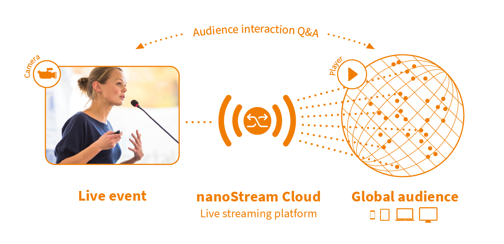

## nanoStream Cloud

### Overview

nanoStream Cloud is an unique platform and API for live video streaming in real-time, specifically designed for global interactive business applications. It enables you to create high-quality, ultra-low-latency live video experiences, whether for [live betting](https://www.nanocosmos.de/blog/category/interactive-use-cases/gaming-betting-interactive-use-cases/), [townhall meetings](https://www.nanocosmos.net/blog/category/interactive-use-cases/townhall-events/), [auctions](https://www.nanocosmos.net/blog/category/use-cases/live-auctions/), or e-commerce.

Built for reliability and scalability, nanoStream Cloud ensures high-quality live streaming experiences, supported by its commitment to 100% uptime and 24/7 operations.  
The platform includes a global Content Delivery Network, Adaptive Bitrate Player, Analytics and a hand full of powerful features, all crafted to enhance both the Quality of Experience and Quality of Service.

*Infographic: nanoStream Cloud Worklow*

### Live Encoding

Whether you use **software encoders**, **hardware devices**, or **browser-based tools**, nanoStream Cloud makes it simple to go live in real time.

You can ingest streams through popular protocols such as **RTMP**, **SRT**, **WHIP**, and **WebRTC**. nanoStream Cloud integrates easily with industry-standard tools like [OBS](https://www.nanocosmos.net/blog/how-to-use-obs-for-low-latency-live-encoding-to-nanostream-cloud/) or [Osprey Talon](https://www.nanocosmos.net/blog/osprey-talon-and-nanostream-cloud/). For instant browser-based streaming, the **nanoStream Webcaster** lets you broadcast directly without any plugins or third-party software.

This combination of flexibility, ultra-low latency, and browser compatibility makes nanoStream Cloud ideal for interactive applications where speed and simplicity matter most.

:::tip nanoStream Webcaster Resources
- **Try for free:** Check our end-to-end [instant test](https://www.nanocosmos.net/trial/) on our website.
- **Getting Started:** Learn how to stream directly from your browser. [Read docs →](../webrtc/nanostream_webrtc_getting_started)
- **Webcaster API:** Build your own web-based live broadcast solution with our JavaScript API. [View API Docs →](https://nanocosmos.github.io/webcaster/docs/)
:::

### nanoStream Player

Once your stream is live, **nanoStream H5Live Player** ensures your audience receives it instantly, on any device, anywhere in the world. As part of the nanoStream Cloud ecosystem, this browser-based playback solution delivers **ultra-low latency (\<500ms)** with smooth, adaptive performance.

The player automatically adjusts to the viewer’s network conditions using **[Adaptive Bitrate (ABR)](../dashboard/abr_transcoding)**, ensuring continuous playback even under changing connectivity. Developers can easily [embed the player into websites or apps](../dashboard/code_snippets) using a simple JavaScript API, while keeping control over latency, security, and appearance.

The **H5Live Player** is designed for performance, scalability, and brand integration, allowing you to maintain your look and feel while delivering the speed and reliability your users expect.

:::tip nanoStream H5Live Player Resources
- **Getting Started:** Understand the basics of nanoStream H5Live known as nanoPlayer. [Learn more →](../nanoplayer/nanoplayer_getting_started)
- **ABR & Stream Switching:** Discover how to enable automatic or viewer-controlled stream switching. [See details →](../nanoplayer/nanoplayer_feature_stream_switching)
:::

### nanoStream Analytics

To ensure the best possible live streaming experience, **nanoStream Analytics** provides real-time insight into both **Quality of Service (QoS)** and **Quality of Experience (QoE)**.

With detailed metrics on stream performance, viewer activity, and network behavior, you can identify trends, detect issues early, and make data-driven improvements to your live events. Custom alerts can help you monitor specific streams or regions.
Together with the **nanoStream Guardian**, you can also actively protect your streams by blocking unwanted access, whether by IP, referrer, or entire regions.

:::tip nanoStream Analytics Resources
- **Introduction:** Learn how to monitor and analyze your live streaming performance. [Read more →](../cloud/analytics)
- **nanoStream Guardian:** Discover how to secure your content with IP and referrer blocking. [See more →](../analytics/guardian)
:::

### Stream Management: Dashboard & API

All streaming operations can be managed through the **nanoStream Cloud Dashboard** (*which utilizes the bintu API*) or the **bintu API** directly.
This gives you full control over your streaming workflow, whether you prefer an intuitive web interface or direct API integration.

<article className="margin-vert--lg">
  <Columns className="list_ZO3j" >
    <Card className="col col--6 margin-horiz--md" href="../dashboard/overview">
      <Card.Header title="Dashboard" />
      <Card.Body className="padding-vert--md">
        The <strong>nanoStream Cloud Dashboard</strong> provides an intuitive, web-based interface to manage streams, analytics, and account settings, where no coding is required.
      </Card.Body>
    </Card>
    <Card className="col col--6 margin-horiz--md" href="https://doc.pages.nanocosmos.de/bintuapi-docs/">
      <Card.Header title="bintu API" />
      <Card.Body className="padding-vert--md">
        The <strong>bintu API</strong> enables developers to automate stream creation, grouping, tagging, and management for global, scalable live streaming operations.
      </Card.Body>
    </Card>
  </Columns>
</article>

## Why nanoStream Cloud?

**nanoStream Cloud** brings together all essential components for real-time live streaming, designed to meet the needs of interactive and business-critical applications.

- **Ultra-Low Latency:** Sub-second delay for true interactivity
- **Global Reach:** A worldwide CDN optimized for performance and stability
- **Smart Playback:** Adaptive Bitrate and latency control for every device
- **Security Built-In:** Token-based authentication, geo- and IP-blocking, and Guardian integration
- **Flexible Integration:** Browser-based tools and powerful APIs
- **Actionable Insights:** Real-time analytics for data-driven decisions
- **Ease of Use:** A modern dashboard for fast setup and management

Whether you are building a custom live video platform or streaming at scale, nanoStream Cloud provides the technology foundation for reliable, high-quality real-time video.

## Resources

Stay up to date with the latest nanoStream Cloud updates, best practices, and events:

- [Support](https://www.nanocosmos.net/support/)  
- [nanoStream Blog](https://www.nanocosmos.net/blog/)  
- [Career Opportunities](https://www.nanocosmos.net/blog/jobs/)  
- [Events](https://www.nanocosmos.net/events/)  
- [Partner Program](https://www.nanocosmos.net/nanostreamready/)  