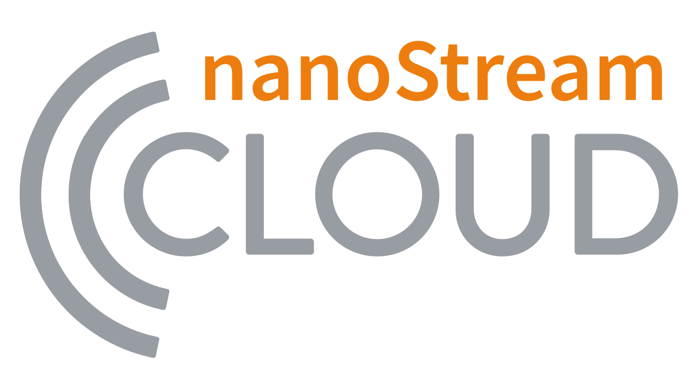

<!--  -->

## Real-time streaming to boost your business
Enable interactive live video experiences that engage your audience anywhere, any time

nanoStream Cloud is an unique platform and API for live video streaming in real-time, specifically designed for global interactive business applications. Whether it is for [live betting](https://www.nanocosmos.de/blog/category/interactive-use-cases/gaming-betting-interactive-use-cases/), [townhall meetings](https://www.nanocosmos.de/blog/category/interactive-use-cases/townhall-events/), or even e-commerce, nanoStream Cloud provides high-quality live streaming experiences, supported by its commitment to 100% uptime and 24/7 operations.  
The platform includes a global Content Delivery Network, Adaptive Bitrate Player, Analytics and a hand full of powerful features, all crafted to enhance both the Quality of Experience and Quality of Service.

## nanoStream Cloud Components

### Live Encoding
- Ingest with RTMP, SRT, WHIP and WebRTC such as with [OBS](https://www.nanocosmos.de/blog/2019/03/how-to-use-obs-for-low-latency-live-encoding-to-nanostream-cloud/) and [Osprey Talon](https://www.nanocosmos.de/blog/2023/02/osprey-talon-and-nanostream-cloud/) 
- Instest plugin-free directly from your browser with the included nanoStream Webcaster

<article className="margin-vert--lg">
  <Columns className="list_ZO3j" >
    <Card className="col col--6 margin-horiz--md" href="/docs/webrtc/nanostream_webrtc">
      <Card.Header title="Playground">Getting Started</Card.Header>
      <Card.Body className="padding-vert--md">nanoStream Webcaster will work as a powerful live encoder from the broadcaster/publisher side, ingesting directly into nanoStream Cloud.</Card.Body>
    </Card>
    <Card className="col col--6 margin-horiz--md" href="/docs/webrtc/nanostream_webrtc_api">
      <Card.Header title="TypeScript Support">Webcaster API</Card.Header>
      <Card.Body className="padding-vert--md">The nanoStream Webcaster Browser API is based on a Javascript API connected to the nanoStream WebRTC Server. It can be used for creating your own live video broadcast web page for plugin-free live streaming with WebRTC.</Card.Body>
    </Card>
  </Columns>
</article>

### nanoStream Player

- Live Playback is supported with our unique H5Live player. The same player code runs on all browsers. The player code can easily be embedded on your own web page with a code snippet shown on the player page, or managed by our Javascript API.
- Includes Adaptive Bitrate for playback with different quality levels, based on the viewer's network conditions. The player decides automatically which quality level to use.

<article className="margin-vert--lg">
  <Columns className="list_ZO3j" >
    <Card className="col col--6 margin-horiz--md" href="../nanoplayer/nanoplayer_getting_started">
      <Card.Header title="Configuration">Getting Started</Card.Header>
      <Card.Body className="padding-vert--md">nanoStream H5Live is a client-server technology based on nanoStream Cloud and nanoStream H5Live Player (aka nanoPlayer).</Card.Body>
    </Card>
    <Card className="col col--6 margin-horiz--md" href="../nanoplayer/nanoplayer_feature_stream_switching">
<Card.Header title="Installation">ABR & Stream Switching</Card.Header>
    <Card.Body className="padding-vert--md">The stream switching and integrated adaptive bitrate playback enables automatic and application/viewer controlled stream switching either separately or in combination.</Card.Body>
    </Card>
  </Columns>
</article>

### nanoStream Analytics

Complete streaming metrics overview for insights on Quality of Service and Quality of Experience.

#### Security
- Geo blocking
- Token-based security
- nanoStream Guardian for IP and Referrer blocking

<article className="margin-vert--lg">
  <Columns className="list_ZO3j" >
    <Card className="col col--6 margin-horiz--md" href="/docs/cloud/analytics">
      <Card.Header title="Playground">General</Card.Header>
      <Card.Body className="padding-vert--md">nanoStream Cloud Analytics offers a great way to monitor and analyze the performance and quality of service of your live streams.</Card.Body>
    </Card>
    <Card className="col col--6 margin-horiz--md" href="/docs/analytics/guardian">
      <Card.Header title="Security">nanoStream Guardian</Card.Header>
      <Card.Body className="padding-vert--md">nanoStream Guardian is a new service integrated into nanoStream Cloud, which allows you to block specific IP addresses, referrers, and even entire CIDR masks from accessing your streams.</Card.Body>
    </Card>
  </Columns>
</article>

### Stream management dashboard and API

Stream Management is done with our bintu dashboard and API. You will obtain and manage geo-loadbalanced URLs to enable global scale.

<article className="margin-vert--lg">
  <Columns className="list_ZO3j" >
    <Card className="col col--6 margin-horiz--md" href="/docs/dashboard/overview">
      <Card.Header title="Installation">Dashboard</Card.Header>
      <Card.Body className="padding-vert--md">The nanoStream Cloud Dashboard is a web-based tool implemented and designed to provide users with an intuitive and comprehensive overview of their streaming activities.</Card.Body>
    </Card>
    <Card className="col col--6 margin-horiz--md" href="https://doc.pages.nanocosmos.de/bintuapi-docs/">
      <Card.Header title="Configuration">Bintu API</Card.Header>
      <Card.Body className="padding-vert--md"> bintu.live is a stream management platform used by nanoStream for end to end live streaming services. bintu live can be used to create, manage, group and tag live streams. </Card.Body>
    </Card>
  </Columns>
</article>

## nanoStream Cloud at a glance

- Sub-second latency
- Global footprint 
- Active stream protection
- Live Transcoding and Adaptive Bitrate
- Browser-based playback
- Support to all major protocols RTMP, WebRTC, SRT, WHIP and more
- Included Webcaster for streaming directly from the browser
- Powerful API
- User-friendly dashboard
- Analytics

## Resources

You can keep up with the latest news updates of nanoStream Cloud, upcoming events and industry trends by following our [blog](https://www.nanocosmos.de/blog/).
