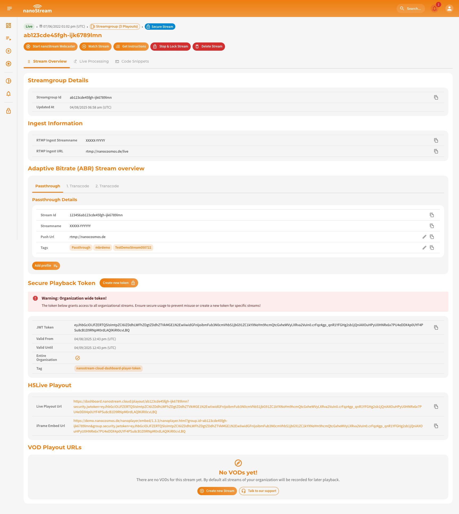

:::warning Deprecated Feature 🚨 

You're looking at a deprecated feature. Please use the new [live processing recording](../cloud/live_processing#recording) instead.


:::


:::info Live Recording and VOD will require a business upgrade
Please reach out to our dedicated sales team via the [contact form](https://www.nanocosmos.de/contact) or by sending an email to sales(at)nanocosmos.de
:::

## Overview

Live recording and Video on Demand (VOD) enable you to automatically archive your incoming live streams for later playback. When recording is enabled, nanoStream Cloud captures the upstream signal in real time and stores it securely in a regional data center. The resulting MP4 file can then be accessed, downloaded, or embedded as VOD content.

Typical use cases include:

- Rewatching live events after the session has ended
- Publishing recordings on websites or media portals
- Compliance or auditing requirements
- Backup copies of live productions

You can choose whether a stream should be **live only** or **live + recorded**. This is fully controlled via the ingest URL.

## Ingest Options

| Mode | Description | Ingest URL Pattern |
|--------|------------|-------------------|
| **Live only** | Stream is delivered live without creating a recording | `rtmp://bintu-stream.nanocosmos.de/live/STREAM-ID` |
| **Live + Recording (VOD)** | Stream is delivered live and recorded for later playback | `rtmp://bintu-stream.nanocosmos.de/rec/STREAM-ID` |

If recording is **not enabled** for your account, all ingest URLs will behave as **live only**. If enabled, by default all incoming streams will be recorded.

## Storage Regions

Recordings are stored automatically in the region closest to the ingest location to ensure low latency and optimal performance. nanoStream Cloud currently supports:

| Region | Storage Identifier |
|---------|-------------------|
| **Europe (default)** | `-eu-` |
| **North America** | `-us-` |
| **Australia / Oceania** | `-au-` |


This region is reflected in the VOD playback URL.

## VOD Playback URLs

Once the stream is recorded and processed, a VOD URL becomes available in MP4 format.

Example URLs by region:

| Region | Example VOD URL |
|---------|----------------|
| Europe | `https://bintu-vod-eu.nanocosmos.de/XXXXX/XXXXX-12345.mp4` |
| North America | `https://bintu-vod-us.nanocosmos.de/XXXXX/XXXXX-12345.mp4` |
| Australia | `https://bintu-vod-au.nanocosmos.de/XXXXX/XXXXX-12345.mp4` |


:::tip Playback Performance
To achieve best playback performance, choose the VOD URL matching the region where the recording was stored.
:::

## Accessing Recorded VODs

Once a stream has been recorded, you can access its corresponding VOD asset either **programmatically** via the **bintu REST API**, or directly through the **nanoStream Cloud Dashboard**. Each recorded stream is linked to a unique asset (the `.mp4` file) stored in the respective region, as mentioned above.

### Get VOD Assets via REST API

The [bintu REST API](https://doc.pages.nanocosmos.de/bintuapi-docs/#operation/Stream%20Info) allows you to retrieve all details of a stream, including available recordings and their playback URLs. There you can also learn how to read the responses. You can query your VOD assets with a simple `GET` request to the **Stream Info** endpoint:

**Parameters**:
- `YOUR_STREAM_ID` – the unique ID of your live stream in nanoStream Cloud
- `asset_limit` – optional parameter defining how many assets (recordings) should be returned
- `X-BINTU-APIKEY` – your API key for authentication

```js title="bintu/get_vod_assets.sh"
curl --request GET \
  --url 'https://bintu.nanocosmos.de/stream/YOUR_STREAM_ID?asset_limit=10' \
  --header 'X-BINTU-APIKEY: REPLACE_WITH_YOUR_API_KEY'
```
:::note Advanced Developer bintu API docs
For additional languages, advanced configuration options, and complete request/response samples, please refer to the official **bintu API documentation**: [doc.pages.nanocosmos.de/bintuapi-docs](https://doc.pages.nanocosmos.de/bintuapi-docs). \
The API reference provides full details on all available endpoints and workflows for managing stream options, including the topic discussed in this section.
:::

:::tip Developer Tip
If your application manages multiple streams, you can use the bintu API to list and filter VOD assets automatically.
:::


### Get VOD Assets via Dashboard

The VOD playback URLs can be easily accessed through the nanoStream Cloud Dashboard. Each [stream overview](/docs/dashboard/stream_overview#single-stream-overview) entry contains a section that lists **recorded assets** (VOD Playout URLs).


*Screenshot: Example Stream Overview (Streamgroup)*

:::tip Accessing the recorded assets

The URLs can be accessed in various areas of the dashboard:

- **Playout Overview**: [dashboard.nanostream.cloud/playout/YOUR-STREAM-ID](https://dashboard.nanostream.cloud/playout/YOUR-STREAM-ID)
- **Stream Overview**: [dashboard.nanostream.cloud/stream/YOUR-STREAM-ID](https://dashboard.nanostream.cloud/stream/YOUR-STREAM-ID)
- **Webcaster Overview**: [dashboard.nanostream.cloud/webcaster/YOUR-STREAM-ID](https://dashboard.nanostream.cloud/webcaster/YOUR-STREAM-ID)
:::