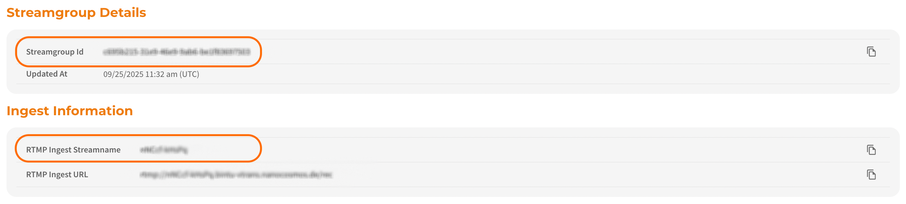

The **AI-powered real-time captioning** feature takes spoken language and shows it as text, in real time, helping viewers quickly understand what’s being said in the stream.  
It is designed for **live events that demand precision, accessibility, and scalability**.  

:::note
This feature is available **via API only** and does not include a built-in UI.  
Integration into your playback system or application is required.
:::

## Benefits

- Provides dynamic and accurate readable content to enhance user engagement  
- Improves the user experience by letting viewers follow along without sound  
- Helps users hard of hearing to stay focused on what’s being said

:::tip Prerequisites
To enable and use the live captioning feature, the following requirements must be met:
- Live captions must be enabled for your organisation  
- Pricing and payment options must be set up, as live captions is a business option  
- An Automatic Speech Recognition (ASR) engine type must be selected
:::

:::info
Some of our ASR services require 24 hours’ prior notice.
Please contact our [Sales team](https://www.nanocosmos.net/contact/) to find the best setup for your organisation and to receive comprehensive information about ASR types based on your use case.
:::

## Quick Start: Enabling Live Captions via API

This guide provides a high-level overview of how to enable live captions for your stream using the **Bintu API**.

### 1. Getting Started
First, you need to create a stream.  More information can be found here: [Start Streaming](https://docs.nanocosmos.de/docs/dashboard/start_streaming)

### 2. Activate Captions
To configure live captions, you need to collect the following information:

- `StreamgroupId` / `StreamName` 

   

- `ApiKey`  

  

:::tip Your API key
You can find your bintu API key on the [organisation overview page](https://dashboard.nanostream.cloud/organisation).
:::

This information has to be provided to the **Bintu API** to enable live captions for your stream.  

➡️ [How to configure Live Captions](https://doc.pages.nanocosmos.de/bintuapi-docs/#tag/Stream-Options)

### 3. Stream & Consume Captions
- Live captions and caption switcher are **not part of the H5Live Player** and are not embedded automatically.  
- Captions are generated in real time and made available through a **dedicated output channel**.  
- To allow end users to enable/disable captions, you must integrate captions functionality into your playback system or application. [Contact nanocosmos support]() for detailed integration instructions.  
- Live captions start automatically with the stream  
- The first captions appear within **5–7 seconds** depending on the ASR provider  
- Captions stop automatically when the stream ends 

:::warning 
If your stream is already live and you change live caption settings, updates will only take effect after you stop and restart the stream.
:::

## Languages Overview
| Language  | Description                 |
| ---------- | --------------------------- |
| `en` | English |

## Looking Ahead

As AI technology continues to advance, we’re excited about the possibilities ahead. Our roadmap includes:

- **Multi-language translation** to allow single streams to serve diverse global audiences  
- **Industry-specific optimization** with specialized terminology  
- **Superior subtitle accuracy** through continuous learning from client feedback  
- **Deeper integration** with business systems and workflows (e.g., Cloud platform Dashboard)  

:::info Questions?
Provide your live caption preferences via the [contact form](https://www.nanocosmos.net/contact) or by sending an email to sales(at)nanocosmos.net.  
**For technical questions you can use our [support form](https://www.nanocosmos.net/support).**
:::

