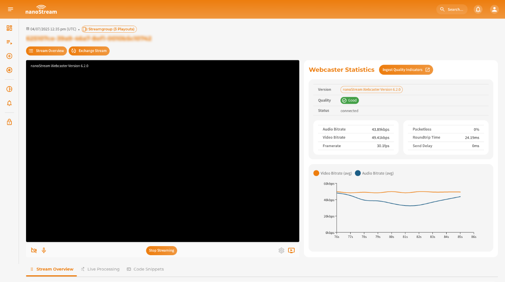

Live encoding is the first step in every live streaming workflow. A live encoder takes your camera or screen signal, compresses it in real time (typically using **H.264/AAC**) and sends it to **nanoStream Cloud** via an ingest protocol such as **RTMP, SRT or WHIP**. Once received, nanoStream Cloud distributes the stream worldwide with ultra-low latency.

On this page you will learn what your encoding options are, the recommended settings, and how to connect with the most common encoders.

## Live Encoding Options

nanoStream Cloud works with browser-based, software-based, and hardware-based encoders:
- **Browser Encoder**: nanoStream Webcaster
- **Software Encoder**: OBS Broadcaster Software, Wirecast, VMix, ffmpeg
- **Hardware Encoder**: JVC Connected Camera, Videon, Teradek, and others

### Supported Formats

| Encoder | Video Codec | Audio Codec | Container |
|---------|-------------|-------------|-----------|
| nanoStream Webcaster | H.264 | Opus | WebRTC |
| Software/Hardware Encoders | H.264 | AAC | RTMP |
| On Request | H.265, SRT, RTSP | - | – |

### Encoder Setup

In this section, we have outlined the setup for the most commonly used encoders, nanoStream Webcaster, OBS, and Osprey Talon.

import Tabs from '@theme/Tabs';
import TabItem from '@theme/TabItem';

<Tabs
  defaultValue="webcaster"
  values={[
    {label: 'nanoStream Webcaster', value: 'webcaster'},
    {label: 'OBS Studio', value: 'obs'},
    {label: 'Osprey Talon', value: 'osprey'},
  ]}>
  <TabItem className="tab-item" value="webcaster">
  
  The **nanoStream Webcaster** is a browser-based encoder that requires no installation or plugins. It is ideal for quick broadcasts live streaming setups.

  You can stream directly from your browser by going to [dashboard.nanostream.cloud/webcaster](https://dashboard.nanostream.cloud/webcaster) and creating a new stream or by selecting an existing one. Alternatively, it is possible to manually append the stream ID to the URL at any time, e.g. `dashboard.nanostream.cloud/webcaster/YOUR-STREAM-ID`.

  **Steps:**
  1. Open the Webcaster via Dashboard → *Webcaster*
  2. Select or create a Stream
  3. Choose camera and microphone
  4. Click **Start Broadcast**

  To learn more about how to set up the webcaster and process the stream, simply refer to our dedicated docs: [Ingesting with the nanoStream Webcaster](/docs/dashboard/start_streaming#ingesting-with-the-nanostream-webcaster).

  If you prefer to assemble the nanoStream Webcaster yourself, you can find all available methods in our [Webcaster API](https://nanocosmos.github.io/webcaster/docs/).

  
  *Screenshot: nanoStream Webcaster*

  </TabItem>

  <TabItem className="tab-item" value="obs">
  
  **OBS Studio** (Open Broadcaster Software) is a free, powerful software for professional live streaming. It allows you to broadcast to **nanoStream Cloud** while giving full control over video quality, bitrate, and encoder settings.
  
  OBS offers **nanoStream Cloud** as a streaming service for automatic setup, making configuration simple and fast.
  
  **Steps:**
  1. Download & Install [OBS Studio](https://obsproject.com/).
  2. Open OBS and go to `Settings → Stream`.
  3. Under **Service**, select `Other… → nanoStream Cloud/bintu`.
  4. Enter the **Stream Key**, known as **Stream name** in nanoStream Cloud Dashboard (e.g., `ABCDE-XYZ12`). 
  5. Configure video source (add source, arrange overlays, etc.)
  6. Start Streaming around the world!
  7. Check your nanoStream Cloud Dashboard to confirm that the live stream is running.

  :::tip Start Streaming
  Learn how to start and share a stream, including the necessary steps and details for a seamless setup [here](/docs/dashboard/start_streaming#start-streaming).
  :::

  -----

  If you need more guidance, read our extended blog post about [Low Latency OBS: How to use OBS for Low Latency Live Encoding to nanoStream Cloud](https://www.nanocosmos.net/blog/how-to-use-obs-for-low-latency-live-encoding-to-nanostream-cloud/).

  <div class="video-wrap">
      <div class="video-container">
          <iframe src="https://www.youtube.com/embed/vkQmMIQJl_4?si=PtzBgA52KC3Su1wA" frameborder="0" allowfullscreen></iframe>
      </div>
  </div>
  *Video Tutorial: Set up OBS with nanoStream Cloud*

  </TabItem>

  <TabItem className="tab-item" value="osprey">
  
  [Osprey Talon](https://www.ospreyvideo.com/) is a professional hardware encoder that allows you to broadcast high-quality, ultra-low-latency streams to **nanoStream Cloud**. This guide walks you through configuring your device for RTMP, SRT, and WHIP ingestion.

  #### Step 1: Login to your Osprey Device
  
  Access your Osprey Talon via a web browser using the device IP. \
  Default credentials: **Username:** `admin` / **Password:** `osprey`
  
  #### Step 2: Select the Upstream Protocol

  Osprey Talon supports multiple protocols for live ingest. nanoStream Cloud supports **RTMP**, **SRT**, and **WHIP**. You can find the appropriate ingest URL and stream name in your **nanoStream Cloud Dashboard** in the [stream overview](/docs/dashboard/stream_overview).
  
  Once logged in, navigate to `Output → Upstream Protocol` to configure the first channel.


  #### a) RTMP

  For the most common setup:
  1. Select `nanocosmos (RTMP)` or `RTMP/RTMPS` in the Protocol dropdown.
  2. In the `Destination URL`, enter your RTMP ingest URL (e.g., `rtmp://bintu-stream.nanocosmos.de/live`).
  3. Enter the **Stream Key**, known as **Stream name** in nanoStream Cloud Dashboard (e.g., `ABCDE-XYZ12`). 

  #### b) SRT
  
  SRT provides reliable streaming over unpredictable networks and can be used as an alternative to RTMP.
  
  1. Select **TS over SRT** as the protocol.
  2. Set **SRT Mode:** `Caller`.
  3. **Destination Address:** `bintu-srt.nanocosmos.de`.
  4. **Port:** `5000`.

  :::tip When to use SRT
  SRT is ideal for low-latency streaming in challenging network conditions, as it handles packet loss and jitter automatically.
  :::
  
  
  #### c) WHIP (WebRTC-based Ingest)
  
  WHIP allows **browser-friendly, ultra-low-latency ingest** via WebRTC.
  1. Select **nanocosmos WHIP** as the protocol.
  2. Enter the **Stream Key**, known as **Stream name** in nanoStream Cloud Dashboard (e.g., `ABCDE-XYZ12`). 
  
  :::tip When to use WHIP
  WHIP is recommended for scenarios where ultra-low latency and direct WebRTC playback are required, such as interactive webinars or live betting.
  :::

  #### Step 3: Video Configuration & Start Your Broadcast
  
  1. Configure the video source, resolution, and encoding settings for your broadcast.
  2. Click `Actions → Start` to begin streaming.
  3. Check your nanoStream Cloud Dashboard to confirm that the live stream is running.

  ------

  If you need more guidance, have a look at our blog post [Tutorial: Osprey Talon and nanoStream Cloud](https://www.nanocosmos.net/blog/osprey-talon-and-nanostream-cloud/).
  
  </TabItem>
</Tabs>

## Encoder Configuration

The visual quality of a live stream is determined primarily by two variables: **resolution** and **bitrate**. 
Resolution defines how many pixels are transmitted (e.g. `1280×720`), while the bitrate defines how much data per second is available to represent motion and detail (e.g. `500 kbit/s`). 
Both settings must be in balance, especially for low-latency environments. 

Live streaming behaves differently from file-based video. 
Lower latency means less buffering, which reduces tolerance for unstable networks. Because of that:


| Configuration | Description |
|---------------|-------------|
| **Avoid changing resolutions during a stream** | For live streams, a constant pixel resolution is required, as most streaming and playback environments do not support changing resolutions while streaming. |
| **Mobile networks require lower bitrates** | Mobile networks have limited bandwidth and usually lead to a quality impact of a stream. If you set a high bitrate for your stream, which cannot be delivered through the network, your clients will experience buffering and stream freezes during the playback. |
| **High-motion content needs more bitrate than static content** | Video Encoding Quality is very much dependent on the content. Static content with little movement and structure is much better to compress than moving content. |


:::tip Test your content
It is highly recommended to run your own tests based on typical content, and approve by your own quality expectations.
:::

### General Recommendations

nanoStream Cloud works with a wide range of live encoder configurations. In general, there are some common recommendations for ultra-low latency:

| Setting | Recommendation |
|---------|----------------|
| **Frame rate** | 25 or 30 fps, not 60 |
| **Encoder GOP Size** | ~2 seconds (e.g. 50-60 frames for 25/30 fps) |
| **Bitrate** | Choose *as low as possible, as high as necessary* |
| **Camera Resolution** | Configure the camera with the max. resolution you would like to use for streaming, *not higher*. Don't capture `1080p` if you stream with `720p` |
| **Upscaling** | Avoid upscaling, it wastes bandwith and reduces quality |
| **Resolution Choice** | Prefer `720p` for ultra-low latency use cases|


### Standard Resolutions 

-  640x480 (4:3) 
-  640x360 (16:9)
-  240p (424x240)
-  360p (640x360)
-  432p (768x432)
-  480p (848x480)
-  576p (720x576 or 1024x576, "SD")
-  720p (1280x720, "HD")
-  1080p (1920x1080, "Full HD")

### Recommended Bitrates

| Resolution | Recommended Bitrate |
|------------|---------------------|
| **≤ 576p** (*up to 720x576*) | ≤ 300-500 kBits/s (medium), ≥ 1000 kBit/s (high) |
| **720p HD** (*1280x720*) | 600-1000 kBits/s (low/medium), ≥ 1000-2000 kBits/s (high) |
| **1080p Full HD** (*1920x1080*) | ≥ 2-3 MBit/s |
| **4K** (*4096x2160*) | ≤ 6 MBit/s |

:::info Low-bandwith tip
If you expect to have audiences in bad network environments (e.g. mobile or public Wi-Fi), we suggest to reduce the bitrate to far below `1 MBit/s - (1000 kBits/s)`, for example `500 kBits/s`.
:::

## Stream Configuration

RTMP is the default ingest format for nanoStream Cloud. You receive your RTMP ingest URL via Dashboard or API and enter it into your encoder.
Any RTMP-capable encoder can be used. 

:::tip Getting Started
To learn how to retrieve the ingest information and successfully start a stream, we have written a detailed guide. 
There you will once again find instructions for the most common encoders (including the nanoStream Webcaster, OBS and Osprey Talon).

- **[Getting started with nanoStream Cloud](/docs/cloud/cloud_getting_started)**.
:::


## Data Traffic (Bandwith Usage)

Data traffic depends and grows with the `bitrate sent from the encoder` and the `bitrate received for every viewer`.
You can estimate the required upstream or downstream traffic per hour as:

```sql
bitrate(kbit/s) × 3600 / 8 = MB per hour
```

**Example**

| Bitrate | Approx. Data per Hour |
|---------|-----------------------|
| **500 kBits/s** | ~225 MB / hour |
| **1000 kBits/s** | ~450 MB / hour |


## Adaptive Bitrate / Multi-Bitrate Live Streaming

To adjust to network conditions, certain adaptive bitrate (ABR) configurations are available.

- **Dynamic Upstream**: Automatic adjustment of live encoder bitrate (dependent on your live encoder)
- **Multiple Bitrates (MBR)**: To support multiple video quality levels, you can send multiple streams in multiple bitrates (e.g., 2000 + 500 kbit/s). You can send your own MBR stream or use **our live transcoding service**.
- **Downstream**: [ABR Playback](../nanoplayer/nanoplayer_feature_stream_switching): Automatic adjustment of the quality on the player side

For ABR Playback, several live streams need to be running at the same time with different quality levels. These streams can either be created on the encoder side or on the server side by live transcoding, based on one incoming stream.

:::info Adaptive Bitrate (ABR) and Live Transcoding with nanoStream Cloud
- Learn what adaptive bitrate playback and live transcoding are and how you can set them up in the nanoStream Cloud Dashboard, [by clicking here](/docs/dashboard/abr_transcoding).
- To understand how stream switching and ABR work on the player side, visit the [player docs](/docs/nanoplayer/nanoplayer_feature_stream_switching).
:::

## Additional info

See the links below for recommendations by apple, youtube, vimeo and adobe:
- https://developer.apple.com/library/ios/technotes/tn2224/_index.html
- http://support.google.com/youtube/bin/answer.py?hl=en&answer=1722171
- http://vimeo.com/help/compression
- http://www.adobe.com/devnet/adobe-media-server/articles/dynstream_live/popup.html

