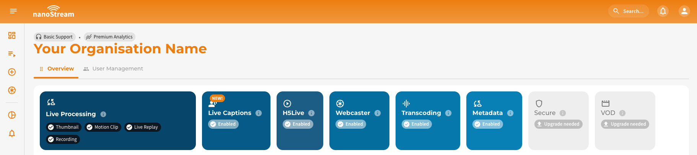

As part of [**nanoStream Control — the security and intelligence layer of the nanoStream Platform**](https://www.nanocosmos.net/blog/nanostream-control-monitor-protect-and-optimize-your-real-time-video-experience/) — nanoStream Security provides a comprehensive, multi-layered framework designed to protect your data, secure live and on-demand streaming, and control user access throughout the entire workflow. The platform combines encryption, authorization controls, and role-based access management to maintain reliability and prevent unauthorized usage.

## New Security Features in 2026

In 2026, several enhancements were introduced to strengthen playback security and access control:

### Revocation of Secure Playback Tokens (JWT)

Secure Playback Tokens (JWTs) can now be revoked to immediately invalidate playback credentials when needed. This prevents unauthorized use of compromised tokens.  
[Learn more about token revocation](/docs/cloud/security_token_revocation)

### Active Playback Session Termination After Token Expiration (forceDisconnect)

An **option** was added to terminate active playback sessions once the associated JWT expires. When enabled, this “forceDisconnect” policy ensures expired tokens cannot continue streaming.  
[Learn more about playback token expiration](/docs/nanoplayer/nanoplayer_security_jwt#playback-token-expiration)

### Referrer Allow‑Listing in the Guardian API

Referrer allow‑listing was added to give finer control over playback origins. Only requests from allow‑listed domains are permitted to play your streams, improving domain‑based access control.
[Learn more about referrer allow-listing](/docs/cloud/guardian#allow-list-a-set-of-referrer-domains)

### Playback Token Analytics and Revocation in Guardian 

Playback token analytics have been added in the Guardian to help detect potential misuse or unusual activity. It also allows to quickly revoke tokens to prevent further access.
[Learn more about the Guardian](/docs/analytics/dashboard/guardian)

## Security Architecture Overview

nanoStream security is built around three pillars: **Prevention**, **Detection**, and **Response**. Each layer reinforces the others, creating a defense-in-depth approach that makes unauthorized access increasingly difficult and unsustainable for attackers.

{/* Images generated by /scripts/generate-security-images/gen-security-pillars.py */}
<div style={{ display: 'flex', justifyContent: 'space-between', alignItems: 'flex-start' }}>
  
  
  
</div>

## Key Security Principles

- **Reliability & Resilience**: A globally distributed infrastructure with built-in redundancy and automatic failover ensures stable 24/7 operation.
- **Encryption**: Secure streaming with transport-level and protocol-level encryption.
- **Fine-Grained Authorization**: Secure tokens, webhooks, and signed URLs provide precise control over stream ingest, playback, and API access.
- **Access Control**: Role-based permissions ensure that only authorized users can perform sensitive operations.
- **Token-Based Playback**: Playback via the H5Live Player can be protected using JWT tokens for secure, time-limited, or domain-restricted viewing.

## Encrypted Streaming

nanoStream ensures that data transfer across ingest, control, and playback layers is encrypted using modern standards.  
All H5Live Player and Webcaster operations run over **HTTPS/TLS**, ensuring secure communication by default. For ingest workflows, you may choose to enforce encrypted streaming using **RTMPS** instead of standard RTMP. RTMPS provides SSL encryption to protect audio/video data as it is sent to nanoStream.

Typical ingest endpoints:

- **RTMP (non-encrypted):** `rtmp://bintu-stream.nanocosmos.de:1935/live/STREAM-NAME`
- **RTMPS (encrypted):** `rtmps://bintu-stream.nanocosmos.de:1937/live/STREAM-NAME`
- **SRT   (encrypted):** `srt://bintu-srt.nanocosmos.de:5000?streamid=push:STREAM-NAME&...`

Encrypted ingest is strongly recommended for any public, external, or production-level environment.

## Secure Playback

nanoStream supports token-based access control for secure playback, which integrates with the H5Live Player to ensure that only authorized viewers can access a stream. This mechanism protects your streams from unauthorized access, sharing, or embedding. With token security, you can control who can watch a stream, when access is permitted, and under which conditions, making tokens a key component of a secure streaming setup.

The secure token format is **JWT (JSON Web Token)**, a fast, reliable, and user-friendly way to protect your content.

Tokens can be created via our dedicated [API](/docs/nanoplayer/nanoplayer_security_jwt) or via the UI of our [nanoStream Dashboard](/docs/dashboard/secure_playback).

:::warning Prerequisites
To make use of **Secure Playback**, it must be explicitly enabled for your organization. Activation may be subject to additional pricing or service terms.

You can verify whether this feature is available by navigating to [dashboard.nanostream.cloud/organisation](https://dashboard.nanostream.cloud/organisation) in your dashboard.  
In the **[Enabled Packages](./organization_overview#enabled-packages)** section, locate the entry for `Secure`. If it shows **Upgrade needed**, please contact us.

  

To activate `Secure` or learn more about available plans, feel free to reach out via [nanocosmos.net/contact](https://www.nanocosmos.net/contact). We're happy to assist you in finding the best setup for your use case.
:::


:::info Secure Organizations
Once your organization enables secure playback, **all H5Live stream playbacks require a valid token**. Streams cannot be played without one.
*For this reason, we recommend setting up a separate Bintu organization for initial testing to avoid affecting your production workflow.*
:::

### Creating Playback Tokens

Tokens can be created in two ways:

- **Via Dashboard** — Create tokens directly in the nanoStream Dashboard UI without writing code, ideal for testing and manual workflows.
- **Via Token API** — Use the Token API to generate JWTs programmatically, with optional restrictions such as expiration time, allowed domain, viewer IP, and user identifiers. This is recommended for production systems where tokens should be created dynamically per viewer session.

:::tip Developer Tip
You can generate playback tokens dynamically (e.g., per user session) by integrating the Secure Playback API into your backend.
This is recommended for all access-controlled streaming systems.
:::

:::tip Deep Dive
- **[JWT Secure Playback API](/docs/nanoplayer/nanoplayer_security_jwt)** — full API specification with endpoints, parameters, request/response examples, and player integration guide.
- **[Dashboard Secure Playback Guide](/docs/dashboard/secure_playback)** — step-by-step walkthrough with screenshots for creating tokens via the Dashboard.
- **[Token Best Practices & Backend Integration](/docs/cloud/security_token_best_practices)** — recommended token workflow, best practices for token restrictions, and a complete backend integration example.
- **[Token Revocation](/docs/cloud/security_token_revocation)** — how to create revocable tokens and immediately invalidate compromised JWTs across the entire delivery network.
:::

## nanoStream Guardian

nanoStream Guardian is a real-time protection layer that lets you manage and enforce access rules for IPs, CIDRs, ASNs, and referrers, giving you additional control over who can view your streams and under what conditions. Guardian helps you mitigate threats such as illegal restreaming and unauthorized embedding.

Guardian can be used directly from the Analytics Dashboard or via a dedicated Guardian API, enabling both manual operation and automated workflows.

Get a deep dive by visiting the [dedicated nanoStream Guardian docs](/docs/cloud/guardian). For a walkthrough of the Guardian controls in the Analytics Dashboard, see the [Analytics Guardian Guide](/docs/analytics/dashboard/guardian).

## Webhooks & Ingest Authorization

Webhooks provide server-side authorization for ingest workflows and are the recommended method to control RTMP/RTMPS publishing. When a client attempts to start or stop publishing a stream, Bintu sends a webhook request to your backend. Your service can allow or reject the ingest based on authentication, user permissions, or business logic.

Webhooks enable secure, real-time control over:

- **on_publish**: client attempts to start publishing
- **on_publish_update**: recurring interval-based updates during the publishing
- **on_publish_done**: publishing ends

For detailed examples, authentication methods, and integration guidelines, visit our dedicated docs: [Bintu custom web hooks](/docs/cloud/bintu_custom_webhooks).

## Role-Based Access Control (RBAC) & API Security


nanoStream includes a role-based permission model to ensure that only authorized users can perform critical or sensitive operations. This applies to both the Dashboard and the Bintu API.

| User Role | Responsibility | Access Level | Permissions |
|---|---|---|---|
| <span className="role role-admin">nanoAdmin</span> | The Administrator  | Highest  | Has full control over all functions within the organization, including managing user roles and issuing new tokens to disable existing ones. **Is the *only* role with access to user management and the API Key.**  |
| <span className="role role-user">nanoUser</span>    | The Operator  | High  | Can perform all tasks related to stream management and operations, expect for changes that could disrupt operations, such as deleting or stopping streams or changing critical settings. |
| <span className="role role-readonly">nanoReadOnly</span>| The Observer  | Low  | Has read-only access to basic information such as stream configuration, stream states, metrics and alerts. |

:::tip Additional Resources
We have outlined the concepts and advantages of [Role-Based Access Control (RBAC)](/docs/cloud/user_roles) on the dedicated page. In addition, this page provides a detailed description of how to get started with roles, which roles are available, which API endpoints can be accessed and a high-level permission overview.

For more information on how to manage users in an organisation, please refer to our [User Management Guide](/docs/dashboard/user_management), which includes instructions on how to manage users, and invite new ones.
:::

## Understanding Stream Misuse

The most common attack against live streaming services is the **Man-in-the-Middle (MITM) relay attack**. Understanding how it works is essential for effective detection and response.

### How Restreaming Attacks Work

```
nanoStream → Misuse Server (Relay) → Misuse CDN → Unauthorized Viewer
```

1. The attacker obtains a valid playback URL and token - either by using a legitimate client session from a web application, or by abusing the customer's token generation backend.
2. The attacker's relay server connects to a nanoStream playback server using the stolen token.
3. The relay server re-distributes the stream to an unauthorized destination (via WebSocket relay, HLS, WebRTC, or other protocols).

### Why Token Restrictions Matter

- A token created without IP restrictions and a long expiration (e.g., 1 hour) can be used to play the stream from any location.
- Domain/referrer restrictions can be bypassed via referrer spoofing by the relay server.
- **IP restrictions cannot be spoofed** — they provide the strongest per-viewer protection.

### Detecting Misuse

The Analytics Dashboard provides two complementary views for analyzing playback patterns and identifying suspicious activity:

- **[Guardian View](/docs/cloud/guardian)** — aggregates playback data **by IP address**. This view helps you spot individual clients or networks exhibiting unusual behavior, such as repeated reconnects, high connection counts from a single IP, or traffic from unexpected geographic regions. It is the primary view for identifying and blocking specific viewers or subnets.

- **[Token Guardian View](/docs/cloud/security_token_guardian_view)** — aggregates playback data **by token**. This newer view enables you to trace how each issued token is being used across IPs, sessions, and referrers. It is particularly valuable for detecting token sharing, relay setups, and unauthorized redistribution.

Both views provide the option to analyze playback patterns and take immediate action (e.g., blocking IPs or referrers). Key indicators of suspicious activity to watch for include:

- **Multiple IPs per token** — a single token used from many IP addresses
- **Data center traffic** — playback originating from cloud providers rather than residential ISPs
- **Referrer anomalies** — unknown domains or missing referrers
- **Geographic spread** — a single token active across multiple countries simultaneously
- **High concurrency** — a user-bound token with more than 2 simultaneous sessions
- **Unusually long playback duration** — characteristic of relay servers that must stay connected continuously

For a detailed walkthrough of the token-based analysis workflow, visit the [Token Guardian View](/docs/cloud/security_token_guardian_view) documentation. For the IP-based Guardian View, see the [nanoStream Guardian](/docs/cloud/guardian) page.

## Best Practices Checklist

The following checklist summarizes the recommended security configuration for nanoStream:

### Token Configuration
- [ ] Use **short-lived tokens** (5–30 minutes for high-security use cases, up to 24 hours maximum)
- [ ] Restrict tokens to **specific streams or stream groups** (avoid organization-wide tokens in production)
- [ ] Bind tokens to the **viewer's IP address** whenever possible
- [ ] Bind tokens to your **playback domain**
- [ ] Include a **user identifier** (`user` field) in every token
- [ ] Use **tags** for traceability and misuse analysis
- [ ] Create tokens as **revocable** (`revocable: true`) for high-value events and per-user access

### Backend Security
- [ ] Use **Bintu tokens** (`X-BINTU-TOKEN`) for API authentication — they are temporary, role-scoped, and can be [invalidated](https://doc.pages.nanocosmos.de/bintuapi-docs/#tag/User/paths/~1user~1tokenkey/put) if compromised
- [ ] Store credentials **exclusively on the backend** — never in client-side code
- [ ] **Authenticate users** before issuing playback tokens
- [ ] Validate `Origin` / `Referer` headers and enforce **CORS**
- [ ] Log token issuance and playback attempts

### Monitoring
- [ ] Regularly review the **Guardian View** and **Token Guardian View** for anomalies
- [ ] Watch for traffic from **cloud providers / data centers** (non-residential ISPs)
- [ ] Investigate tokens with **multiple IPs**, **missing referrers**, or **multi-country usage**
- [ ] Monitor for **unusually long playback durations** and **high concurrency**

### Response
- [ ] Use **nanoStream Guardian** to block confirmed malicious IPs and referrers
- [ ] Report unauthorized restreaming sites to nanocosmos for misuse analysis and support
- [ ] Consider **ASN blocking** for attacks originating from cloud infrastructure
- [ ] Use **token revocation** to invalidate compromised tokens immediately

### Ingest Protection
- [ ] Configure **webhooks** to authorize stream publishing
- [ ] Use **RTMPS** (encrypted ingest) for production environments

## Additional Resources {#resources}

- [Token Best Practices & Backend Integration](/docs/cloud/security_token_best_practices)
- [Token Revocation](/docs/cloud/security_token_revocation)
- [Token Guardian View](/docs/cloud/security_token_guardian_view)
- [nanoStream Guardian](/docs/cloud/guardian)
- [Analytics Guardian Guide](/docs/analytics/dashboard/guardian)
- [JWT Secure Playback (Player Docs)](/docs/nanoplayer/nanoplayer_security_jwt)
- [Dashboard Secure Playback Guide](/docs/dashboard/secure_playback)
- [Custom Webhooks](/docs/cloud/bintu_custom_webhooks)
- [Role-Based Access Control (RBAC)](/docs/cloud/user_roles)
- [Guardian API Documentation](https://guardian.nanostream.cloud/docs/)
- [General JWT Introduction](https://www.jwt.io/introduction)