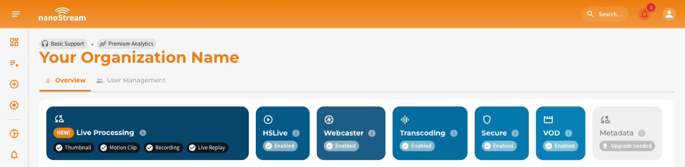

nanoStream Cloud provides a comprehensive, multi-layered security framework designed to protect your data, secure live and on-demand streaming, and control user access throughout the entire workflow. The platform combines encryption, authorization controls, and role-based access management to maintain reliability and prevent unauthorized usage.

## Key Security Principles

- **Reliability & Resilience**: A globally distributed infrastructure with built-in redundancy and automatic failover ensures stable 24/7 operation.
- **Encryption**: Secure streaming with transport-level and protocol-level encryption.
- **Fine-Grained Authorization**: Secure tokens, webhooks, and signed URLs provide precise control over stream ingest, playback, and API access.
- **Access Control**: Role-based permissions ensure that only authorized users can perform sensitive operations.
- **Token-Based Playback**: Playback via the H5Live Player can be protected using JWT tokens for secure, time-limited, or domain-restricted viewing.

## Encrypted Streaming

nanoStream Cloud ensures that data transfer across ingest, control, and playback layers is encrypted using modern standards.  
All H5Live Player and Webcaster operations run over **HTTPS/TLS**, ensuring secure communication by default. For ingest workflows, you may choose to enforce encrypted streaming using **RTMPS** instead of standard RTMP. RTMPS provides SSL encryption to protect audio/video data as it is sent to nanoStream Cloud.

Typical ingest endpoints:

- **RTMP (unencrypted):** `rtmp://bintu-stream.nanocosmos.de:1935/live/STREAM`
- **RTMPS (encrypted):** `rtmps://bintu-stream.nanocosmos.de:1937/live/STREAM`

Encrypted ingest is strongly recommended for any public, external, or production-level environment.

## Secure Playback (H5Live)

The H5Live Player supports **signed URLs** using security tokens to enforce secure playback. This is essential to prevent unauthorized use, sharing, or embedding of your streams. nanoStream Cloud provides a **token-based authorization system** integrated with the H5Live Player. Tokens allow you to control who can watch a stream, when and under which conditions, making them a key component of any secure streaming setup.

Two token formats are available:

- **JSON Web Token (JWT)**: A standard conform security token, recommended for new setups and ideal for both single-stream and ABR configurations.
- **STS Token** (deprecated since Player Version v4.18.0): Proprietary security token with multi value format, available for backwards compatibility.

Tokens can be created via our dedicated API or via the UI of our nanoStream Cloud Dashboard.

:::warning Prerequisites
To make use of **Secure Playback**, it must be explicitly enabled for your organization. Activation may be subject to additional pricing or service terms.

You can verify whether this feature is available by navigating to [dashboard.nanostream.cloud/organisation](https://dashboard.nanostream.cloud/organisation) in your dashboard.  
In the **[Enabled Packages](./organization_overview#enabled-packages)** section, locate the entry for `Secure`. If it shows **Upgrade needed**, please contact us.

  

To activate `Secure` or learn more about available plans, feel free to reach out via [nanocosmos.net/contact](https://www.nanocosmos.net/contact). We're happy to assist you in finding the best setup for your use case.
:::


:::info Secure Organizations
Once your organization enables secure playback, **all H5Live stream playbacks require a valid token**. Streams cannot be played without one.
*For this reason, we recommend setting up a separate Bintu organization for initial testing to avoid affecting your production workflow.*
:::

### Creating JSON Web Token (JWT) via API

Secure Playback tokens (JWT) are created via the **Secure Playback API**. It allows you to generate **JSON Web Tokens** (JWT) for single streams, streamgroups, or your entire organization, including optional restrictions (time, domain, IP, user, etc.).

You can create playback tokens utilizing the api with the following permission level:

|<span className="role role-admin">nanoAdmin</span>|<span className="role role-user">nanoUser</span>|<span className="role role-readonly">nanoReadOnly</span>|
|---|---|---|
| ✓ | ✓ | ✗ |

**Parameters**
- `X-BINTU-APIKEY` or `X-BINTU-TOKEN`: your API key temporary bintu token for authentication

:::info Locate your API Key
To find your API key, please sign in to your nanoStream Cloud/bintu account and copy your API key from the organization overview, which is located under [dashboard.nanostream.cloud/organisation](https://dashboard.nanostream.cloud/organisation).
:::

**Body**

There are various fields that can be shared in the body of the request. As in the first table underneath, three options are available, from which one must be selected to determine the target of the token. Any optional restrictions you wish to apply to this token target are listed below.

*Required identification (choose **one**)*:

| Option | Key | Example | Description |
|--------|-----|---------|-------------|
| Stream Group | `groupid` | `"groupid": "STREAM_GROUP_ID"` (String: Bintu Streamgroup id) | Token applies to one streamgroup |
| Stream Names | `streams` | `"streams": ["XXXXX-YYYY1","XXXXX-YYYY2"]` (Array: *n* Bintu streamnames) | Token applies to *n* listed streams |
| Organization-wide | `orgawide` | `"orgawide": true` (Boolean) | Token applies to all streams of the organization |


*Optional Restrictions (choose **n**)*:

| Key | Description | Example |
|-----|-------------|---------|
| `nbf` | Not valid before (UNIX timestamp) | `"nbf": 1686900000"` |
| `exp` | Expiration time (UNIX timestamp) | `"exp": 1686903652"` |
| `domain` | Allowed domain | `"domain": "example.domain.com"` |
| `ip` | IP address restriction | `"ip": "123.45.67.89"` |
| `tag` | Optional label | `"tag": "table 7"` |
| `user` | User/session ID | `"user": "aaa-bbb-ccc-ddd"` |

:::tip Developer Tip
You can generate playback tokens dynamically (e.g., per user session) by integrating the Secure Playback API into your backend.
This is recommended for all access-controlled streaming systems.
:::


**Example Request**

```js title="token/create_jwt.sh"
curl --request POST \
  --url https://token.nanostream.cloud/api/v1/splay \
  --header 'content-type: application/json' \
  --header 'X-BINTU-APIKEY: REPLACE_WITH_YOUR_API_KEY' \
  --data '{
    "groupid": "xxxxxxxx-zzzz-yyy-aaaa-aaabbbcccddd",
    "exp": 1686903652,
    "domain": "example.domain.com",
    "ip": "123.45.67.89",
    "tag": "table 7",
    "user": "aaa-bbb-ccc-ddd"
  }'
```

**HTTP Response Codes**

*`200`: Success*

```json
{
  "success": true,
  "data": {
    "token": "eyJhbGciOiJSUzI1NiIsInR5cCI6IkpXVCIsImtpZCI6Im5hbm9jb3Ntb3MifQ..."
  }
}
```

*`400`: Missing or Invalid Parameter (Error)*

```json
{
  "success": false,
  "errorCode": 1000,
  "message": "Parameter required: ..."
}
```

*`403`: Invalid API Key (Error)*

```json
{
  "success": false,
  "errorCode": 1001,
  "message": "Provided APIKey is not valid"
}
```

**Using the JWT in the H5Live Player**

Once created, the JWT is appended to your H5Live playback URL: `https://demo.nanocosmos.de/nanoplayer/release/nanoplayer.html?bintu.streamname=YOUR_STREAM_NAME&token=YOUR_JWT_TOKEN`.The player validates the token automatically.

:::tip Additional Resources
- [How to create JSON Web Token for secure playback via API](/docs/nanoplayer/nanoplayer_security_jwt#how-to-create-json-web-token-for-secure-playback-via-api)
- [How to verify JSON Web Token for secure playback via API](/docs/nanoplayer/nanoplayer_security_jwt#how-to-verify-json-web-token-for-secure-playback-via-api)
- [How to integrate secure H5Live player configuration with JWT](/docs/nanoplayer/nanoplayer_security_jwt#how-to-integrate-secure-h5live-player-configuration-with-jwt)
:::

### Creating JSON Web Token (JWT) via Dashboard

JWTs can also be created directly in the nanoStream Cloud Dashboard, without using the API.

<article className="margin-vert--md">
  <Columns className="list_ZO3j" >
    <Card className="col--12" href="/docs/dashboard/secure_playback">
      <Card.Header title="Dashboard Guide to Secure Playback" />
      <Card.Body>
      Find out more in our detailed guide, which includes screenshots relating to generating signed URLs and integrating tokens into your playback environment utilizing the nanoStream Cloud Dashboard.
      </Card.Body>
    </Card>
  </Columns>
</article>

## nanoStream Guardian

In addition to proactive access control mechanisms such as JWT-based Secure Playback, nanoStream Cloud includes **nanoStream Guardian**, a real-time protection layer designed to block unwanted traffic the moment it appears. Guardian helps you mitigate threats such as illegal restreaming, unauthorized embedding, bot-based abuses, or sudden spikes in traffic that may indicate DDoS-like behavior.

Guardian can be used directly from the Analytics Dashboard or via a dedicated Guardian API, enabling both manual operation and automated workflows.

Get a deep dive by visiting the [dedicated nanoStream Guardian docs](/docs/cloud/guardian).

## Webhoks & Ingest Authorization

Webhooks provide server-side authorization for ingest workflows and are the recommended method to control RTMP/RTMPS publishing. When a client attempts to start or stop publishing a stream, Bintu sends a webhook request to your backend. Your service can allow or reject the ingest based on authentication, user permissions, or business logic.

Webhooks enable secure, real-time control over:

- **on_publish**: client attempts to start publishing
- **on_publish_done**: publishing ends
- **on_play**: playback attempt
- **on_play_done**: playback closes
- **on_publish_update**: metadata or stream updates

For detailed examples, authentication methods, and integration guidelines, visit our dedicated docs: [Bintu custom web hooks](/docs/cloud/bintu_custom_webhooks).

## Role-Based Access Control (RBAC) & API Security


nanoStream Cloud includes a role-based permission model to ensure that only authorized users can perform critical or sensitive operations. This applies to both the Dashboard and the Bintu API.

| User Role | Responsibility | Access Level | Permissions |
|---|---|---|---|
| <span className="role role-admin">nanoAdmin</span> | The Administrator  | Highest  | Has full control over all functions within the organization, including managing user roles and issuing new tokens to disable existing ones. **Is the *only* role with access to user management and the API Key.**  |
| <span className="role role-user">nanoUser</span>    | The Operator  | High  | Can perform all tasks related to stream management and operations, expect for changes that could disrupt operations, such as deleting or stopping streams or changing critical settings. |
| <span className="role role-readonly">nanoReadOnly</span>| The Observer  | Low  | Has read-only access to basic information such as stream configuration, stream states, metrics and alerts. |

:::tip Additional Resources
We have outlined the concepts and advantages of [Role-Based Access Control (RBAC)](/docs/cloud/user_roles) on the dedicated page. In addition, this page provides a detailed description of how to get started with roles, which roles are available, which API endpoints can be accessed and a high-level permission overview.

For more information on how to manage users in an organisation, please refer to our [User Management Guide](/docs/dashboard/user_management), which includes instructions on how to manage users, and invite new ones.
:::