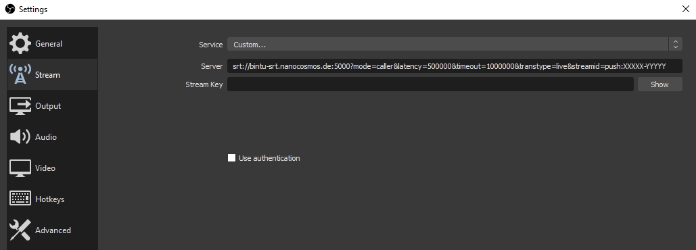
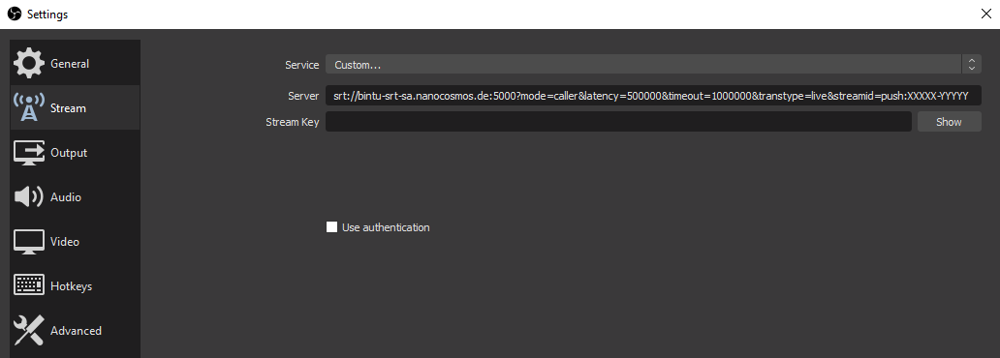

The Secure Reliable Transport (SRT) protocol is a modern, UDP-based streaming protocol designed to ensure **low latency**, **resilience**, and **secure delivery** of live video across unpredictable networks. By combining retransmission, adaptive latency, encryption, and congestion control, SRT offers a robust way to transport real-time media, even over long distances or unstable internet connections.

While SRT is used exclusively as an **ingest** protocol in nanoStream Cloud, playback is performed via **H5Live** (ultra-low latency HTML5 playback) or **RTMP**. This hybrid workflow enables high-quality global ingest while maintaining ultra-low-latency delivery on all platforms.

:::warning SRT Playback
**SRT playback is currently not supported by nanoStream Cloud.**  
Please use **H5Live Player** or **RTMP** for viewing your live streams.
:::

:::info Before starting
If you don’t have an account yet you can [sign up](https://dashboard.nanostream.cloud/signup), or get in touch with our sales team via [nanocosmos.net/contact](https://www.nanocosmos.net/contact) or by email at sales(at)nanocosmos.net.

*Need help accessing an existing organization or unsure how to proceed?* <br/>
👉 Check the [Authentication section](#authentication) in our docs for step-by-step guidance on creating an account, logging in or requesting access from your system administrator.
:::

## Overview

To use SRT ingest with nanoStream Cloud, you will need an existing **Bintu stream** inside your organization, or you can create a new one via the REST API/dashboard.

:::tip Bintu Streams
If you are new to Bintu streams, refer to the [Getting Started: Create a Stream](/docs/cloud/cloud_getting_started#create-a-stream) section for details on how to create streams. To learn how to interpret the stream informations, head to the [Stream Overview](/docs/dashboard/stream_overview) page.
:::

Once you have a stream, your encoder will push an *SRT MPEG-TS* transport stream containing a single H.264 video channel and optional AAC audio channel. On the server side, nanoStream Cloud processes the ingest and makes it available for playback immediately or through stream groups for ABR (adaptive bitrate) playback.

The following sections walk you through all relevant details: supported formats, ingest addresses, SRT stream IDs, encoder parameters, and best practices for live streaming.

## Ingest

When you publish a stream via SRT, your encoder (e.g., OBS Studio, vMix, hardware encoders) sends MPEG-TS over SRT to one of the nanoStream Cloud ingest domains. The system automatically distributes load and routes ingest to the appropriate data center unless you explicitly choose a region.

### Supported Formats and Codecs

SRT ingest in nanoStream Cloud expects a clean, single-track MPEG-TS feed. This ensures consistent decoding, stable transcoding workflows, and reliable global delivery.

| Setting | Specification |
|-------------------|--------------------------------------------------------|
| **Stream format** | MPEG-TS                                                |
| **Track count**   | Single video track and/or single audio track           |
| **Video codec**   | H.264 (recommended baseline profile settings for broad compatibility) |
| **Audio codec**   | AAC (LC preferred for universal playback support)      |

It is strongly recommended to **avoid sending multiple video or audio tracks**, as they can cause playback issues or ingest rejection. Hardware encoders, OBS, and vMix all support this minimal setup natively.

:::info Multi Bitrate Stream
If your organization has the `live transcoding` feature enabled, you can use SRT ingest as the **passthrough** source for creating multi-bitrate renditions. No additional configuration is needed on the encoder side. 

To learn more about how Adaptive Bitrate and live transcoding work, visit our dedicated page: [Understanding ABR & Transcoding](/docs/dashboard/abr_transcoding).
:::

### Server Domains and Port

Your SRT encoder connects to one of the following ingest domains. The **global** domain is recommended for most users, as it automatically routes your ingest to the nearest available region. If you experience connectivity issues or want to explicitly test a region, you may override the domain.

| Region                    | Domain                     |
|---------------------------|----------------------------|
| **Global (recommended)**  | `bintu-srt.nanocosmos.de`    |
| **Asia**           | `bintu-srt-as.nanocosmos.de` |
| **Europe**         | `bintu-srt-eu.nanocosmos.de` |
| **North America**  | `bintu-srt-us.nanocosmos.de` |
| **South America**  | `bintu-srt-sa.nanocosmos.de` |
| **Port**           | `5000`                       |

If you are unsure which domain to use, we recommend starting with the global ingest server.

:::tip Debugging routing issues
For debugging routing issues, refer to the [Network Diagnostics](/docs/cloud/network-diagnostics) page.
:::

### SRT Stream ID

Every SRT ingest requires a **stream ID**, which identifies the target Bintu stream inside nanoStream Cloud.

SRT stream id format definition: `prefix:streamname[:postfix]`
- **prefix**: `push` for ingest or publish action
- **streamname**: existing Bintu stream name in the format `XXXXX-YYYYY`
- **suffix**: `record` to enable VOD recording of a live stream (optional)

:::tip Stream ID Examples
Replace `XXXXX-YYYYY` with an existing Bintu stream name.
- Basic SRT ingest: `push:XXXXX-YYYYY`
- Enable live recording (VOD output): `push:XXXXX-YYYYY:record`
- Push streamname with parameters: `push:XXXXX-YYYYY?param1=one&param2=two`
- Push with streamname parameters and VOD recording: `push:XXXXX-YYYYY?param1=one&param2=two:record`

Some applications, such as *OBS Studio*, may require URL-encoded arguments when stream name parameters are included. See the following examples, to understand the application:
- Push with URL encoded stream id: `push%3AXXXXX-YYYYY%3Fparam1%3Done%26param2%3Dtwo`
- Push with URL encoded stream name parameters: `push:XXXXX-YYYYY%3Fparam1%3Done%26param2%3Dtwo`
- Push with URL encoded stream name parameters and VOD recording: `push:XXXXX-YYYYY%3Fparam1%3Done%26param2%3Dtwo:record`
:::

:::warning Stream ID limitations

The SRT protocol defines strict limitations for stream ID structure:

- Maximum length: **512 characters**
- Allowed characters: `a-z`, `A-Z`, `0-9`, `?`, `&`, `=`, `-`, `_`, `,`, `:`
- The colon `:` is only permitted as a delimiter, **not** inside stream names or parameter values
- Percent sign `%` is only allowed in the context of **URL encoding**.

These rules are enforced by both encoder applications and the nanoStream Cloud ingest layer. Violating them may result in connection failure or invalid stream routing.
:::


### Ingest Parameters

SRT ingest must include several important configuration parameters to ensure stable connectivity:

| Parameter| Recommended |
|----------|-------------|
| **SRT mode**  | `caller` |
| **Transmission type** | `live` |
| **Latency** | Default: **500 ms** (smoother transmission under unstable network conditions) |
| **Timeout** | Recommended: **1 second** (helps prevent connect issues when high RTT occurs) |
| **Stream ID** | Must follow the format described in [SRT Stream ID](#srt-stream-id) |

A higher latency buffer offers more protection against packet loss and jitter. For long-distance transmissions or mobile networks, you can gradually increase the latency if needed.

### Example of Setup using OBS Studio

OBS Studio is able to support SRT streaming starting from version **25.0** and has the flexibility of fine tuning capabilities. It expects latency and timeout values in **microseconds**, so note the conversion:
- `500 ms` → `500000`
- `1 second` → `1000000`

:::tip Additional Ressources
For more details, you can consult the official OBS SRT Protocol Streaming Guide under [obsproject.com/de/kb/srt-protocol-streaming-guide#stream-with-srt](https://obsproject.com/de/kb/srt-protocol-streaming-guide#stream-with-srt).

If you are new to ingesting with OBS (or any encoder), our Getting Started guide offers step-by-step instructions: [Start a Stream](/docs/cloud/cloud_getting_started#start-a-stream).

These resources help you understand how to prepare the encoder side correctly.
:::

## Ingest Address

Replace `XXXXX-YYYYY` with an existing Bintu stream name.

### Global Ingest Domain (recommended)

Setup server with:
```http
srt://bintu-srt.nanocosmos.de:5000?mode=caller&latency=500000&timeout=1000000&transtype=live&streamid=push:XXXXX-YYYYY
```


*Screenshot: OBS Server Setup For Global Domain (recommended)*

### Europe Domain

Setup server with:
```http
srt://bintu-srt-eu.nanocosmos.de:5000?mode=caller&latency=500000&timeout=1000000&transtype=live&streamid=push:XXXXX-YYYYY
```


*Screenshot: OBS Server Setup For Europe Domain*

### North America Domain

Setup server with:
```http
srt://bintu-srt-us.nanocosmos.de:5000?mode=caller&latency=500000&timeout=1000000&transtype=live&streamid=push:XXXXX-YYYYY
```


*Screenshot: OBS Server Setup For North America Domain*

### South America Domain

Setup server with:
```http
srt://bintu-srt-sa.nanocosmos.de:5000?mode=caller&latency=500000&timeout=1000000&transtype=live&streamid=push:XXXXX-YYYYY
```


*Screenshot: OBS Server Setup For South America Domain*

## Playback

SRT playback is not available. Instead, nanoStream Cloud provides ultra-low-latency playback using the **H5live Player**, and standard RTMP protocol playback for compatibility with desktop tools.

### Using H5Live Player

For a single bitrate stream:
```http
https://demo.nanocosmos.de/nanoplayer/release/nanoplayer.html?entry.rtmp.streamname=XXXXX-YYYYY
```

For ABR playback, you can setup a stream group on the nanoStream Cloud Dashboard via [dashboard.nanostream.cloud/](https://dashboard.nanostream.cloud/)

:::tip Stream Configuration

- [Dashboard: Start Streaming](/docs/dashboard/start_streaming).
- [nanoPlayer: Streamgroup configuration](/docs/nanoplayer/nanoplayer_feature_stream_group_configuration).
:::

## RTMP

You can view your stream via RTMP using any RTMP-compatible player. An example using **ffplay**:

```sh
ffplay rtmp://bintu-play.nanocosmos.de/play/XXXXX-YYYYY
```

This is useful for testing or debugging without embedding a player.
