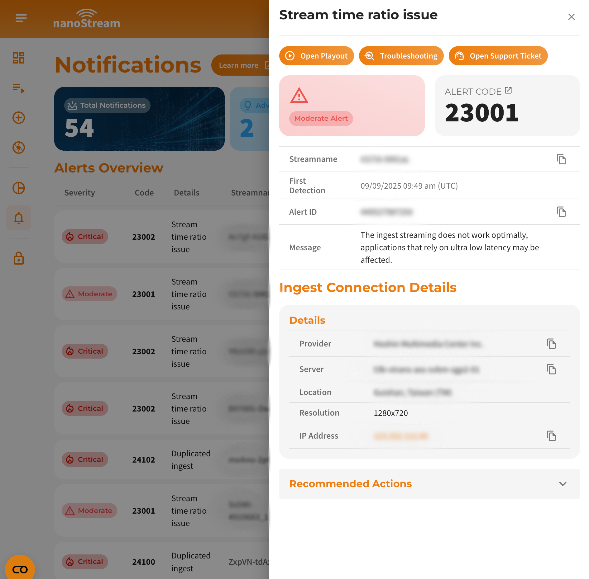

## Introduction
The general purpose of stream alerts is providing more transparent insights about the current live stream performances, estimated causes and possible solutions. Alerts offer multiple capabilities to take immediate action and therefore improve the streaming experience for your audience.

:::info Focus on Ingest 
The current version supports ingest related quality and performance issues of the first mile, meaning from your ingest point via your ISP to our nearest ingest server.   
:::

### Before starting
To begin, please sign in using your nanoStream Cloud/Bintu account credentials.  
If you have not created an account yet, you can [sign up](https://dashboard.nanostream.cloud/auth?signup) or reach out to our dedicated sales team via the [contact form](https://www.nanocosmos.de/contact) or by sending an email to sales(at)nanocosmos.de.

:::tip Good to know
Alerts are effortlessly activated for all organizations by default.
Starting from version `3.7.1.0` onwards, beside the Analytics Dashboard, the nanoStream Cloud Dashboard provides a seamless way to access alerts, ensuring a streamlined experience for your organization.
:::

### How to use

#### via nanoStream Analytics Dashboard

> You can search for **Alerts** of your organization directly on the [nanoStream Analytics Dashboard](https://metrics.nanocosmos.de/troubleshooting?orgHash=&orgName=&countries=&tags=&streamNames=&timeShortcutId=12&timeInterval=day&timeStart=&timeEnd=&worldmapMetric=pi~Playout%20%2F%20Ingest&piWorldSubSwitch=both&abrWorldSubSwitch=chart&cdnWorldSwitch=allCdns&worldView=country&worldRegionZoom=&troubleStart=&troubleEnd=&troubleInterval=second&troubleMode=ingest&troubleIngestInput=&troubleIngestStream=&troublePublishStart=&troublePublishEnd=&troublePublishFineStart=&troublePublishFineEnd=&troublePlayoutInput=&troublePlayoutStream=&troublePlayerId=&troublePlayoutFineStart=&troublePlayoutFineEnd=&ipFilteringStart=&ipFilteringEnd=&ipFilteringStreams=&ipFilteringTags=&alertId=&alertFineStart=&alertFineEnd=&troubleIngestMode=alert) (Troubleshooting).

#### via nanoStream Analytics API

Our Analytics API provides 2 different alerting routes:

> [Click here](https://metrics.nanocosmos.de/api/doc/v2/#tag/Alerting) to dive into the alerting routes and visit our nanoStream Analytics API developer documentation.

- **[`GET` Ingest stream alerts/advices](https://metrics.nanocosmos.de/api/doc/v2/#tag/Alerting/paths/~1api~1v2~1alerting~1ingest/get)**: Returns all detected alerts and advices for all live ingest streams in the last 5 minutes.
- **[`POST` Custom ingest stream alerts/advices](https://metrics.nanocosmos.de/api/doc/v2/#tag/Alerting/paths/~1api~1v2~1alerting~1ingest~1custom/post)**: Returns all detected alerts and advices for all live ingest streams in the last 5 minutes. Additionally, through this API route, it is possible to pass ingest streams that should either be excluded from detection or define ingest streams for which an alert should be triggered if they are detected as offline.

#### via nanoStream Cloud Dashboard

> You can view **Alerts and Advices** of your organization directly on the [nanoStream Cloud Dashboard](https://dashboard.nanostream.cloud/alerts).

:::info Analytics Enhancement from Version `3.7.1.0`
With the release of version `3.7.1.0`, the [nanoStream Cloud Dashboard](https://dashboard.nanostream.cloud/) has enhanced its user interface in addition to the [Analytics Dashboard](https://metrics.nanocosmos.de).  
For a detailed guide and additional insights in regards of the **Alerts and Advices** feature, please refer to the cloud [dashboard's documentation page](../dashboard/alerts_and_advices). This resource offers explanations to ensure you make the most out of the features available.
:::

*Screenshot: Alerts and Advices*

## Severity Levels

Alerts are categorized in multiple **severity levels**, that should help to prioritize them:

| Severity | Priority | Estimated Impact |
|----------|----------|------------------|
| Critical   | highest   | These stream alerts have the highest priority and might also have to biggest impact on the streaming experience in a fundamental way. You should engage these issues first.|
| Moderate   | high      | Such notifications can be considered as urgent. If there are no other critical alerts, try solving these next. |
| Minor         | low       | The corresponding issue might partially affecting the stream quality. |
| Advices      | info      | This can be seen as a general info about unused streaming potential. Please consider reading the advice message or refer to the [advice codes in the table below.](#advices)|

Lastly we fire an **<u>Advice</u>** for non-ABR streams with a higher bitrate than 4 MBit on every RTMP stat event. If you encounter such an advice, please consider using transcoding profiles ([Activating ABR](../dashboard/abr_transcoding)) to insure a better streaming experience for clients located in lower bandwith regions.

## Alert Detection

:::caution time range of relevant data
The used **analysis algorithm** for this alerting feature is based on the stream quality and performance logs of the **previous 5 minutes**.
The analysis for live stream alerts is executed every minute. The considered time ranges for the calculation are:  
- end of time range: `start of current minute`
- start of time range: `end - 5 minutes`
:::

To fire up alerts we make use of 4 RTMP stats events for each minute. 20 events are collected in total for the given maximum range of 5 minutes. These events contain information regarding the **stream time ratio**, which is used to identify potential ingest stream performance/quality issues in order to classify them and raise corresponding alerts. 
This specific stat can be examined in detail using the [troubleshooting](./analytics-dashboard-troubleshooting.mdx#stream-time-ratio) feature on the [Analytics Dashboard](https://metrics.nanocosmos.de/troubleshooting). Each alert is part of an specific **alert category** and owns a unique alert code. 

### Detection Delay

Please note that there is a **3–4 minute delay** in detecting alerts relative to real time. From the delayed moment, a **5-minute time window in the past** is used to detect alerts. This means that if a problem occurs, it may not trigger alert immediately; allow up to 9 minutes for notification.

---

## Alert Types and Codes

###  [21000 - 21999]
General alerts include basic issues related to unexpected ingest behavior.

Description

#### Stream Offline (Expected Online) Alert

##### Description

This alert is triggered when the alerting system identifies a stream name provided in the request for the [Custom Ingest Stream Alert API route](https://metrics.nanocosmos.de/api/doc/v2/#tag/Alerting/paths/~1api~1v2~1alerting~1ingest~1custom/post) as offline, despite it being expected to be online. This alert only appears in the response object of this API request, since users must explicitly define which streams they expect to be online. Keep in mind the 3-4 minute delay in detection.

##### Subtypes
| Code | Type | Description | Recommended Action |
| ---- | ---- | ----------- | ------------------ |
| 21001 | Offline | The stream is unexpectedly offline. | Restart the stream. |

-----

###  [22000 - 22999]

Stream issues that may appear as a consequence of irregular communication problems with the nanoStream Cloud can be identified through stability alerts. 

#### Continous Restarts Alert

##### Description
The system monitors stream restart attempts. If at least three restarts occur within a 5-minute period, a Continuous Restarts Alert is triggered.

##### Subtypes
| Code | Type | Description | Recommended Action | 
| ---- | ---- | ----------- | ------------------ |
| 22001 | Continous Restarts | The ingest stream starts and stops continuously. | Restart the stream. |

-----

###  [23000 - 23999]
Either bandwidth issues or insufficient encoder/computing performances of the ingest source can be observed by fired performance alerts. 

#### Stream Time Ratio Alert
##### Description
If the average of all [stream time ratio (STR)](./analytics-dashboard-troubleshooting.mdx#stream-time-ratio) values is <a className="inline-math text-normal">&le; 0.9</a>, the stream has potential performance issues. Further classifications follow by matching the given conditions in one of these cases below for at least 5 stream time ratio values. If one case is true, a performance alert is created for this particular stream.
- Suboptimal Performance: **0.93 &ge; (5 STR values) > 0.86**
- Poor Performance: **0.86 &ge; (5 STR values)**

##### Subtypes
<table>
    <thead>
        <tr>
        <th>Code</th>
        <th>Type</th>
        <th>Description</th>
        <th>Recommended Action</th>
        </tr>
    </thead>
    <tbody>
        <tr>
            <td>23001</td>
            <td>Suboptimal Performance</td> 
            <td>The ingest streaming is not optimal; ultra-low latency reliant apps may be affected.</td>
            <td rowSpan="2">Restart the stream and do a bandwith speedtest afterwards.</td>
        </tr>
        <tr>
            <td>23002</td>
            <td>Poor Performance</td>
            <td>The ingest streaming is malfunctioning.</td>
        </tr>
    </tbody>
</table>

-----

###  [24000 - 24999]

Infrastructure alerts represent issues that may be invisible from the outside of our infrastructure and even if there are no direct impairments stream performance/quality wise, these issues can lead to critical problems. Alerts of this category serve especially as early notification system, so taking action is immediately possible. Occuring problems with the underlying **<u>Infrastructure</u>** of the corresponding stream are detected by analysing just the passthrough (non-transcoding) streams. 

#### Duplicated Ingest Alert

##### Description
Multiple references on different server instances fires a Duplicated Ingest Alert. Depending on the passthrough ingest location or source, the specific alert varies slightly.

##### Subtypes
<table>
    <thead>
        <tr>
            <th>Code</th>
            <th>Type</th>
            <th>Description</th>
            <th>Recommended Action</th>
        </tr>
    </thead>
    <tbody>
        <tr>
            <td>24100</td>
            <td>General Duplicated Ingests</td>
            <td>Duplicated ingests detected.</td>
            <td rowSpan="4">Stop all the ingests using the same stream name from all machines/encoders/locations and restart only 1 from the intended machine/encoder/location. Review ingest workflow.</td>
        </tr>
        <tr>
            <td>24101</td>
            <td>Multiple Infrastructures</td>
            <td>Duplicated ingests found on varying infrastructures.</td>
        </tr>
        <tr>
            <td>24102</td>
            <td>Multiple Locations</td>
            <td>Duplicated ingests found across different locations.</td>
        </tr>
        <tr>
            <td>24103</td>
            <td>Multiple IPs</td>
            <td>Duplicated ingests have different IP addresses.</td>
        </tr>
    </tbody>
</table>

## Advice Types and Codes
Advices can be seen as low priority alerts and shall inform you about possible improvements of the stream configuration.
##### Description
The ingest stream has a high bitrate. Viewers with poor connection might not be able to playback the stream smoothly.

##### Subtypes
| Code | Description | Recommended Action |
| ---- | ----------- | ------------------ |
| 29001 | High ingest bitrate may affect playback on slow connections. | Consider to use adaptive bitrate streams with different transcoding profiles. | 

-----

## What to Do with Alerts

The alerts serve several purposes:  

- Get notified immediately if something goes wrong with your streams  
- Observe stream quality degradation in real time before a customer complains  
- Gain a bigger picture of your streaming system's stability  

The goal is to **resolve the issues causing the alert as quickly as possible**.  

### Steps to Handle Alerts

:::tip Guideline to handle alerts
These guidelines can be used to get an idea about **what the problem is, why it is appearing and how to troubleshoot any kind of alert code** in general.
:::

**1.** Open up the corresponding stream playback within the dashboard and look out for anomalies, like continous buffering, stuttering, visual interferences or connection issues. 
**2.** Execute a hard restart of the ingest connection / encoder source to force application to restart the ingest process. 
**3.** Use the direct link to the [Troubleshooting Page](https://metrics.nanocosmos.de/troubleshooting) right below the alert to investigate the ingest stream, while looking for anomalies within the stream duration, like performance drops or occurred errors. Using the provided direct link of the alert is automatically filling the necessary data and you can begin to troubleshoot right away. If you do not know what to look for, please consider taking a look at [these examples](./analytics-dashboard-troubleshooting.mdx#stream-time-ratio). 
**4.** If the alert persists, please use the support link of the corresponding alert below to submit a ticket with the necessary details. 

While the exact solution may vary, some common approaches include:

- **General performance issues detected by *Stream Time Ratio* metrics (error codes: 23001 / 23002):**  Restart the stream and run a bandwidth speed test afterwards  
- **Continuous restarts (error codes: 22000 / 22001):**  Restart the stream; for 22001, check local bandwidth using a speed test  
- **Duplicated ingests (error codes: 24100–24103):**  Stop all ingests using the same stream name across all machines/encoders/locations; restart only one from the intended source and review the ingest workflow  

:::info
If an alert continues to occur despite attempts to resolve it, your overall streaming workflow may not be optimal and should be reviewed with performance measurements.
:::
