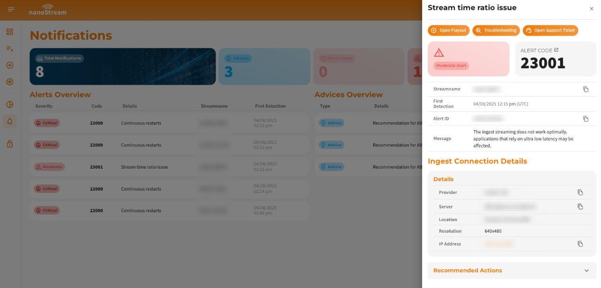
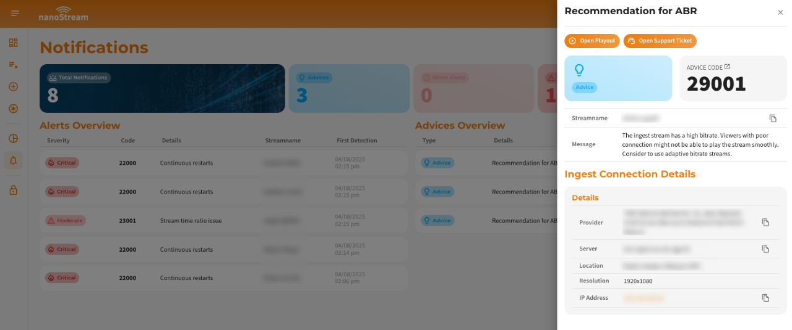
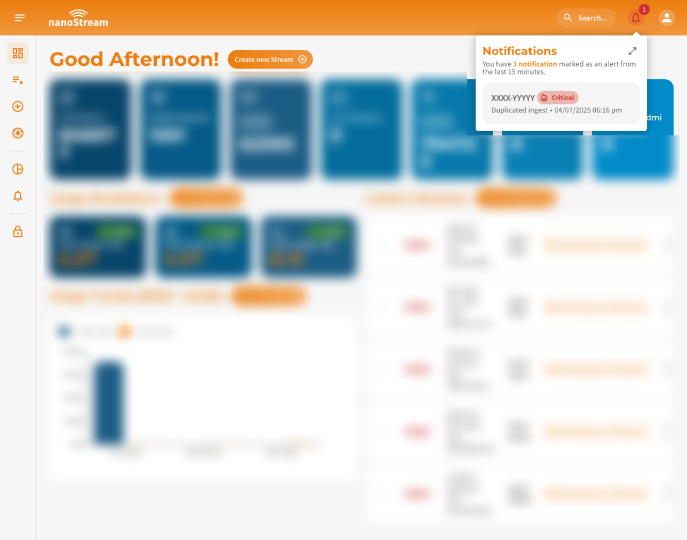

Alerts and advices are tools provided by nanoStream to give you real-time feedback and recommendations about your live streams. They provide invaluable insights into the performance of your live streams, potential issues, and even suggestions on how to enhance the viewer experience.

*Screenshot: Notifications Overview*

## Alerts

**Alerts** are real-time notifications triggered when a potential issue is detected in your live streaming workflow.

### Alert Overview

Selecting an alert opens a side panel with detailed information, structured as Header, Metadata and Stream Details.

*Screenshot: Example Alert Overview*

#### Header
- **Alert title** at the top
- A row of **available actions**:
  - **Open Playout** – View the stream to verify its current status.
  - **Troubleshooting** – Open the [metrics.nanocosmos.de](https://metrics.nanocosmos.de/) to inspect ingest-to-playout metrics. Learn more about troubleshooting [here](../analytics/troubleshooting).
  - **Open Support Ticket** – Create a support request so we can assist you directly.

#### Alert Metadata

| Field    | Value | Explanation |
|----------|-------|-------------|
| Severity | Critical | Levels include Critical, Moderate or Minor. |
| Code     | `24100` | A unique alert code. Click the code to view details in the [alert documentation](../cloud/stream-alerting.md#alert-codes). |

#### Stream Details

| Field           | Value                             | Explanation |
|----------------|-----------------------------------|-------------|
| Stream name     | `XXXX-YYYYY`                      | The name of the stream that triggered the alert. |
| First Detection | `15/08/2024 04:16 PM (UTC)`       | The timestamp when the alert was first identified. |
| Alert ID        | `123456789`                       | A unique identifier for this specific alert event. |
| Message         | Duplicated ingests have been found at different locations. | A short description of the detected issue. |

#### Ingest Connection Details

This section displays relevant technical data related to the alert. For example, for Alert `24100` (Duplicated Ingests), the following details are shown for each server:

- Provider,
- Server,
- Location,
- Resolution
- IP Address

#### Responding to Alerts

Je nach Alert Code, werden in diesem Accordion Actionen vorgeschlagen, die dabei helfen sollen, den Alert zu beheben.

**1. Understand the Message**:
Determine if the alert message is self-explanatory. Often, the alert might provide clear insights into the issue and potential remedies.

**2. Refer to the Documentation**:
Always consult the specific [alert code description](../cloud/stream-alerting.md#alert-codes) for a deeper understanding of the alert and the recommended corrective actions.

**3. Troubleshoot the Alert**:
If the problem persists or isn't evident, consider using our troubleshooting tools available on the [Analytics Dashboard](https://metrics.nanocosmos.de/troubleshooting). 

**4. Contact Support**:
If challenges persist, we're here to help! [Create a new support request](https://www.nanocosmos.de/support) and ensure you attach all relevant data related to the alert. Our team will address your concerns promptly.

## Advices

**Advices** offer **non-critical recommendations** to help improve stream performance and viewer experience.   They are **not urgent** but should be reviewed to ensure optimal quality.

### Advice Overview

Selecting an advice opens a side panel, similar in structure to the alert view, structured as Header, Metadata and Stream Details.

*Screenshot: Example Advice Overview*

#### Header
- **Advice title**
- Available actions:
  - **Open Playout** – Inspect the stream visually.
  - **Open Support Ticket** – Request assistance, if needed.

#### Advice Metadata

| Field     | Value | Explanation |
|-----------|-------|-------------|
| Severity  |  Advice | This is always set to  Advice level |
| Code      | `29001` | A unique identifier for the advice type |

#### Stream Details

| Field       | Value                               | Explanation |
|-------------|-------------------------------------|-------------|
| Stream name | `XXXX-YYYYY`                        | The name of the stream for which the advice is relevant. |
| Message     | The ingest stream has a high bitrate. Consider using adaptive bitrate streams to ensure smooth playback for viewers with poor connections. | A detailed recommendation describing the potential improvement. |

#### Ingest Connection Details

This section shows relevant ingest information for the advice, such as:

- Ingest provider
- Server
- Location
- IP address

For example, for Advice `29001`, all parameters of the high-bitrate ingest stream are shown to help you take corrective action.

## Notifications

The **bell icon** in the top-right navigation bar indicates whether there are any active alerts for your organization. If the bell appears **red**, this signals a **Critical Alert**.

Clicking on the bell reveals a list of recent alerts, displaying the following information for each:

- Stream name
- Alert severity
- Alert label
- Timestamp (UTC)

*Screenshot: Example Notification*

Clicking on an item of this list opens the **Alert Overview** panel.

The alert list displays alerts from the **last 15 minutes**. To view **all alerts and advices**, click the expand arrow at the top right of the container.  
**Note:** Advices are not shown in this container - to see them, go to [nanostream.cloud/alerts](https://nanostream.cloud/alerts).

