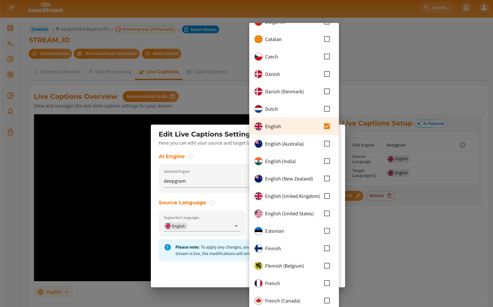
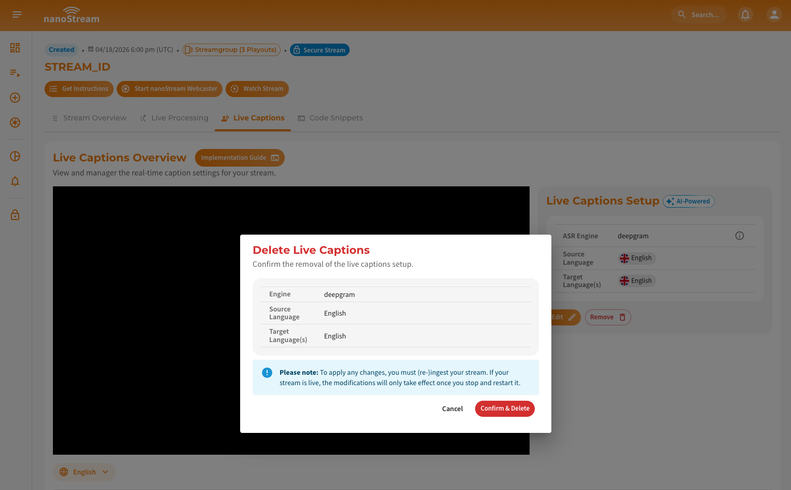

**Live Captions** convert spoken audio into readable text in real time. This feature improves accessibility and keeps viewers engaged, especially for streams with spoken content, in sound-off environments, or for users who are hard of hearing.

Through the **nanoStream Cloud Dashboard**, you can easily set up, manage, and integrate Live Captions into your playback environment. This guide explains how to enable, configure, and use Live Captions from within the dashboard.

:::warning Prerequisites
To make use of **Live Captions**, it must be explicitly enabled for your organization. Activation may be subject to additional pricing or service terms.

You can verify whether this feature is available by navigating to [dashboard.nanostream.cloud/organisation](https://dashboard.nanostream.cloud/organisation) in your dashboard.  
In the **[Enabled Packages](./organization_overview#enabled-packages)** section, locate the entry for `Live Captions`. If it shows **Upgrade needed**, please contact us.

  

To activate `Live Captions` or learn more about available plans, feel free to reach out via [nanocosmos.net/contact](https://www.nanocosmos.net/contact). We're happy to assist you in finding the best setup for your use case.
:::

:::info Live Caption Security Requirements
Live captions are only available for **secure playback**. Therefore, by enabling `live captions`, you will also need to enable the `secure` feature. Please reach out to our sales team via [nanocosmos.net/contact](https://www.nanocosmos.net/contact) or by email at sales(at)nanocosmos.net if you have any questions. \
To learn more about secure playback, visit the dedicated article [Secure Playback (H5Live)](/docs/cloud/security#secure-playback-h5live).
:::

## Add Live Captions to a New Stream

When creating a new stream in the dashboard, live captions can be configured directly.


*Screenshot: Adding live captions during stream creation*

First, select the desired live caption engine. Then specify the language of the audio source, which is the language spoken during the stream. You can then select one or more target languages in which the live captions should be displayed; engines that support translations enable simultaneous output in multiple languages.\
Once the engine and languages are configured, save your settings. From that point, Live Captions will automatically activate as soon as the stream goes live, with the first lines typically appearing within **5–7 seconds**.

:::info Learn more about Live Captions
For a deeper understanding of Live Captions, including how they work, supported ASR engines, and language options, you can explore the following resources:

- **How Live Captions Work**:  Detailed explanation of the real-time caption generation process and low-latency delivery. [Read more →](/docs/cloud/live_captions#how-it-works)

- **Supported ASR Engines & Languages**: Overview of available engines (Deepgram, Whisper) and the full list of source and target languages, including regional variants. [Read more →](/docs/cloud/live_captions#asr-engines-and-languages)

- **Managing Live Captions via API**: Learn how to control captions programmatically using the bintu API, including adding, editing, and removing captions. [Read more →](/docs/cloud/live_captions#managing-live-captions)
:::


## Overview of Live Captions Setup

After creating a stream, you can access **Live Captions** playout and code snippets in several dashboard locations:

- **Stream Overview:** [dashboard.nanostream.cloud/stream/YOUR-STREAM-ID](https://dashboard.nanostream.cloud/stream/YOUR-STREAM-ID)
- **New Stream Instructions:** [dashboard.nanostream.cloud/stream/new/YOUR-STREAM-ID](https://dashboard.nanostream.cloud/stream/new/YOUR-STREAM-ID)
- **Playout Overview:** [dashboard.nanostream.cloud/playout/YOUR-STREAM-ID](https://dashboard.nanostream.cloud/playout/YOUR-STREAM-ID)
- **Webcaster Overview:** [dashboard.nanostream.cloud/webcaster/YOUR-STREAM-ID](https://dashboard.nanostream.cloud/webcaster/YOUR-STREAM-ID)

In all these areas (except **New Stream Instructions**), you’ll find a dedicated **Live Captions tab**, which includes:

- **Live Captions Player**.
- **Language selector** below the player to switch between enabled target languages.
- Current **engine**, **source language**, and **target language(s)**.
- Options to **add**, **edit**, or **remove** captions.
- **Secure Playback Token** with decoded informations.
- **Captions Playout** URLs for each target language.


*Screenshot: Live Captions Overview Tab*

## Modify Live Captions Setup

To modify existing Live Captions settings, open the **Live Captions tab** in any Stream Overview.

:::warning Important
Changes only take effect after **re-ingesting your stream**. If the stream is live, modifications apply **after stopping and restarting**.
:::

**Edit Live Captions**: Click **Edit**. Then update the **engine**, **source language**, or **target languages** and save your changes.


*Screenshot: Editing Live Captions settings*

**Remove Live Captions**: Click **Remove** and confirm the deletion.


*Screenshot: Removing Live Captions from a stream*

## Live Captions Player & Code Snippets

The **Live Captions player** can be embedded using an iframe. Code snippets are available in:

- **Stream Overview → Code Snippets tab** ([dashboard.nanostream.cloud/stream/YOUR-STREAM-ID/code-snippets](https://dashboard.nanostream.cloud/stream/YOUR-STREAM-ID/code-snippets))
- **New Stream Instructions → Access the Playout section** ([dashboard.nanostream.cloud/stream/new/YOUR-STREAM-ID](https://dashboard.nanostream.cloud/stream/new/YOUR-STREAM-ID))

```js title="live_captions/iframe.html"
<iframe
    frameborder="0"
    allowfullscreen
    width="1280"
    height="720"
    src="https://bintu-nmessenger.autodevops-prod.nanostream.cloud/client/embed/nanoplayer.html?group.apiurl=GROUP_API&group.id=STREAM_ID&caption.channel=STREAM_ID-SOURCE_LANG-TARGET_LANG&caption.token=CAPTION_TOKEN&group.security.jwtoken=JWT_TOKEN">
</iframe>
```

:::tip
You can assemble your own player URL by combining these parameters with valid tokens. Use organization-wide tokens for logged-in users or generate new tokens for external viewers.

**URL**: \
https://bintu-nmessenger.autodevops-prod.nanostream.cloud/client/embed/nanoplayer.html  \
?group.apiurl=GROUP_API \
&group.id=STREAM_ID \
&caption.channel=STREAM_ID-SOURCE_LANG-TARGET_LANG \
&caption.token=CAPTION_TOKEN \
&group.security.jwtoken=JWT_TOKEN

| Parameter | Description |
|-----------|-------------|
| `group.apiurl` | Base API URL of the bintu instance |
| `group.id` | Stream ID / Group ID |
| `caption.channel` | Caption channel (includes stream ID + source language id + target language id) e.g. `STREAMNAME-en-en` |
| `caption.token` | JWT token for accessing captions |
| `group.security.jwtoken` | JWT token for secure playback |
:::