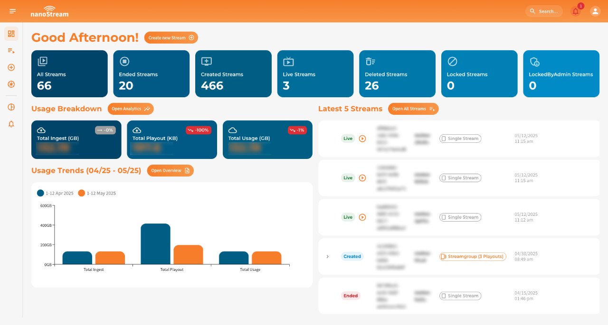
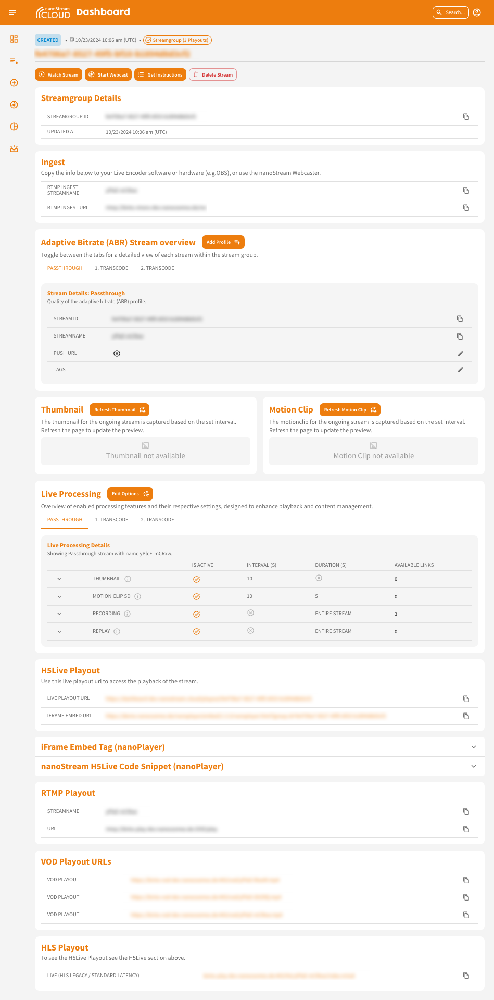
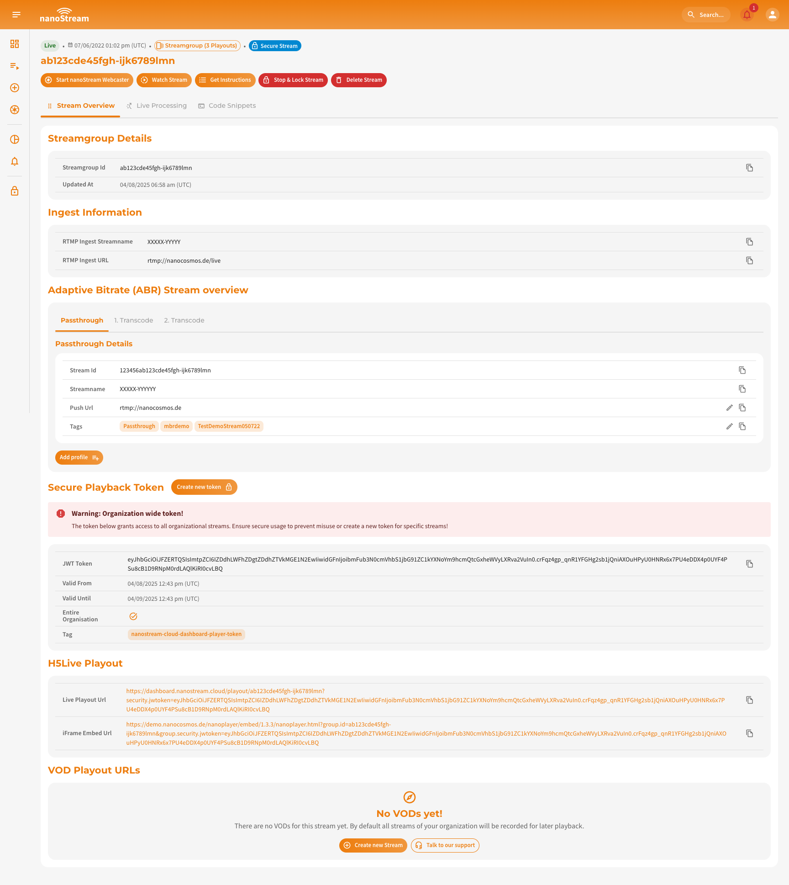

# Changes from Dashboard v4 to v5

The **nanoStream Cloud Dashboard** has received a visual and structural refresh in version 5. This guide highlights the most relevant changes for users familiar with version 4. While there are no breaking changes or major workflow updates, a few UI improvements and new layout patterns were introduced to improve usability and clarity.

We encourage you to check the updated views and explore the changes in your own dashboard. Below, we outline some of the major changes.

:::info Before starting
To get started with the **nanoStream Dashboard**, sign in with your existing *nanoStream account*.  
If you don’t have an account yet, you can [sign up](https://dashboard.nanostream.cloud/signup), or get in touch with our sales team via [nanocosmos.de/contact](https://www.nanocosmos.de/contact) or by email at sales(at)nanocosmos.net.

*Need help accessing an existing organization or unsure how to proceed?*  
👉  Check the [Authentication section](./getting_started#authentication) for step-by-step guidance on creating an account, logging in, and requesting access from your system administrator.
:::

## Dashboard

We redesigned the main dashboard view for a cleaner, more modern appearance. The updated UI improves visual hierarchy and makes key metrics easier to scan.

| Version 4 | Version 5 |
|--------------|--------------|
|  *Screenshot: Dashboard Version 4* |  *Screenshot: Dashboard Version 5*|

- **Stream Count & Alerts** \
In version 5, the stream status boxes (live, created, ended, ...) now span the full screen width and are styled in our corporate blue for improved readability. In version 4, this section also included a status bar below and embedded alerts—such as red or green indicators reflecting overall stream health. These elements have been removed to create a cleaner visual separation.
**Alerts** are now accessible globally via a new alert icon in the AppBar (top right, next to the profile menu). This allows you to check for active alerts at any time, regardless of which page you're on.
    :::tip Learn more about Alerts & Advices  
    - [Understanding Alerts & Advices](./alerts_and_advices)  
    - [Notifications](./alerts_and_advices#notifications)  
    :::

- **Usage Breakdown** \
In version 4, three orange boxes displayed the monthly usage (traffic) of your organization. In version 5, these have been replaced with a more concise display in blue. They now show current month data for **Ingest**, **Playout**, and **Total** usage.
A small chip in the top-right corner of each box indicates how the values have changed compared to the previous month.
Detailed monthly trends are now visualized just below in a **Usage Trends** bar chart. Hovering over the chart reveals exact values, and clicking the bars or the **Open Overview** button opens a modal with a detailed comparison table.
    :::tip Learn more about Usage Breakdown  
    - [Usage Breakdown: Month-to-Date](./analytics#usage-breakdown-month-to-date)  
    :::

## Stream Overview

Previously, all stream-related information was displayed in a single scrollable view. In version 5, we’ve introduced a **tabbed layout** to improve structure and make it easier to access and manage specific stream sections:

- **Overview**: General stream info, metadata, ingest configuration, and H5Live URLs  
- **Live Processing**: Manage stream-specific features like recording, thumbnails, live replay, and motion clips  
- **Code Snippets**: Ready-to-use embed code to integrate the H5Live Player into your web page

:::tip Learn more about the Stream Overview  
- [Stream Overview with Tabs](./stream_overview#single-stream-overview)  
:::

| Version 4 | Version 5 |
|--------------|--------------|
|  *Screenshot: Stream Overview Dashboard 4*|  *Screenshot: Stream Overview Version 5*|

## Organization Overview

The organization section is now structured with two tabs:

- `Overview`: General details and usage
- `User Management`: Manage and review users assigned to the organization

This separation allows faster access to user management while keeping the overview clean.

| Version 4 | Version 5 |
|--------------|--------------|
|  *Screenshot: Stream Overview Dashboard 4*|  *Screenshot: Organization Overview Version 5*|

:::tip Mange your organization
In version 4, user management was part of the organization overview. In version 5, it’s now accessed through its own tab for easier navigation. Users can be filtered, edited, and removed more efficiently.  

👉 Explore the full [User Management Guide](./user_management) for in-depth guidance and best practices. To get an overall overview of the organization page and its content, check our [Organization Overview](./organization_overview) docs
:::

## Next steps

To make the most of the nanoStream Cloud Dashboard and explore all its features and capabilities, we recommend diving into our documentation. You can start with the links below or follow the guides step by step — whatever suits your workflow best. Each section is designed to help you unlock the full potential of your streaming setup.

<article class="margin-top--lg">
    <section class="row list_ZO3j">
        <article class="col col--4 margin-bottom--lg">
            <a class="card padding--lg cardContainer_Uewx" href="./stream_overview">
                <h2>Stream Overview</h2>
                
Understanding and Interpreting Your Stream Data

            </a>
        </article>
        <article class="col col--4 margin-bottom--lg">
            <a class="card padding--lg cardContainer_Uewx" href="./user_management">
                <h2>User Management</h2>
                
Manage Access to Your Organization

            </a>
        </article>
        <article class="col col--4 margin-bottom--lg">
            <a class="card padding--lg cardContainer_Uewx" href="./alerts_and_advices">
                <h2>Alerts & Advices</h2>
                
Gaining Insights into the Performance of Your Live Streams

            </a>
        </article>
    </section>
</article>
