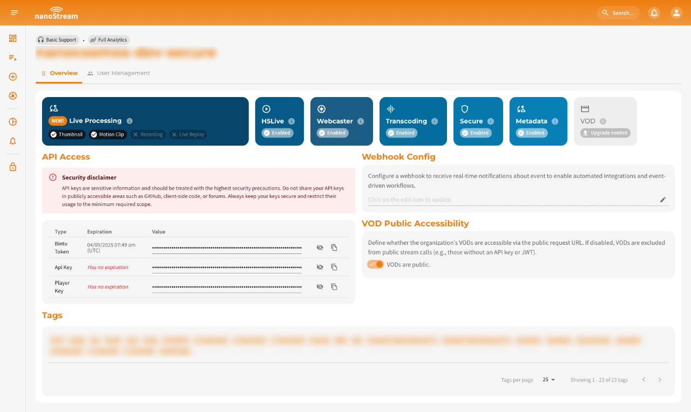
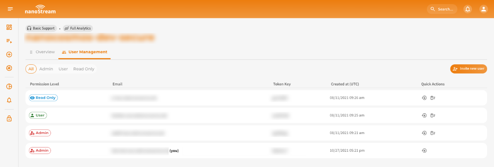

The **Organization Overview** page provides a detailed breakdown of your organization’s configuration and user management. Simply navigate to [dashboard.nanostream.cloud/organisation](https://dashboard.nanostream.cloud/organisation)
It can be accessed manually on desktop devices via the profile icon in the top right corner or on mobile devices through the menu under the **Account** section. At the top of the page, you’ll see the **Organization Name** and two chips indicating the **Support Level** and **Analytics Level**.

This page is divided into two tabs:

- **Overview** ([dashboard.nanostream.cloud/organisation/overview](https://dashboard.nanostream.cloud/organisation/overview)) – Displays settings, access, and configuration  
- **User Management** ([dashboard.nanostream.cloud/organisation/users](https://dashboard.nanostream.cloud/organisation/users)) – Manages users and their permissions

## Overview

The **Overview** tab provides insights into the current configuration of your organization.

*Screenshot: Organization Overview*

### Enabled Packages

This section displays which product features are currently **enabled** for your organization. If a package is not available, its status will be shown as **Upgrade needed**.

*Screenshot: Enabled Packages*

Available features include:

- **Live Processing**
  - Thumbnail, Motion Clip, Recording, Live Replay, more to follow ...
- **H5Live Player**
- **Webcaster**
- **Transcoding**
- **Secure Playback**
- **Video on Demand (VOD)**
- **Metadata**

### API Access

Depending on your permissions, you will see relevant security tokens and keys for API access.

:::danger Security Disclaimer
API keys are sensitive credentials. Do not share them in public environments (e.g., GitHub, client-side JavaScript, forums). Always follow best practices and limit access scopes where possible.
:::

- **Bintu Token** – A session-based token automatically generated upon login. Required for most nanoStream dashboard actions.
- **API Key** – A master key with access to all API features. Handle with extreme care.
- **Player Key** – Used for embedding and controlling the nanoPlayer securely.

### Webhook Config

You can configure¹ a webhook endpoint to receive real-time notifications about stream-related events. This enables event-driven workflows and system integrations.

¹Editable depending on access level

### VOD Public Accessibility

You can define¹ whether your organization’s VOD (Video on Demand) content is publicly accessible via API requests without authentication.

¹Editable depending on access level

### Tags

This section provides an overview of all tags currently set and managed within the organization. Tags are used for categorizing and organizing streams.

## User Management

The **User Management**¹ tab lists all users associated with your organization. In this tab you can: 
- filter users by **Role Level**
- generate **invitation links** with specific roles
- perform **quick actions** on users

The user table includes the following columns:

- **Permission Level**
- **Email**
- **Token Key**
- **Created At** (UTC timestamp)
- **Quick actions** (Reset User Token, Delete User)

¹Accessible depending on access level

:::info Learn More About User Management in nanoStream
User Management in nanoStream allows you to efficiently manage user roles and permissions, ensuring secure and controlled access to streams.

👉 Explore the full [User Management](./user_management) documentation for in-depth guidance and best practices.
:::

*Screenshot: User Management*