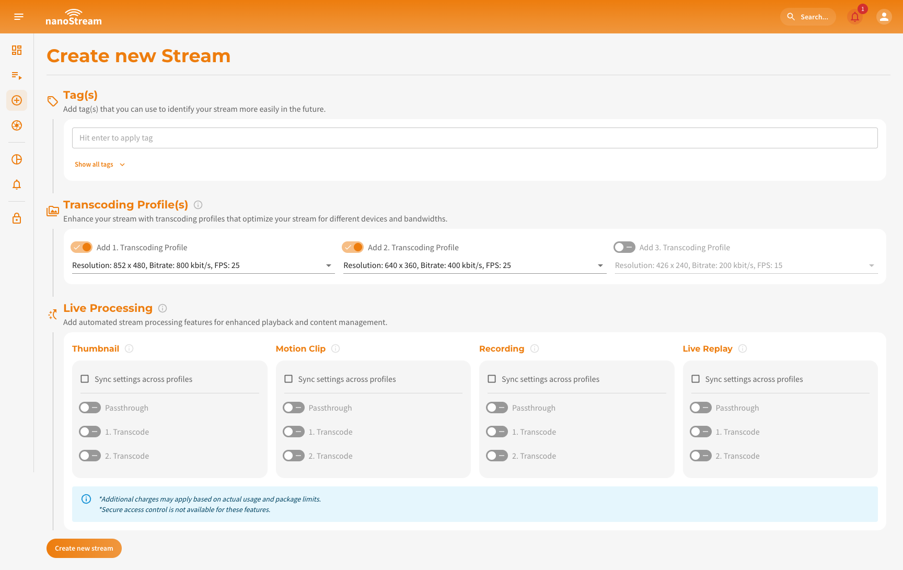
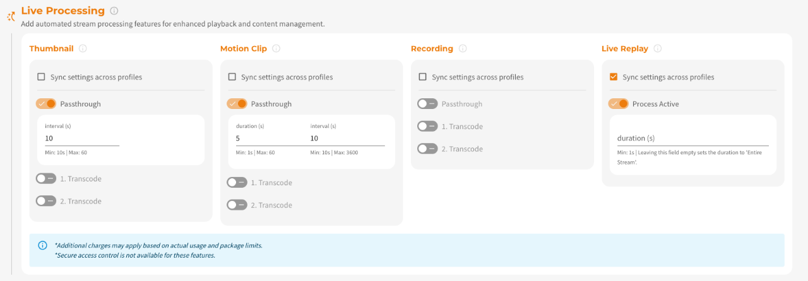
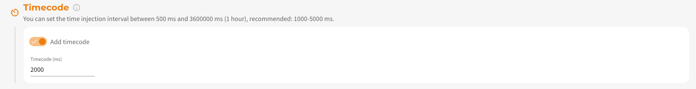
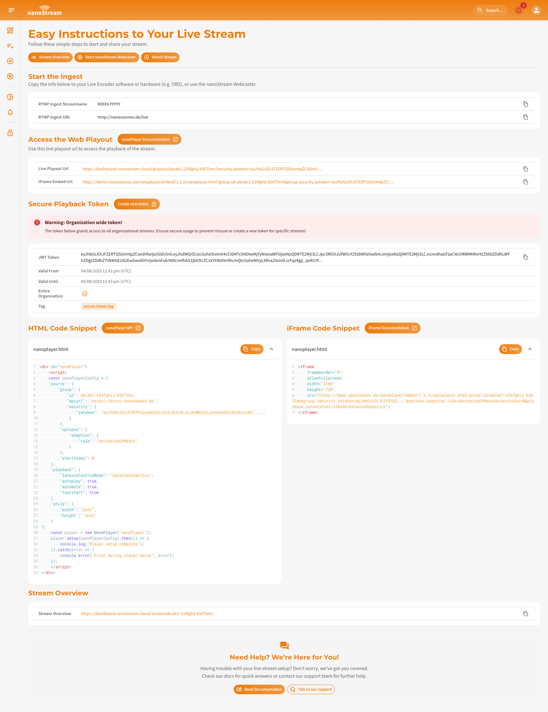

nanoStream offers two ways to start streaming:

1. **[Using nanoStream Webcaster](#ingesting-with-the-nanostream-webcaster)** (*browser-based ingest*)
2. **[Using an external live encoder](#ingesting-with-a-separate-live-encoder-software-or-hardware)** (*e.g., OBS, Wirecast, hardware encoders*)

Regardless of which ingest method you choose, you must first **create a stream**.

:::warning Before starting
To get started, sign in with your existing *nanoStream account*.  
If you don’t have an account yet, you can [sign up](https://dashboard.nanostream.cloud/signup), or get in touch with our sales team via [nanocosmos.net/contact](https://www.nanocosmos.net/contact) or by email at sales(at)nanocosmos.net.

*Need help accessing an existing organization or unsure how to proceed?*  
👉  Check the [Authentication section](./getting_started#authentication) for step-by-step guidance on creating an account, logging in, and requesting access from your system administrator.
:::

## Create Stream

Navigate to 👉 [dashboard.nanostream.cloud/stream/create](https://dashboard.nanostream.cloud/stream/create).

*Screenshot: Create new Stream*

### Tag(s)

Tags help you organize streams at scale (e.g., by customer, event, region, workflow).

**How to add tags:**
1. Type a tag and press **Enter**.
2. From the 3rd character onward, the system suggests previously used tags.
3. Click **Show all tags** to view recently used ones.

*Screenshot: Adding tags to a new stream*

### Transcoding Profile(s)

During the stream creation process live transcoding is already enabled by default. You have the option to add transcoding profiles and configure them according to your requirements. The default selection is pre-filled, but you can choose different settings. Ensure that the bitrate of each Transcoding Profile is lower than the ingest/passthrough bitrate or the profile above.

:::tip Learn more about ABR & Live Transcoding
Adaptive Bitrate (ABR) and Live Transcoding work together to ensure seamless playback quality, even under unstable network conditions.
- **ABR** automatically switches between multiple stream qualities depending on the viewer’s bandwidth.
- **Live Transcoding** creates these multiple stream outputs from a single high-quality input.

👉 Dive into the [Adaptive Bitrate and Transcoding section](./abr_transcoding) to understand how it works and when to use it.
:::

:::info Manage your Transcoding Profiles
As your streaming requirements evolve, you may find the need to revise your transcoding profiles. You can fully manage your stream profiles within the [Stream Overview](./stream_overview).
Check [**Modifying Transcoding Profiles After Stream Creation**](./abr_transcoding#modifying-transcoding-profiles-after-stream-creation) for detailed steps and UI walkthroughs.
:::

*Screenshot: Adding transcoding to a new stream*

### Live Processing

:::warning Prerequisites
To utilize the `live processing` feature, you need to enable it and ensure the corresponding pricing and payment options are set up.    
Contact us via [nanocosmos.net/contact](https://www.nanocosmos.net/contact) to find the perfect solution for you!  
:::

Live Processing lets you enhance your stream with additional automated features. You can either apply the same settings to all streams part of your ABR streamgroup by clicking on **Sync settings across profiles** or configure them individually. \
Applying uniform settings is useful for **Live Replay**, while separate settings allow tailored configurations for different stream qualities.

*Screenshot: Adding live processing to a new stream*

:::tip Learn more about `Live Processing`
- [Thumbnails & Motion Clips](./live_processing#thumbnails-andor-motion-clips): Auto-generate visual snapshots & highlights.
- [Recording](./live_processing#recording): Save your stream sessions for later.
- [Live Replay](./live_processing#live-replay): Rewatch and share past moments instantly.

👉 Dive into the [Live Processing Docs](./start_streaming#live-processing) to understand how it works and when to use it.
:::

### Live Captions

:::warning Prerequisites
To utilize the `live captions` feature, you need to enable it and ensure the corresponding pricing and payment options are set up.    
Contact us via [nanocosmos.net/contact](https://www.nanocosmos.net/contact) to find the perfect solution for you!  
:::

Live Captions convert spoken audio into real-time text using AI-powered speech recognition. \
To enable that, you need to configure the **ASR engine**, **source language** (spoken language) and **target language(s)** (translated captions).

*Screenshot: Adding live captions to a new stream*

:::tip Learn more about `Live Captions`
To understand how Live Captions work end-to-end, including activation, configuration flows, engine selection, supported languages, and API integration, explore the full documentation:

- [ASR Engines And Languages](/docs/cloud/live_captions#asr-engines-and-langauges): Learn which recognition engines are available, how they differ, and which languages they support.
- [Manage Live Captions via Dashboard](/docs/dashboard/live_captions): Step-by-step instructions for enabling, editing, or removing captions in the nanoStream Cloud Dashboard.
- [Integrate Live Captions programmatically](/docs/cloud/live_captions#api-integration): Add or modify caption settings using the bintu REST API with practical request examples.

👉 Dive into the [Live Captions Docs](/docs/cloud/live_captions) for the complete feature guide.
:::

### Timecode

:::warning Prerequisites
To utilize the `timecode` feature, you need to enable it and ensure the corresponding pricing and payment options are set up.   
Contact us via [nanocosmos.net/contact](https://www.nanocosmos.net/contact) to find the perfect solution for you!  
:::

By clicking on **Add timecode** you can enable this feature. It allows precise synchronization or indexing of video content. You can set the time injection interval between 500 ms and 3600000 ms (1 hour), while we recommend: 1000-5000 ms. The default is 2000ms. 

*Screenshot: Setting timecode injection to a new stream*

## Start Streaming

After clicking on **Create New Stream**, you will be redirected to the **Easy Instructions to Your Live Stream** page. This page provides you with all the information required to start and share a stream, including the necessary steps and details for a seamless setup.
You can also access this page later via the [quick action button](./stream_overview#single-stream-overview) called [Get Instructions](./start_streaming#start-streaming) in the [Stream Overview](./stream_overview).

:::info Please note  
All the information provided here is also available in the detailed **[Stream Overview](./stream_overview)** for your reference.
:::

*Screenshot: New stream Overview*

Under the Header of the page, you can see three buttons:
- **[Stream Overview](./stream_overview)**: Takes you to the detailed stream overview page with additional stream information.
- **[Start nanoStream Webcaster](#ingesting-with-the-nanostream-webcaster)**: Redirects you to the Webcaster page where you can begin the ingest process immediately.
- **Watch Stream**: Directs you to the playout page where you can watch your live stream.

:::tip Learn more about nanoStream Webcaster
- [Ingesting with the nanoStream Webcaster](#ingesting-with-the-nanostream-webcaster)
- [Stats and Metrics: Monitor Your Webcast's Performance](../webrtc/nanostream_webrtc_stats_and_metrics)    
:::

Below these three buttons, you can see the following sections:

1. **Start the Ingest**: This section displays the **RTMP stream name** and **RTMP URL** needed to begin your stream. To copy the details easily, click on the copy icon next to the information.
2. **Access the Web Playout**: Here you will find all **playout URLs** for streaming your content.
    :::info Enable secure playback
    **nanoStream** also provides a `secure` feature to generate a JWT playback token. This lets you customize token settings like expiration date, not-before date, client IP, domain, user ID, or a tag for enhanced security. \
    Verify whether this feature is available for your organization by navigating to [dashboard.nanostream.cloud/organisation](https://dashboard.nanostream.cloud/organisation) in your dashboard. *To enable this feature for your organization, contact us via [nanocosmos.net/contact](https://www.nanocosmos.net/contact)*. 

    You can learn more about nanoStream Cloud Security on our dedicated feature docs: **[nanoStream Cloud: Secure Playback (H5Live)](/docs/cloud/security#secure-playback-h5live)**.
    :::
3.  **[Code Snippets](./code_snippets)**: We provide two types of code snippets to embed the H5Live Player with your stream on your website: **Live Captions Player Code Snippet**, **iFrame Code Snippet** and **HTML Code Snippet**. You can simply copy and paste the appropriate code into your webpage to integrate the nanoStream H5Live Player.
4. **[Stream Overview](./stream_overview)**: This section provides a link to the full stream overview page. Clicking the URL will take you to the detailed overview with more relevant details about the stream.

## Ingesting with the nanoStream Webcaster

The Webcaster interface is designed with simplicity and efficiency in mind, offering key elements that make live streaming easy.

*Screenshot: nanoStream Webcaster*

The Webcaster interface, shown in the screenshot, is divided into three main sections: 
- **Top left**: The webcaster itself,
- **Top right**: Real-time statistics *and*
- **Bottom**: The stream details.

### Toolbar

The Toolbar, located below the webcaster, acts as your command center, providing quick access to essential functions (f.l.t.r.):

- **Camera On/Off**: Toggle your camera.
- **Audio On/Off**: Control your audio input.
- **Start/Stop Streaming**: Initiate or conclude your live stream.
- **Settings**: Access detailed customization options.
- **Playout Link**: Quickly retrieve the link to share your live stream.

### Settings

Tailor your streaming experience with the nanoStream Webcaster settings, accessible when you are not actively streaming.

1. **Video Source**: Choose between video feed from your camera or screen sharing. If you opt for screen sharing, a dedicated dialog will appear upon application of changes, allowing you to select the specific screen. Should you wish to switch to a different window, revisit the settings, click on screenshare again, and apply changes.

2. **Video Quality**: Adjust the maximum video bitrate, resolution, and framerate according to your preferences. Fine-tune these settings to achieve the desired balance between video quality and bandwidth efficiency.

3. **Audio Configuration**: Select your preferred audio input device and set the maximum bitrate to ensure optimal audio quality during your stream.

*Screenshot: nanoStream Webcaster Settings*

### Webcaster Statistics

The statistics section provides [stats and metrics](../webrtc/nanostream_webrtc_stats_and_metrics) to monitor the health and performance of your stream. Key metrics include:
- **Packet Loss**: An important indicator for stream stability, showing the percentage of lost packets during transmission.
- **Round-Trip Time (RTT)**: Reflects the responsiveness of your stream by measuring the time it takes for data to travel from the source to the destination and back.
- **Send Delay**: Indicates the delay in sending data, which is critical for monitoring latency.

Additionally, there is detailed information on audio and video bitrates, as well as framerate. These metrics are visualized in a line chart during the broadcast for real-time monitoring.

*Screenshot: nanoStream Webcaster Statistics*

## Ingesting with a separate live encoder software or hardware

:::info Step-by-step Instructions for live encoder
Our documentation includes descriptions for OBS Studio and Osprey Talon. There you can see step-by-step instructions on how to configure your live encoder to start a stream: **[Start a Stream](/docs/cloud/cloud_getting_started#start-a-stream)**
:::

1. Configure your preferred live encoder software or hardware, such as OBS or Wirecast, according to the setup instructions.
2. Obtain the necessary **RTMP stream details (stream name and URL)** from the **Ingest** section on the **Stream Overivew** or **[Easy Instructions to your live stream](#easy-instructions-to-your-live-stream)**.
3. Enter the **RTMP stream details** into your live encoder settings.
4. Start the live stream from your encoder to begin sending the video feed to nanoStream Cloud.
