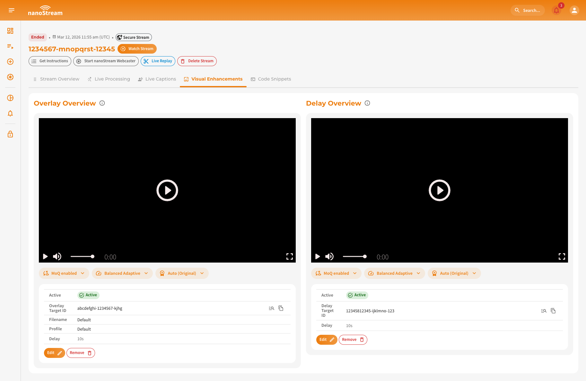
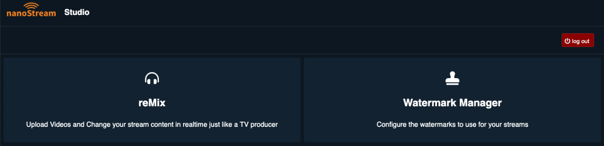
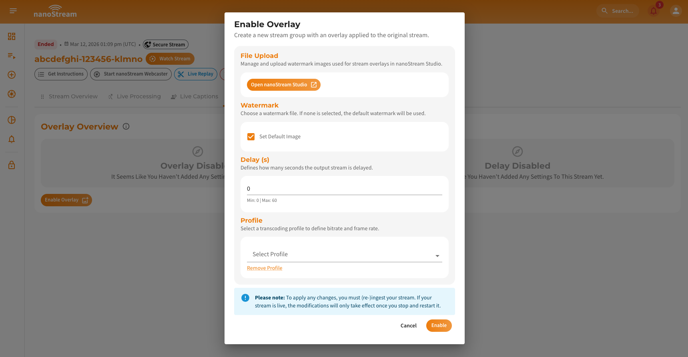
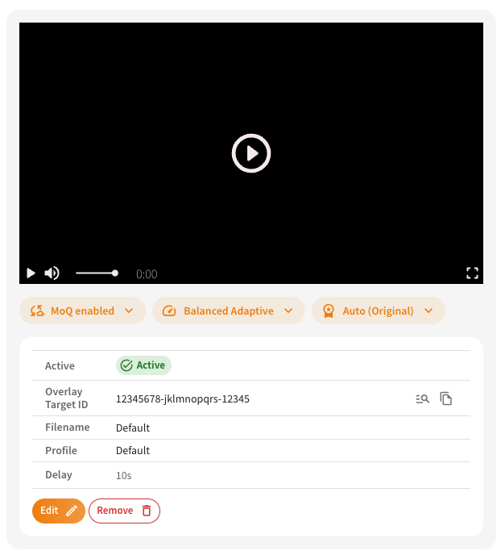
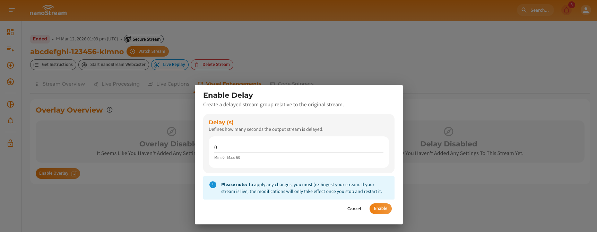
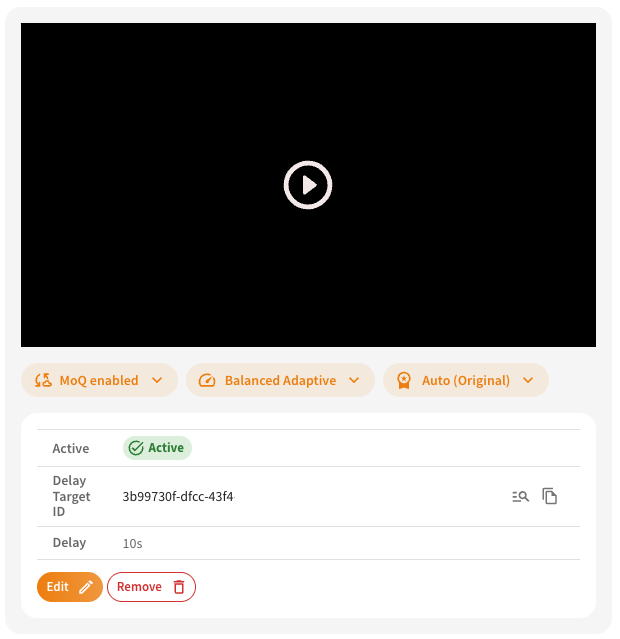

Visual Enhancements allow you to modify the visual output of a live stream without affecting the original ingest stream.
In nanoStream, there are the following enhancement types, that are supported:

- **Overlay**: adds a watermark image to the stream
- **Delay**: creates a delayed version of the stream

When enabling one of these options, the system creates a new stream derived from the original source stream. This derived stream acts as a *substream*, meaning it remains connected to the parent stream while applying the configured enhancement.

You can identify these relationships in the dashboard:
- In the **Visual Enhancements tab** of the parent stream
- In the **Stream Overview page**, where the header indicates whether a stream is a e.g. *Overlay* or *Delay* Stream

After creating a stream, you can access the visual enhancements in the dedicated **Visual Enhancements tab** in several dashboard locations:
- **Stream Overview:** [dashboard.nanostream.cloud/stream/YOUR-STREAM-ID](https://dashboard.nanostream.cloud/stream/YOUR-STREAM-ID)
- **Playout Overview:** [dashboard.nanostream.cloud/playout/YOUR-STREAM-ID](https://dashboard.nanostream.cloud/playout/YOUR-STREAM-ID)
- **Webcaster Overview:** [dashboard.nanostream.cloud/webcaster/YOUR-STREAM-ID](https://dashboard.nanostream.cloud/webcaster/YOUR-STREAM-ID)

*Screenshot: Visual Enhancements Overview Tab*

## Overlay

The Overlay stream option adds a watermark image to the source stream. When enabled, a new streamgroup is created where the overlay and optional delay are applied.

### Upload and Manage Watermarks in nanoStream Studio

Watermark images used for overlays are managed in **nanoStream Studio**.

:::info Uploading assets to nanoStream Studio
Open **https://studio.nanostream.cloud/** and sign in using your regular **nanoStream dashboard credentials**.
:::

*Screenshot: nanoStream Studio Menu*

After logging in, open the **Watermark Manager** from the menu. There you can review all watermark images currently available for your streams.
To upload a new watermark, click **Upload Watermarks to your storage** and select the image file you want to use. Once uploaded, you can select the watermark to preview it and optionally set it as the **default watermark**. Setting a default watermark means this image will automatically be used whenever the overlay configuration does not specify a particular file. This corresponds to the **Set Default Image** option in the "Enable Overlay Dialog".

### Enable Overlay

To configure an overlay, open the Visual Enhancements tab of your desired stream and select **Enable Overlay**.

*Screenshot: Adding stream option overlay to a stream*

1. **File Upload**: [Upload and Manage Watermarks in nanoStream Studio](#upload-and-manage-watermarks-in-nanostream-studio)
2. **Watermark**: Type in the watermark filename to use for the overlay. If no specific image is selected, the system will automatically apply the default watermark configured in the watermark manager.
    :::tip Selecting a watermark file
    - Only enter the **file name**, **without the file extension**  
    - The name must match the uploaded file **exactly** (case-sensitive)
    - The value is **not validated automatically**

    If the name is entered incorrectly, the watermark cannot be applied to the stream.
    :::
3. **Delay**: Determine how many seconds the overlaid stream should be delayed compared to the original stream. A delay between 0 and 60 seconds can be applied depending on your use case.
4. **Profile**: The selected profile defines the **bitrate and frame rate** of the generated overlay stream. If no profile is selected, default values will be used.

By clicking on **Enable** nanoStream will create a new streamgroup derived from the original stream, where the overlay and optional delay are applied.

### Overview of Overlay Setup

After enabling the overlay, the dashboard shows the generated overlay stream. The **player** displays the output of the overlay stream. Below the player, the active configuration is shown.

  
*Screenshot: Overlay Setup Overview*

The configuration includes:
- **Overlay Target ID**: Identifier of the stream group where the overlay is applied. By clicking on the icon on the right, you can copy the streamid or open the dedicated stream overview.
- **Filename**: The selected watermark image.
- **Profile**: The applied transcoding profile.
- **Delay**: The configured delay value.

The overlay stream automatically receives its input from the original stream. 
The settings for overlay can be changed or removed at any time. To do so just click on **Edit** or **Remove** and apply changes.

## Delay

Delay creates a version of the stream that is delayed from the original stream.

### Enable Delay

To configure an delay, open the Visual Enhancements tab of your desired stream and select Enable Delay.

*Screenshot: Adding stream option delay to a stream*

1. **Delay**: Specify how many seconds the stream output should be delayed. The allowed range is: **0–60 seconds**.

By clicking on **Enable** nanoStream will create a **new stream group** that outputs the delayed version of the original stream.

### Overview of Delay Setup

After enabling the delay, the delayed stream becomes available in the dashboard.

  
*Screenshot: Delay Setup Overview*

The player shows the delayed output, while the configuration below the player displays the active settings.
The configuration includes:

- **Delay Target ID**: Identifier of the stream group where the delay is applied. By clicking on the icon on the right, you can copy the streamid or open the dedicated stream overview.
- **Delay**: The configured delay value.

The delayed stream automatically receives its input from the original stream.
The settings for delay can be changed or removed at any time. To do so just click on **Edit** or **Remove** and apply changes.