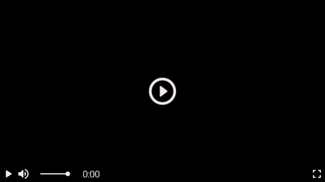
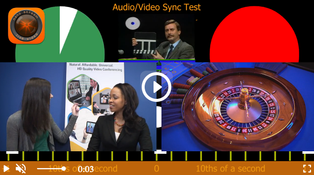

Changing parameters is straightforward and easy. You can have a tailor-made design and a smooth appearance within seconds. **It is possible**, among others, **to adjust integrated player controls, icons, background color, add a poster, change the cursor** etc. Of course, you can also disable all built-in styles. In this manual, we will go through customizable elements so that  **H5Live Player** UI will suit all your needs.


*Screenshot: H5Live Player View with Poster*

1. [**View**](#other-customizations): Video overlayer including visible styles, controls and poster/background.
2. [**Center View**](#other-customizations): Can include play button [see example above], loading animation, mute/volume icon.
3. [**Controls**](#built-in-controls-animations-and-styles): Control bar with play/pause control, mute control, volume control (slider), playback time, fullscreen control.
4. [**Poster**](#poster) / [**background**](#background-color-of-the-player): A poster [image of your choice] that can be set and the background color can be changed.

Below you have a short description of each property and how-to for adjusting styles.

## Built-in controls, animations and styles {#built-in-controls-animations-and-styles}

The [**nanoStream H5Live Player Version 4.9.1**](https://www.nanocosmos.de/blog/2021/02/nanostream-player-4-9-1-introducing-a-new-design/) is introducing new possibilities in terms of design. The control bar and control icons background colors are customizable. The player is more vivid due to additional button behavior: `buttonHighlighting`, `buttonAnimation` and a variety of available cursors with `buttonCursor`. <br/> 
See the [config](./nanoplayer_api#nanoplayerconfig--codeobjectcode) here.


*Screenshot: Default style of the H5Live Player*

### `symbolColor` and `controlBarColor`

In `config.style.symbolColor` you need to pass the value of the desired color. The default value is `"rgba(244,233,233,1)"`.
The control bar color background is set by default to `"rgba(0,0,0,0.5)"`. To change it, insert the string with desired color value in `config.style.controlBarColor`.

To change one of the colors, insert its value in one of the formats (all case insensitive):

- RGB e.g. `"rgb(255,165,0)"` and with alpha `"rgba(255,165,0,0.5)"`
- HEX e.g. `"#FFA500"` or `"#fa0"` and with alpha `"#FFA500AA"` or `"#fa0a"`
- HSL e.g. `"hsl(39,100%,50%)"` and with alpha `"hsla(39,100%,50%,0.5)"`
- valid CSS Keyword (e.g. `"pink"`/`"white"`/`"aquamarine"`)

#### Example with HEX color value for symbolColor and controlBarColor:

```javascript
"style": {
    "symbolColor"     : "#ed7d0e",
    "controlBarColor" : "#000000FF"
}
```

*Screenshot: Example with HEX color value for symbolColor and controlBarColor*

#### Example with RGBA color value and transparency:

```javascript
"style": {
    "symbolColor"     : "rgb(255,255,255)",
    "controlBarColor" : "rgba(237,125,14,0.8)"
}
```


*Screenshot: Example with RGBA color value and transparency*

### `buttonHighlighting` and `buttonAnimation`

Both properties add the 3D effect to the player and make it more lively.

- `buttonHighlighting` on hover activates a shadow container of the button
- `buttonAnimation` on hover magnifies the button and bounces when clicked

The  `config.style.buttonHighlighting` and `config.style.buttonAnimation` properties will either be:

- `true` by default, means that they are displayed
- `false` to have them disabled

#### Example

```javascript
"style": {
    "buttonHighlighting" : false,
    "buttonAnimation"    : false
}
```

### `buttonCursor`

To change the cursor, you can use any CSS cursor property, e.g:

- `buttonCursor="default"`
- `buttonCursor="pointer"`
- `buttonCursor="grab"`

The default value is set to `"pointer"`. To change it, implement the string with the desirable CSS cursor in `config.style.buttonCursor`

#### Example

```javascript
"style": {
    "buttonCursor": "default"
}
```

Changing the default value to `"default"`, resolves in a switch from the pointing finger to an arrow while hovering over a clickable element.

### Poster {#poster}

Poster images, which are displayed while the video element is loading, are supported and can be added in the `config.style.poster`. The string has to be a relative or absolute path to a valid image source like `"./assets/poster.png"` or image URL.

#### Example

```javascript
"style": {
    "poster": "https://[yourdomain]/assets/niceimage.png"
}
```

### Background color of the player {#background-color-of-the-player}

To change the background color of the player set the backgroundColor parameter in `config.style.backgroundColor` to the desired color. By default, it is set to `"black"`.

```javascript
"style": {
    "backgroundColor": "white"
}
```

## Responsiveness

To make the player responsive and preserve the aspect ratio, you need to set up player configuration and the CSS of playerDiv.

### Player configuration

Set the `style.width` and `style.height` properties inside the player config to `auto` to  keep the size of the parent container.

```javascript
// player config 
    var config = {
        "style": {
            "width"  : "auto",
            "height" : "auto"
        },
        ...
    }
```

### playerDiv CSS

Set a percentage value for `padding-bottom` to maintain the aspect ratio of the players `<div>` element.
For a 16:9 aspect ratio: **(9 / 16 = 0.5625) = 56.25%**

```html
    <body>
        <div id="playerDiv" style="width:100%;padding-bottom:56.25%"></div>
    </body>
```

### Other aspect ratios

| Aspect ratio | padding-bottom |
| ------------ | -------------- |
| 1:1          | 100%           |
| 16:9         | 56.25%         |
| 4:3          | 75%            |

### Scaling Options: 

In video playback, scaling refers to the process of adjusting the size and aspect ratio of a video to fit within the dimensions of the player or display screen. Scaling is essential for ensuring that videos are displayed properly and optimally on various devices and screen sizes. Different scaling options are available to accommodate different aspect ratios and preferences, each offering unique benefits and considerations.
In H5Live player scaling can be adjusted in the `config.style`:

```javascript
    "style": {
        "scaling": "crop"
    }
```
#### Modes:

1. Letterbox

Letterboxing maintains the aspect ratio of the video by adding black bars to the sides or top and bottom of the video to fit it within the player's dimensions without stretching or cropping. 
By default, the scaling option is set to `"letterbox"`.

Use Case: Ideal for maintaining the original aspect ratio of the video while ensuring it fits within the player's frame without distortion. 

    `"scaling" : "letterbox"`

<br/>
*Screenshot: H5Live Player scaling set to letterbox, 16:9 stream would look like this in a 4:3 player*

2. Crop

Cropping removes parts of the video frame to fit it within the player's dimensions, resulting in a loss of content from the original video. 

Use Case: Useful when you want to fill the entire player frame with the video content, even if it means cropping parts of the original video.

    `"scaling" : "crop"`

<br/>
*Screenshot: H5Live Player scaling set to crop, 16:9 stream would look like this in a 4:3 player*

3. Fill

Filling scales the video to completely fill the player's frame, potentially distorting the video if the aspect ratio of the video and player frame differs. 

Use Case: Suitable for cases where filling the player frame with the video content is more important than maintaining the original aspect ratio, such as fullscreen playback. 

    `"scaling” : "fill"`

<br/>
*Screenshot: H5Live Player scaling set to fill, 16:9 stream would look like this in a 4:3 player*


#### Original grapic without scaling
<br/>
*Original graphic*


## Other Customizations {#other-customizations}

To disable all custom properties in the player, e.g. in case you want to build your controls or display the video as a background without any icons, you can simply set the `view` to false in `config.style.controls`. In this way, you receive a plain video element.

```javascript
"style": {
    "view": false
}
```

### Disable built-in controls

Inline controls are set by default. However, it is possible to disable them by changing the value to `false` in `config.style.controls`.

```javascript
"style": {
    "controls": false
}
```

:::info
If you create custom controls or other overlay elements make sure to set the z-index value > 10 to ensure they are positioned on top of the video layer.
:::

### Style as an audio-only player

To style the player as audio-only (without displaying the video element), it is enough to set the audioPlayer value to `true` in `config.style.audioPlayer`.

```javascript
"style": {
    "audioPlayer": true
}
```

 <br/>
*Screenshot: Style as an audio-only player*

To customize audio-only control bar follow [built-in controls customization](#built-in-controls-animations-and-styles).

### Display audio-only stream

For audio-only stream, when there is no video, you can style the player to have a black background in the video frame and audio controls.

```javascript
"style": {
    "displayAudioOnly": true
}
```

### Hide fullscreen control

To hide fulscreen control icon set the fullscreen control to `false` in `config.style.fullScreenControl`.

```javascript
"style": {
    "fullScreenControl": false
}
```

### Other customizable parameters with a boolean value

It is possible to customize other parameters as well by setting them to `true` or `false` in `config.style.[parameter]`, e.g.:

- `interactive`
- `view`
- `keepFrame`
- `centerView`

A list of all parameters available for styling can be found in [NanoPlayer API](./nanoplayer_api/#NanoPlayer..config) in the `config.style` object.

## Example code snippet with customization

In this example we want to change `controlBarColor` and `symbolColor`, replace the default `buttonCursor` and disable the `buttonAnimation`. In addition the `playerDiv` is styled responsive. For presentation, we insert all other customizable parameters within the `style` object. To try it out simply copy the snippet and paste it into a body of any HTML file (replace the streamname `[your_streamname]` with yours).

```html showLineNumbers
    <div id="playerDiv" style="width:100%;padding-bottom: 56.25%"></div>
    <script src="//demo.nanocosmos.de/nanoplayer/api/release/nanoplayer.4.min.js?20210127"></script>
    <script>
    var player;
    var defaultUrl = "rtmp://bintu-play.nanocosmos.de/play"; 
    var defaultServer = {
        "websocket": "wss://bintu-h5live.nanocosmos.de:443/h5live/stream",
        "hls": "https://bintu-h5live.nanocosmos.de:443/h5live/http/playlist.m3u8",
        "progressive": "https://bintu-h5live.nanocosmos.de:443/h5live/http/stream.mp4"
    }; 
    var streamNames = [ 
        "[your_streamname]"
    ]; 
    var config = {
        "source": {
            "startIndex": 0,
            "entries": [
                {
                    "index": 0,
                    "h5live": {
                        "server": defaultServer,
                        "rtmp": {
                            "url"        : defaultUrl,
                            "streamname" : streamNames[0]
                        }
                    }
                }
            ]
        },
        "playback": {
            "autoplay" : true,
            "automute" : true,
            "muted"    : false
        },
        "style": {
            "width"                : "auto",
            "height"               : "auto",
            "controls"             : true,
            "interactive"          : true,
            "view"                 : true,
            "scaling"              : "letterbox",
            "keepFrame"            : true,
            "displayAudioOnly"     : true,
            "audioPlayer"          : false,
            "displayMutedAutoplay" : true,
            "backgroundColor"      : "rgb(237,125,14)",
            "fullScreenControl"    : true,
            "centerView"           : true,
            "symbolColor"          : "#FFF",
            "controlBarColor"      : "rgba(237,125,14,0.8)",
            "buttonAnimation"      : false,
            "buttonHighlighting"   : true,
            "buttonCursor"         : "grab",
            "poster"               : ""
        },
    };
    document.addEventListener("DOMContentLoaded", function () {
        player = new NanoPlayer("playerDiv");
        player.setup(config).then(function (config) {
            console.log("setup success");
            console.log("config: " + JSON.stringify(config, undefined, 4));
        }, function (error) {
            alert(error.message);
        });
    });
    </script>
```
